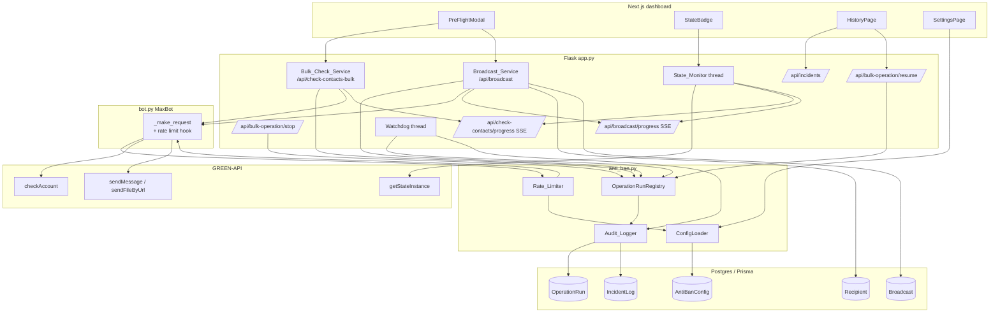
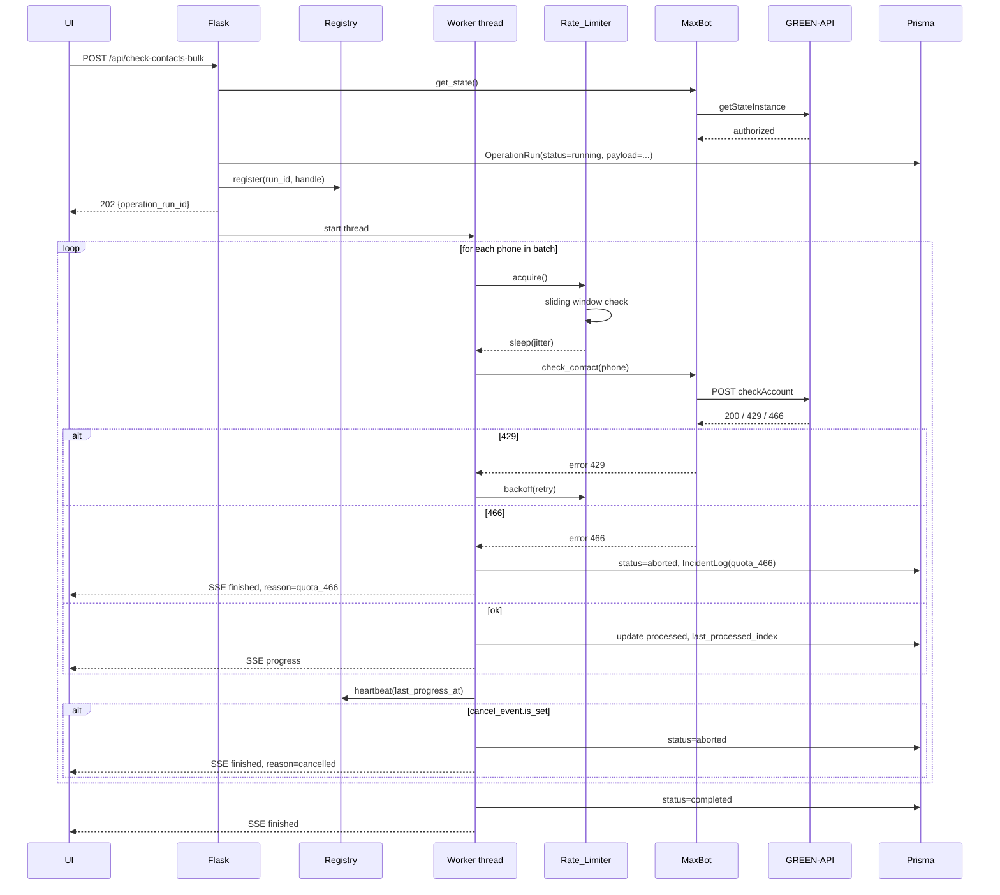
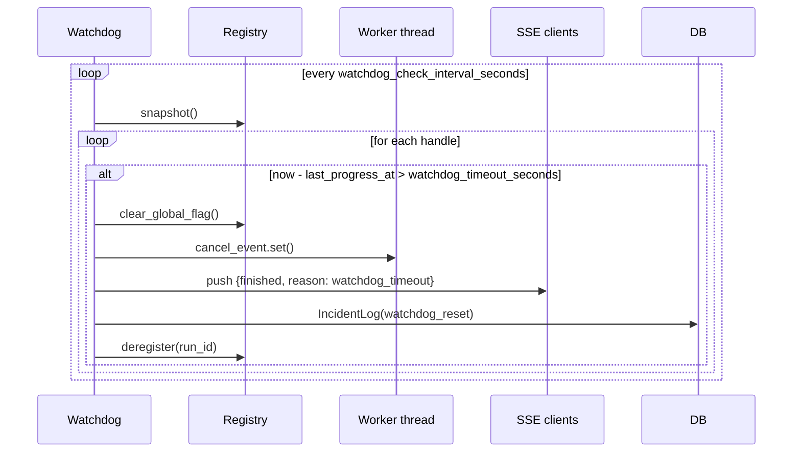

# Design Document

## Overview

Фича `anti-ban-protection` встраивает в существующий MAX Bot
(Flask `app.py` + `bot.py` + Next.js фронтенд + Prisma/Postgres) набор
механизмов, снижающих риск получения `yellowCard`/`blocked` от GREEN-API
при массовых операциях `checkAccount` и рассылках, а также устраняет
смежные баги UI и backend (залипшая кнопка, отсутствующая «Стоп», не
сбрасываемые флаги при обрыве SSE).

Дизайн опирается на [рекомендации GREEN-API по снижению риска
блокировки](https://green-api.com/v3/docs/faq/how-to-reduce-risk-of-blocking/):
человекоподобные паузы, batch-обработка, мониторинг `stateInstance`,
корректная обработка `429`/`466`. Архитектурно вводится один новый
серверный модуль (`anti_ban.py`) и две новые Prisma-модели
(`AntiBanConfig`, `OperationRun`, `IncidentLog`). Существующие
обработчики `/api/check-contacts-bulk` и `/api/broadcast` оборачиваются
в общий `Bulk_Operation`-абстракцию и используют один и тот же
`Rate_Limiter` через `MaxBot`.

### Ключевые решения

- **Один Rate_Limiter на инстанс GREEN-API**, потому что лимиты GREEN-API
  применяются на уровне инстанса. Реализация — singleton по
  `(user_id, id_instance)` с потокобезопасным состоянием
  (`threading.Lock`).
- **Sliding window — deque с timestamp-ами**, как минимально-достаточная
  реализация без зависимостей. Подход стандартный и хорошо
  тестируется по properties.
- **Sleep вместо отказа при достижении часового лимита**: операция
  не падает, а ставится в `paused`, как требует Requirement 1.5.
  Это снижает количество «потерянных» прогрессов и упрощает UX.
- **Watchdog как отдельный daemon-thread**, стартующий вместе с Flask.
  Альтернатива — APScheduler — добавляет зависимость без выгоды.
- **`Operation_Run.payload` — JSON в Postgres** (Prisma `Json`).
  Контракт сериализации проверяется round-trip property
  (Requirement 10).
- **Pre-flight-модалка только в UI**, серверу она не нужна — сервер всё
  равно проверяет лимиты независимо. Это позволяет показать
  пользователю расчёт без round-trip.
- **State_Monitor — общий компонент**, опрашивающий `getStateInstance` с
  интервалом из конфига и публикующий статус через тот же SSE-канал
  (новое событие `state`), что и прогресс. Не вводим отдельный
  endpoint, чтобы не плодить соединения.
- **Кнопка «Стоп» — синхронный flip флага в потокобезопасном
  объекте `OperationRunRegistry`**. Поток `Bulk_Operation` проверяет
  флаг между запросами и в `try/finally` гарантирует очистку
  глобальных `_check_active` / `_broadcast_active`.

### Источники

- [GREEN-API: How to reduce risk of blocking](https://green-api.com/v3/docs/faq/how-to-reduce-risk-of-blocking/) —
  рекомендации по паузам, длинным паузам, мониторингу `stateInstance`,
  reaction to `yellowCard`.
- [GREEN-API: Errors](https://green-api.com/v3/docs/api/common/Errors/) —
  семантика HTTP 429 и 466.
- [GREEN-API: getStateInstance](https://green-api.com/v3/docs/api/account/GetStateInstance/) —
  значения `stateInstance`.

## Architecture

### Высокоуровневая схема



### Потоковая модель (Flask backend)

| Поток | Жизненный цикл | Защита |
|------|-----------------|--------|
| Главный (Flask request) | per-request | — |
| `Bulk_Operation` worker | один на активную операцию | `OperationRunRegistry.lock` |
| `Watchdog` | daemon, запускается при импорте `anti_ban.py` | `OperationRunRegistry.lock` |
| `State_Monitor` | daemon, запускается на первый запрос `progress` SSE и живёт пока есть хотя бы один подписчик | внутренний `Lock` |

`OperationRunRegistry` — потокобезопасная in-memory таблица активных
операций (`run_id → RunHandle`). `RunHandle` хранит:

- `cancel_event: threading.Event`
- `last_progress_at: float`
- `kind: "check" | "broadcast"`
- `global_flag_name: "_check_active" | "_broadcast_active"`

### Поток выполнения Bulk_Operation



### Watchdog



## Components and Interfaces

### `anti_ban.py` — новый модуль

#### `AntiBanConfig` (Python dataclass, грузится из БД/`.env`)

```python
@dataclass(frozen=True)
class AntiBanConfig:
    delay_min: float = 3.0
    delay_max: float = 7.0
    batch_size: int = 50
    long_pause_every_n: int = 50
    long_pause_seconds: float = 60.0
    daily_check_limit: int = 1000
    hourly_check_limit: int = 200
    daily_message_limit: int = 500
    broadcast_delay_min: float = 5.0
    broadcast_jitter_max: float = 3.0
    state_poll_interval_seconds: int = 30
    watchdog_timeout_seconds: int = 120
    watchdog_check_interval_seconds: int = 10
    cancel_check_interval_seconds: float = 1.0
    sse_client_timeout_seconds: int = 60
    max_retries: int = 5
    max_consecutive_429: int = 3
    sliding_window_n: int = 20
    sliding_window_t: int = 60
    incident_history_limit: int = 100
    backoff_base_seconds: float = 5.0
    response_ratio_window_hours: int = 24
    response_ratio_min_outgoing: int = 50
    warn_on_zero_response_ratio: bool = True
```

Конфиг кэшируется per-`user_id` на 60 секунд, чтобы не бить БД на
каждом запросе.

#### `Rate_Limiter`

```python
class RateLimiter:
    def __init__(self, config: AntiBanConfig): ...
    def acquire(self, *, kind: Literal["check", "broadcast"]) -> None
    """Блокирующий sleep до разрешения следующего запроса.
       Учитывает: jitter, sliding window, long pause каждые N."""

    def record_request(self) -> None
    """Регистрирует факт ушедшего запроса (для sliding window)."""

    def on_http_429(self, retry_count: int) -> float
    """Возвращает паузу для backoff и устанавливает её как обязательную."""

    def hourly_count(self, user_id: str, kind: str) -> int
    def daily_count(self, user_id: str, kind: str) -> int
    """Счётчики из БД (через AuditLogger). Используются для лимитов."""
```

`acquire` инкапсулирует:

1. Если последняя пауза backoff > 0 — ждать остаток.
2. `sleep(uniform(delay_min, delay_max))` (для broadcast — `delay_min ≥
   broadcast_delay_min`, плюс `uniform(0, broadcast_jitter_max)`).
3. Если `long_pause_every_n > 0` и счётчик кратен N — добавить
   `long_pause_seconds`.
4. Sliding window: если `len(window_within_T) >= N`, ждать пока
   старейшая отметка не выйдет за окно.

Для тестируемости все источники недетерминизма (`random`, `time.time`,
`time.sleep`) внедряются через DI: `RateLimiter(..., clock=,
sleep=, rng=)`.

#### `OperationRunRegistry`

```python
class OperationRunRegistry:
    def register(self, run_id: int, handle: RunHandle) -> None
    def deregister(self, run_id: int) -> None
    def get(self, run_id: int) -> RunHandle | None
    def heartbeat(self, run_id: int) -> None
    def cancel(self, run_id: int) -> bool
    def snapshot(self) -> list[RunHandle]
    def is_active(self, kind: str) -> bool
```

#### `AuditLogger`

```python
class AuditLogger:
    def start_run(self, *, user_id, kind, total, payload) -> int
    def update_progress(self, run_id, processed, last_processed_index) -> None
    def finish_run(self, run_id, status: Literal["completed","aborted","banned","paused"]) -> None
    def log_incident(self, *, user_id, run_id, kind: IncidentKind, details: dict) -> None
    def list_incidents(self, user_id, limit) -> list[Incident]
```

#### `Watchdog`

```python
class Watchdog(threading.Thread):
    def run(self) -> None  # цикл с интервалом config.watchdog_check_interval_seconds
```

Стартует один раз при инициализации `app.py`. На каждом такте:
для каждого `RunHandle` в реестре проверяет
`time.time() - handle.last_progress_at > config.watchdog_timeout_seconds`
и при превышении — отменяет, чистит глобальные флаги, пишет
`IncidentLog`.

### `bot.py` — изменения

`MaxBot._make_request` получает опциональный аргумент
`rate_limiter: RateLimiter | None`. Когда передан, перед каждым
HTTP-запросом вызывается `rate_limiter.acquire(...)`, после успешного
запроса — `rate_limiter.record_request()`. На `requests.HTTPError`
с кодом 429 — `rate_limiter.on_http_429(retry_count)` и повтор до
`max_retries`. Код 466 поднимается как кастомный
`QuotaExceededError`. Код вне 429/466 — как раньше.

`MaxBot.broadcast` получает дополнительные аргументы
`rate_limiter`, `cancel_event`, `progress_cb_after_each` и
проверяет `cancel_event.is_set()` после каждого контакта.

### `app.py` — новые / изменённые маршруты

| Метод | Путь | Назначение |
|-------|------|-----------|
| POST | `/api/check-contacts-bulk` | Старт массовой проверки. Возвращает `operation_run_id`. |
| POST | `/api/broadcast` | Старт рассылки. Возвращает `operation_run_id`. |
| POST | `/api/bulk-operation/stop` | Остановить активную операцию (флаг `cancel_event`). |
| POST | `/api/bulk-operation/resume` | Возобновить `aborted`/`paused` операцию с `last_processed_index + 1`. |
| GET | `/api/incidents` | Список последних `Incident_Log` (лимит из конфига). |
| GET | `/api/anti-ban-config` | Получить текущую конфигурацию пользователя. |
| PUT | `/api/anti-ban-config` | Сохранить новую конфигурацию (с валидацией). |
| GET | `/api/state` | (расширение) Возвращает `state` (Instance_State). |
| SSE | `/api/check-contacts/progress` | (расширение) Эвенты `state`, `finished{reason}`. |
| SSE | `/api/broadcast/progress` | (расширение) Эвенты `state`, `finished{reason}`. |

### Frontend — Next.js

#### Компоненты

- `<PreFlightModal kind="check" | "broadcast" total={n} config={...}>` —
  расчёт ETA и риска, чекбокс «Я понимаю риски», кнопка «Запустить».
- `<StateBadge state={...} />` — бейдж со значением `Instance_State`,
  цвет: `authorized` зелёный, `yellowCard` жёлтый, `blocked`/`notAuthorized`
  красный, `unknown` серый.
- `<StopButton operationRunId={...} />` — кнопка «Стоп» рядом с прогрессом.
- `<IncidentList items={...} />` — на `/dashboard/history`,
  группировка по дате.
- `<AntiBanSettingsForm />` — на `/dashboard/settings`, форма с
  валидацией и предупреждением при `delay_min < 1.0`.

#### Хук `useBulkOperation`

```ts
function useBulkOperation(kind: "check" | "broadcast") {
  const [active, setActive] = useState(false);
  const [progress, setProgress] = useState<Progress | null>(null);
  const [state, setState] = useState<InstanceState>("unknown");
  const start = (payload: Payload) => { ... };
  const stop = () => { ... };
  // SSE timeout — 60s heartbeat, при отсутствии — close + setActive(false)
}
```

Хук — единая точка управления состоянием UI. При получении
`{finished: true}` или ошибке SSE / таймауте setActive(false) гарантированно.

## Data Models

### Prisma — новые модели

```prisma
model AntiBanConfig {
  id                              BigInt   @id @default(autoincrement())
  user_id                         String   @unique @db.Uuid
  delay_min                       Float    @default(3.0)
  delay_max                       Float    @default(7.0)
  batch_size                      Int      @default(50)
  long_pause_every_n              Int      @default(50)
  long_pause_seconds              Float    @default(60.0)
  daily_check_limit               Int      @default(1000)
  hourly_check_limit              Int      @default(200)
  daily_message_limit             Int      @default(500)
  broadcast_delay_min             Float    @default(5.0)
  broadcast_jitter_max            Float    @default(3.0)
  state_poll_interval_seconds     Int      @default(30)
  watchdog_timeout_seconds        Int      @default(120)
  watchdog_check_interval_seconds Int      @default(10)
  sse_client_timeout_seconds      Int      @default(60)
  max_retries                     Int      @default(5)
  max_consecutive_429             Int      @default(3)
  sliding_window_n                Int      @default(20)
  sliding_window_t                Int      @default(60)
  incident_history_limit          Int      @default(100)
  backoff_base_seconds            Float    @default(5.0)
  warn_on_zero_response_ratio     Boolean  @default(true)
  response_ratio_window_hours     Int      @default(24)
  response_ratio_min_outgoing     Int      @default(50)
  updated_at                      DateTime @updatedAt
  @@map("anti_ban_config")
}

model OperationRun {
  id                    BigInt   @id @default(autoincrement())
  user_id               String   @db.Uuid
  kind                  String                    // "check" | "broadcast"
  status                String   @default("running")
  // "running" | "paused" | "completed" | "aborted" | "banned"
  total                 Int
  processed             Int      @default(0)
  last_processed_index  Int      @default(-1)
  payload               Json
  started_at            DateTime @default(now())
  finished_at           DateTime?
  broadcast_id          BigInt?
  reason                String?                   // финальная причина
  incidents             IncidentLog[]
  @@index([user_id, status])
  @@index([user_id, started_at])
  @@map("operation_runs")
}

model IncidentLog {
  id               BigInt        @id @default(autoincrement())
  user_id          String        @db.Uuid
  operation_run_id BigInt?
  kind             String
  // "yellowCard" | "blocked" | "notAuthorized" | "rate_limit_429"
  // | "quota_466" | "watchdog_reset"
  details          Json
  created_at       DateTime      @default(now())
  operation_run    OperationRun? @relation(fields: [operation_run_id], references: [id])
  @@index([user_id, created_at])
  @@map("incident_log")
}
```

### `OperationRun.payload` — формат

```jsonc
{
  "contacts": [
    { "phone": "79991234567", "name": "Alice", "_message": "..." }
  ],
  "params": {
    "message_template": "Hi {name}",
    "use_typing": true,
    "file_url": null,
    "file_name": null,
    "delay": 5.0
  }
}
```

Поле `contacts[].phone` обязательное; остальные ключи строковые
опциональные. Сериализация — `json.dumps(payload, ensure_ascii=False)`.
Round-trip property для этой структуры — Requirement 10.3 — будет
проверяться property-based тестом.

### `Instance_State` — допустимые значения

```python
HEALTHY = {"authorized"}
UNHEALTHY = {"yellowCard", "blocked", "notAuthorized"}
NEUTRAL = {"starting", "sleepMode"}  # не блокирует, но не гарантирует работу
UNKNOWN = "unknown"  # ошибка/нет ответа
```

### Risk-категория для Pre-flight

```
risk(total) = "low"    if total < 200
            = "medium" if 200 <= total < 1000
            = "high"   if total >= 1000
```

### ETA-формула

```
avg_per_request = (delay_min + delay_max) / 2 + 1.0   # +1s сетевой round-trip
long_pauses     = total // long_pause_every_n         # if long_pause_every_n > 0 else 0
eta_seconds     = total * avg_per_request + long_pauses * long_pause_seconds
```

## Correctness Properties

*A property is a characteristic or behavior that should hold true across
all valid executions of a system — essentially, a formal statement
about what the system should do. Properties serve as the bridge between
human-readable specifications and machine-verifiable correctness
guarantees.*

Все property-тесты выполняются с DI-вкручиванием детерминированных
часов (`fake_clock`), `sleep` и `rng`, чтобы избежать реальных пауз и
сетевых вызовов. Минимум 100 итераций на каждое property.

### Property 1: Pause distribution

*For any* `(delay_min, delay_max)` с `1.0 <= delay_min <= delay_max <= 60`
и любого числа `n >= 10` обращений к `RateLimiter.acquire()`:

- каждая сгенерированная пауза `p_i` лежит в `[delay_min, delay_max]` (с
  учётом jitter для broadcast: `[delay_min, delay_max + broadcast_jitter_max]`);
- для любого скользящего окна из 10 пауз выборочное стандартное
  отклонение `>= 0.3` секунды (при условии `delay_max - delay_min >= 1.0`).

**Validates: Requirements 1.2, 1.6, 2.3**

### Property 2: Long pause cadence

*For any* `long_pause_every_n > 0` и любой последовательности из `M >= N`
обращений к `RateLimiter.acquire()`, ровно `M // N` пауз в
последовательности имеют длительность не менее `long_pause_seconds`.

**Validates: Requirements 1.1, 1.7**

### Property 3: Sliding window invariant

*For all* последовательностей вызовов `RateLimiter.acquire()` и для
каждого момента времени `t` после `record_request()`, количество
запросов, чьи timestamps лежат в `(t - sliding_window_t, t]`, не
превышает `sliding_window_n`.

**Validates: Requirements 1.3**

### Property 4: Daily/hourly limits enforce caps

*For any* `kind ∈ {check, broadcast}`, любого пользователя, и любого
текущего счётчика `c` за период `P ∈ {day, hour}`:

- если `c >= limit_P`, то `POST /api/{kind}-...` возвращает HTTP 429;
- если `c < limit_P`, операция запускается;
- для часового лимита (Requirement 1.5) текущий run переходит в
  `status = "paused"` и не делает новых запросов до начала следующего
  часа.

**Validates: Requirements 1.4, 1.5, 2.4**

### Property 5: Broadcast minimum delay floor

*For any* пользовательского значения `user_delay >= 0` и любой
конфигурации, фактическая минимальная пауза между двумя
последовательными `sendMessage`/`sendFileByUrl`/`uploadFile` в одной
рассылке не меньше `broadcast_delay_min`.

**Validates: Requirements 2.1, 2.2**

### Property 6: Zero response ratio warning

*For any* `(outgoing_count, incoming_count, response_ratio_min_outgoing)`,
ответ `POST /api/broadcast` содержит поле `warning =
"zero_response_ratio"` тогда и только тогда, когда
`warn_on_zero_response_ratio == true AND incoming_count == 0 AND
outgoing_count >= response_ratio_min_outgoing`.

**Validates: Requirements 2.5**

### Property 7: Pre-start state gate

*For any* значения `state`, возвращённого `getStateInstance` перед стартом
`Bulk_Operation`:

- если `state ∈ Unhealthy_State`, ответ имеет HTTP 409 с полем
  `state == state`;
- иначе `Bulk_Operation` запускается (HTTP 202).

**Validates: Requirements 3.3**

### Property 8: State polling cadence

*For any* `K >= 1` тиков `fake_clock` длительностью
`state_poll_interval_seconds` в течение жизни активной SSE-подписки,
`State_Monitor` совершает ровно `K` вызовов `getStateInstance` и
публикует ровно `K` SSE-событий типа `state`.

**Validates: Requirements 3.2**

### Property 9: Unhealthy state aborts within poll interval

*For any* активной `Bulk_Operation` и любого момента `t`, в который
`getStateInstance` начинает возвращать значение из `Unhealthy_State`,
не позже чем через `state_poll_interval_seconds` секунд после `t`
выполняются: операция перестаёт делать новые запросы GREEN-API,
`OperationRun.status = "banned"`, в `IncidentLog` добавлена запись с
`kind == returned_state`.

**Validates: Requirements 3.4, 3.5**

### Property 10: Unknown state does not block

*For any* ошибки или отсутствия ответа от `getStateInstance` (исключение,
`None`, любой не-строковый ответ), `State_Monitor` публикует значение
`unknown` и старт новых операций не блокируется по причине состояния.

**Validates: Requirements 3.6**

### Property 11: Backoff bounds and retry cap

*For any* `retry_count >= 0`, значение `Rate_Limiter.on_http_429(retry_count)`
лежит в `[backoff_base * 2^retry_count, backoff_base * 2^retry_count +
backoff_base]`. Для любой последовательности 429-ответов от GREEN-API
число повторов одного запроса не превышает `max_retries`.

**Validates: Requirements 4.1, 4.2**

### Property 12: Consecutive 429 → aborted + incident

*For any* `Bulk_Operation` и любой последовательности из `K`
последовательных HTTP 429 без успешных ответов:

- если `K >= max_consecutive_429`, то `OperationRun.status = "aborted"`
  и `IncidentLog` содержит ровно одну запись с
  `kind = "rate_limit_429"` и `operation_run_id` равным id операции;
- если `K < max_consecutive_429`, операция продолжается без
  записи `rate_limit_429`.

**Validates: Requirements 4.3**

### Property 13: HTTP 466 aborts immediately

*For any* индекса `i ∈ [0, total)`, при котором GREEN-API возвращает
HTTP 466 на `i`-й запрос:

- `Bulk_Operation` останавливается до отправки `(i+1)`-го запроса;
- `OperationRun.status == "aborted"`, `processed == i` (или `i+1` в
  зависимости от того, считается ли неудачный вызов обработанным —
  политика: `processed == i`);
- `IncidentLog` содержит запись с `kind = "quota_466"`.

**Validates: Requirements 4.4**

### Property 14: last_processed_index correctness

*For any* выполнения `Bulk_Operation`, в любой момент времени
`OperationRun.last_processed_index == OperationRun.processed - 1` и
число записей результатов (`Recipient` для broadcast, `CheckResult` для
check), связанных с этим `OperationRun`, равно `processed`.

**Validates: Requirements 4.5, 7.2**

### Property 15: Cancel propagation

*For any* активной `Bulk_Operation` и любого момента вызова
`POST /api/bulk-operation/stop`:

- не позже чем через `cancel_check_interval_seconds` секунд новые
  запросы GREEN-API не отправляются;
- `OperationRun.status == "aborted"`;
- глобальный флаг (`_check_active` или `_broadcast_active`) равен
  `False`.

**Validates: Requirements 5.1, 5.2**

### Property 16: Watchdog cadence

*For any* `K >= 1` тиков `fake_clock` длительностью
`watchdog_check_interval_seconds`, `Watchdog` выполняет ровно `K`
проходов по реестру.

**Validates: Requirements 5.3**

### Property 17: Watchdog timeout side-effects

*For any* активной `Bulk_Operation`, у которой `last_progress_at`
старше чем `watchdog_timeout_seconds` относительно текущего времени:

- соответствующий глобальный флаг сбрасывается в `False`;
- всем подписчикам соответствующего SSE-канала отправляется событие
  `{ "finished": true, "reason": "watchdog_timeout" }`;
- в `IncidentLog` добавляется запись с `kind = "watchdog_reset"`.

**Validates: Requirements 5.4**

### Property 18: Global flag invariant after worker termination

*For all* способов завершения worker-потока `Bulk_Operation` (нормальное
завершение, исключение, `KeyboardInterrupt`, cancel, watchdog), после
выхода из `try/finally` соответствующий глобальный флаг равен `False`.

**Validates: Requirements 5.5**

### Property 19: Frontend resets active flag on SSE end

*For all* событий завершения SSE (`{finished: true}`, `error`, `close`,
heartbeat-таймаут после `sse_client_timeout_seconds`), хук
`useBulkOperation` устанавливает локальный флаг `active = false` в
течение 1 секунды после события.

**Validates: Requirements 5.6, 5.7**

### Property 20: ETA formula correctness

*For any* конфигурации `(delay_min, delay_max, long_pause_every_n,
long_pause_seconds)` и любого `total >= 0`, функция
`computeEta(config, total)` возвращает значение, равное
`total * ((delay_min + delay_max) / 2 + 1) + (total // long_pause_every_n) *
long_pause_seconds` (или `total * avg + 0`, если `long_pause_every_n == 0`).

**Validates: Requirements 6.2**

### Property 21: Risk category mapping

*For any* `total >= 0`, функция `computeRisk(total)` возвращает
`"low"` при `total < 200`, `"medium"` при `200 <= total < 1000`,
`"high"` при `total >= 1000`.

**Validates: Requirements 6.3**

### Property 22: PreFlight launch button disabled until checked

*For any* состояния `<PreFlightModal>`, кнопка «Запустить» имеет
атрибут `disabled` тогда и только тогда, когда чекбокс «Я понимаю
риски» не отмечен.

**Validates: Requirements 6.4, 6.5**

### Property 23: Resume continues from last_processed_index + 1

*For any* `OperationRun` со `status ∈ {aborted, paused}` и валидным
`payload`, после `POST /api/bulk-operation/resume` worker-поток
обрабатывает контакты с индексами `[last_processed_index + 1, total)`
и не повторяет уже обработанные.

**Validates: Requirements 7.4**

### Property 24: Resume of completed run rejected

*For any* `OperationRun` со `status == "completed"`, эндпойнт
`/api/bulk-operation/resume` возвращает HTTP 409 и не запускает новый
worker.

**Validates: Requirements 7.5**

### Property 25: History page renders active and resumable runs

*For any* набора `OperationRun` пользователя, страница
`/dashboard/history` отображает карточки только для записей со
`status ∈ {running, paused, aborted}`. Для `running` показана кнопка
«Стоп», для `paused`/`aborted` — кнопка «Возобновить».

**Validates: Requirements 7.6**

### Property 26: Audit log completeness

*For any* выполнения `Bulk_Operation` (включая инциденты любого типа из
`{yellowCard, blocked, notAuthorized, rate_limit_429, quota_466,
watchdog_reset}`):

- существует ровно одна запись `OperationRun` с заполненными
  `started_at`, итоговым `status` и `finished_at`;
- для каждого произошедшего инцидента существует запись в `IncidentLog`
  с правильным `kind`, ненулевым `created_at`, и связанным
  `operation_run_id` (когда инцидент относится к операции).

**Validates: Requirements 3.5, 7.1, 7.3, 8.1, 8.2**

### Property 27: Incidents API returns last N desc-sorted

*For any* набора записей в `IncidentLog`, ответ `GET /api/incidents`
содержит не более `incident_history_limit` записей, отсортированных по
`created_at DESC`. Для любых двух соседних элементов
`response[i].created_at >= response[i+1].created_at`.

**Validates: Requirements 8.3, 8.4**

### Property 28: Default config returned for missing record

*For any* `user_id`, не имеющего записи в `AntiBanConfig`,
`getConfig(user_id)` возвращает экземпляр `AntiBanConfig` со всеми
дефолтами, заданными в Requirement 9.2.

**Validates: Requirements 9.2**

### Property 29: Config validation accepts iff valid

*For any* объекта конфигурации `c`, `PUT /api/anti-ban-config`
возвращает HTTP 400 тогда и только тогда, когда нарушено хотя бы одно
из условий Requirement 9.3 (`delay_min >= 1.0`, `delay_max >=
delay_min`, `batch_size >= 1`, `long_pause_seconds >= 0`,
`daily_check_limit >= 1`, `hourly_check_limit >= 1`).

**Validates: Requirements 9.3**

### Property 30: Settings warning iff delay_min below safe threshold

*For any* значения `delay_min` в сохранённой `AntiBanConfig`, страница
`/dashboard/settings` отображает предупреждающий блок тогда и только
тогда, когда `delay_min < 1.0`.

**Validates: Requirements 9.4**

### Property 31: Payload JSON round-trip

*For any* валидного `payload = { contacts: list[Contact], params: dict }`,
где `Contact` имеет обязательное поле `phone: str` и произвольные
строковые опциональные поля, выполняется
`json_loads(json_dumps(payload, ensure_ascii=False)) == payload`.
Порядок элементов, ключи и значения совпадают.

**Validates: Requirements 10.1, 10.2, 10.3**

### Property 32: Invalid payload rejected with 422

*For any* строки или JSON-объекта, который не парсится как валидный JSON
или не содержит ключ `contacts` со значением-списком, эндпойнт
`POST /api/bulk-operation/resume` возвращает HTTP 422 и не запускает
новый worker.

**Validates: Requirements 10.4**

## Error Handling

### Категории ошибок и реакция

| Источник | Тип | Реакция |
|---------|-----|---------|
| GREEN-API HTTP 429 | rate-limit | `Rate_Limiter.on_http_429`, retry до `max_retries`, при `max_consecutive_429` подряд → abort + IncidentLog |
| GREEN-API HTTP 466 | quota | abort немедленно + IncidentLog `quota_466` |
| GREEN-API сетевая ошибка / timeout | transient | один retry с backoff; повторная ошибка — пропустить контакт со статусом `error`, продолжить |
| `getStateInstance` ошибка | observability | badge `unknown`, не блокировать новые операции, для активной — продолжить (т.к. подтверждение в Unhealthy_State требует валидного ответа) |
| `Instance_State ∈ Unhealthy_State` | safety | abort активной операции, IncidentLog с `kind == state` |
| Watchdog timeout | self-healing | сброс глобального флага, SSE `finished{watchdog_timeout}`, IncidentLog |
| Cancel by user | normal | `OperationRun.status = "aborted"`, SSE `finished{cancelled}` |
| Worker exception | bug | logging.exception, `OperationRun.status = "aborted"`, SSE `finished{error}`, `try/finally` гарантирует флаг = False |
| Invalid `payload` на resume | client error | HTTP 422 |
| Resume completed run | client error | HTTP 409 |
| Config validation | client error | HTTP 400 со списком нарушений |

### SSE error semantics

- Каждое SSE-событие имеет JSON-тело. Завершающее событие всегда
  содержит `{ "finished": true, "reason": "<one of: completed, cancelled,
  watchdog_timeout, banned, quota_466, rate_limit_429, error>" }`.
- Heartbeat — пустой комментарий `: ping\n\n` каждые 15 секунд (меньше
  `sse_client_timeout_seconds`), чтобы клиент не истёк по таймауту.

### Глобальные инварианты в `app.py`

```python
# Любой worker:
def run():
    global _check_active
    _check_active = True
    try:
        ...
    finally:
        _check_active = False
        registry.deregister(run_id)
```

Watchdog — внешняя страховка на случай, если `finally` не выполнился
(killed thread, OOM). Watchdog не отменяет `try/finally`, но
гарантирует освобождение глобального флага в самой плохой ситуации.

### Frontend error UX

- Кнопка «Стоп» дизейблится после клика, разблокируется по `finished`
  или таймауту 5 секунд (двойной клик безопасен, endpoint идемпотентен).
- При `state ∈ Unhealthy_State` показывается non-dismissible баннер
  «Инстанс нездоров — массовые операции временно недоступны». Старт
  новой операции возвращает 409, кнопка «Запустить» в PreFlight
  отключена.

## Testing Strategy

### Подход

Двухслойное тестирование:

1. **Property-based тесты** — реализуют 32 property из секции
   Correctness Properties.
2. **Example-based unit-тесты** — конкретные примеры и UI-взаимодействия
   (открытие модалки, инициализация чекбокса, конкретные badge-цвета).
3. **Integration-тесты** — Flask-эндпойнты, end-to-end через
   `tests/integration/` с моками `MaxBot` (нет реальных вызовов GREEN-API).

### Технологии

| Слой | Библиотека | Обоснование |
|------|-----------|-------------|
| Python property tests (`anti_ban.py`, `app.py`) | [Hypothesis](https://hypothesis.readthedocs.io) | Стандарт для PBT в Python, есть стратегии для dataclass и времён |
| Python unit tests | `pytest` | Уже есть в проекте (или ставится в DEV-зависимостях) |
| Frontend property tests (хуки, formulas, UI predicates) | [fast-check](https://github.com/dubzzz/fast-check) | Стандарт PBT для TS/JS |
| Frontend unit / component tests | Vitest + React Testing Library | Согласовано с Next.js 14 |
| SSE / endpoint integration | `pytest` + `Flask test client` | Без поднятия реального сервера |

Property-based testing подходит для этой фичи: преобладают чистые
правила (rate-limiting math, state-machine переходы, JSON
round-trip, валидация), которые имеют универсальные инварианты с
большим input-space. Несколько UI-вещей (open modal on click) остаются
как example-based.

### Property test configuration

- Минимум 100 итераций на каждое property (`max_examples=100` в
  Hypothesis, `numRuns: 100` в fast-check).
- Каждый property-тест маркируется комментарием:
  `# Feature: anti-ban-protection, Property {N}: {short text}`
- Все источники недетерминизма (`time.time`, `time.sleep`, `random`)
  внедряются через DI и заменяются `FakeClock` / `FakeSleep` /
  `random.Random(seed)` в тестах. Это делает 100 итераций дешёвыми
  (миллисекунды на iteration), что и оправдывает PBT даже для
  «timing-зависимых» property.
- Таймер watchdog в тестах ускоряется через `FakeClock.advance(...)`,
  цикл проверки выполняется явно, без `time.sleep`.

### Что покрываем example-тестами

- Открытие/закрытие `<PreFlightModal>` по кликам (Requirement 6.1, 6.4,
  6.6).
- Конкретное содержимое badge для известных состояний (Requirement
  3.1).
- SSE-таймаут как edge-case (Requirement 5.7) — один сценарий с
  фиксированным интервалом.
- Schema-snapshot Prisma `AntiBanConfig` (Requirement 9.1).
- Один happy-path сериализации payload (Requirement 10.1) в дополнение
  к round-trip property.

### Integration tests (минимально)

- `test_bulk_check_full_cycle` — старт → 3 контакта → finish, проверка
  `OperationRun` и `Recipient`/`CheckResult` строк.
- `test_broadcast_resume` — старт, abort на середине, resume,
  завершение. Проверка идемпотентности — нет повторных контактов.
- `test_state_unhealthy_aborts` — мокаем `getStateInstance` →
  `yellowCard` в середине, проверяем abort + IncidentLog.

### Что НЕ покрываем

- Реальные вызовы к GREEN-API. Все вызовы мокаются.
- Реальный Postgres в property-тестах — для скорости используем
  Prisma client с SQLite-test-схемой или sqlmodel-совместимый stub.
  В integration-тестах — Postgres из docker-compose.
- Точная визуальная вёрстка `StateBadge` / `<IncidentList>` —
  оставляем визуальную регрессию вне scope.

### Review checklist (закрытие фазы Design)

- [ ] Все 10 требований покрыты как минимум одним property или
  example-тестом.
- [ ] Каждое property явно ссылается на Requirement через
  `**Validates: Requirements ...**`.
- [ ] Архитектурные решения объяснены и обоснованы.
- [ ] Diagrams отражают сценарии Bulk_Operation, Watchdog, State_Monitor.
- [ ] Errors-секция перечисляет все источники ошибок и реакции.
- [ ] Testing Strategy указывает PBT-библиотеки и конфигурацию (>=100
  итераций, теги).


