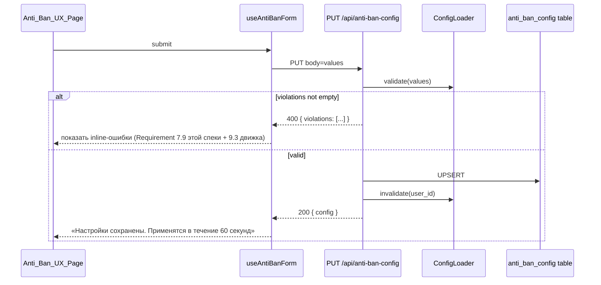

# Design Document

## Overview

Фича `anti-ban-ux-overhaul` — UX-надстройка над уже существующим
движком анти-бана из спеки `anti-ban-protection`. Движок (пакет
`anti_ban/`: `RateLimiter`, `Watchdog`, `StateMonitor`, `AuditLogger`,
`ConfigLoader`, `OperationRunRegistry`) и его контракты — паузы,
sliding window, retry/backoff, watchdog timeout, обработка 429/466,
аудит, мониторинг `stateInstance` — остаются неизменными. Поля
`AntiBanConfig` в Prisma не расширяются; UX работает поверх 24+
существующих параметров.

Дизайн опирается на:

- существующие маршруты `GET/PUT /api/anti-ban-config` и
  `GET /api/incidents` (см. `anti-ban-protection/design.md`,
  «app.py — новые / изменённые маршруты»);
- существующий `ConfigLoader.invalidate(user_id)`, который уже
  вызывается на `PUT /api/anti-ban-config` (см.
  `anti-ban-protection/design.md`, «Components/Interfaces →
  ConfigLoader»);
- существующие in-memory счётчики `RateLimiter` и
  `AuditLogger.count_in_window` для расчёта `current_rps`,
  `hourly_usage_pct`, `daily_usage_pct`;
- дизайн-токены из [`Design/tokens.json`](../../../Design/tokens.json)
  для палитры (status-color: `engagement-gold` (yellow),
  `leadgen-red` (red), `mint-green`/`deliver-green` (green)).

### Ключевые решения

- **Один новый Flask-эндпойнт `GET /api/anti-ban/status`** вместо SSE.
  UX-страница и так — низкочастотная (опрос 5 секунд), а polling даёт
  тривиальный graceful degradation, не плодит долгоживущих соединений
  и не конкурирует с прогресс-каналами `/api/check-contacts/progress`
  и `/api/broadcast/progress`. SSE не оправдан для обновления раз в 5
  секунд.
- **Live-метрики считаются из существующих источников**: `current_rps`
  — из in-memory sliding window `RateLimiter` (за последние 60 секунд);
  `hourly_usage_pct` / `daily_usage_pct` — через
  `AuditLogger.count_in_window(user_id, kind, window)`; счётчик 429 —
  через `IncidentLog WHERE kind = 'rate_limit_429' AND created_at >
  now-1h`. Никаких новых таблиц или фоновых аккумуляторов.
- **Симулятор — чистая функция на фронтенде**, без обращения к
  Flask. Формула совпадает с `anti-ban-protection/design.md`
  («ETA-формула»), что позволяет проверить эквивалентность property-
  тестом без фейкового бэкенда.
- **Пресеты — фронтендная константа**, не отдельная Prisma-модель.
  Три встроенных пресета (`Safe`/`Balanced`/`Aggressive`) фиксированы
  и версионируются вместе с фронтендом. `Balanced` буквально равен
  дефолтам `AntiBanConfig` (Requirement 9.2 движка), что упрощает
  property «пресет → все поля заполнены» и совместимость с экспортом.
- **Active_Preset detection — `deepEqual` по всем полям пресета**.
  Это даёт детерминированный `{safe, balanced, aggressive, custom}`
  и единый код для onMount-determination и для after-edit-recompute.
- **Для подсказок выбран Radix UI Popover**, а не Floating UI:
  Radix даёт встроенную клавиатурную доступность (focus management,
  Esc-закрытие, aria-атрибуты), а позиционирование под капотом
  всё равно использует Floating UI. Floating UI напрямую дешевле по
  bundle size, но пришлось бы дописывать a11y руками. Поскольку
  `lucide-react` и Radix — стандартные зависимости в Next.js-стеке
  Amplemarket-style и не противоречат бренд-гайду, добавляем
  `@radix-ui/react-popover` (см. секцию Components).
- **Onboarding tour — собственная мини-реализация поверх Radix
  Dialog + portal-overlay**, без `react-joyride`. Тур из 5–7 шагов с
  фиксированными селекторами не оправдывает 50 KB зависимости;
  поведение легко покрывается ~150 строк React и одним hook-ом.
- **Tour completion marker — поле в существующей модели `Profile`**,
  по аналогии с `welcomed_at`. Никакой отдельной таблицы.
- **Hot-reload не требует кода в этой спеке**: `PUT
  /api/anti-ban-config` уже вызывает `ConfigLoader.invalidate(user_id)`
  (см. `anti-ban-protection/design.md`); UX-слой только сообщает
  пользователю про TTL 60 секунд.
- **Profile_Export_File / Profile_Import_File — отдельный
  TypeScript-контракт**, проверяемый round-trip property и
  валидацией `ConfigLoader.validate` (Requirement 9.3 движка). Это
  парсер, поэтому round-trip обязателен по правилам спеки.

### Источники

- [`anti-ban-protection/design.md`](../anti-ban-protection/design.md)
  — основной движок; все компоненты ниже ссылаются на него.
- [`anti-ban-protection/requirements.md`](../anti-ban-protection/requirements.md)
  — Requirement 9.2 (дефолты `AntiBanConfig`), 9.3 (правила
  валидации), 6.2 (ETA-формула).
- [`Design/DESIGN.md`](../../../Design/DESIGN.md), `Design/tokens.json`
  — дизайн-токены и цветовая палитра статусных индикаторов.
- [Radix UI Popover](https://www.radix-ui.com/primitives/docs/components/popover)
  — поведение и контракт `FieldTooltip`.
- [GREEN-API: How to reduce risk of blocking](https://green-api.com/v3/docs/faq/how-to-reduce-risk-of-blocking/)
  — обоснование значений `Safe_Preset` (более консервативные паузы
  и лимиты, чем дефолтные).

## Architecture

### Высокоуровневая схема

```mermaid
flowchart TB
  subgraph FE[Next.js dashboard / Anti_Ban_UX_Page]
    PG[/dashboard/settings/anti-ban/]
    PS[PresetSelector]
    AI[ActivePresetIndicator]
    FT[FieldTooltip]
    LSB[LiveStatusBanner]
    IF[IncidentFeed]
    SM[SimulatorModal]
    OT[OnboardingTour]
    IE[ImportExportControls]
    IDM[ImportDiffModal]
    PSC[PresetSwitchConfirmation]
    HFR[useAntiBanForm]
    HLS[useLiveStatus]
  end

  subgraph NEXT[Next.js API routes]
    NPW[/api/profile/welcome/]
    NPT[/api/profile/anti-ban-tour-completed/]
  end

  subgraph FLASK[Flask app.py]
    GAC[/api/anti-ban-config GET]
    PAC[/api/anti-ban-config PUT]
    INC[/api/incidents]
    LSE[/api/anti-ban/status NEW]
    SBA[StatusAggregator NEW]
  end

  subgraph CORE[anti_ban package]
    CL[ConfigLoader]
    RL[RateLimiter]
    AL[AuditLogger]
    REG[OperationRunRegistry]
    WD[Watchdog]
  end

  subgraph DB[(Postgres / Prisma)]
    PROF[(Profile<br/>+ anti_ban_tour_completed_at)]
    AC[(AntiBanConfig)]
    OR[(OperationRun)]
    IL[(IncidentLog)]
  end

  PG --> PS
  PG --> AI
  PG --> LSB
  PG --> IF
  PG --> SM
  PG --> OT
  PG --> IE
  PS --> PSC
  IE --> IDM
  PG --> HFR
  LSB --> HLS

  HLS -->|GET 5s polling| LSE
  HFR -->|GET on mount| GAC
  HFR -->|PUT on save| PAC
  IF -->|GET paginated| INC
  OT -->|POST on done/skip| NPT
  IE -->|file download/upload| HFR

  GAC --> CL
  PAC --> CL
  PAC -->|invalidate| CL
  INC --> AL
  LSE --> SBA
  SBA --> RL
  SBA --> AL
  SBA --> REG
  SBA --> CL

  NPT --> PROF
  CL --> AC
  AL --> OR
  AL --> IL
  RL --> CL
  WD --> REG
  WD --> AL
```

### Поточная модель

| Поток | Жизненный цикл | Где |
|------|-----------------|------|
| Next.js render (RSC + Client) | per-request | `app/dashboard/settings/anti-ban/page.tsx` |
| Browser polling (5s) | per-page-mount | `useLiveStatus` |
| Flask request | per-request | `/api/anti-ban/status` обработчик |
| `RateLimiter` (existing) | per-(user_id, id_instance) singleton | `anti_ban/rate_limiter.py` |
| `Watchdog` (existing) | daemon | `anti_ban/watchdog.py` |
| `StateMonitor` (existing) | daemon | `anti_ban/state_monitor.py` |

UX-слой не вводит новых потоков: `useLiveStatus` работает в браузере,
`StatusAggregator` — синхронный helper в обработчике запроса.

### Поток получения live-status

```mermaid
sequenceDiagram
  participant UI as Anti_Ban_UX_Page
  participant Hook as useLiveStatus
  participant Next as Next.js API
  participant Flask as Flask
  participant SBA as StatusAggregator
  participant RL as RateLimiter
  participant AL as AuditLogger
  participant IL as IncidentLog

  UI->>Hook: mount
  loop every 5s while mounted
    Hook->>Next: GET /api/anti-ban/status (proxy)
    Next->>Flask: GET /api/anti-ban/status
    Flask->>SBA: collect(user_id)
    SBA->>RL: window_count(user_id, kind="check"|"broadcast", 60s)
    RL-->>SBA: count
    SBA->>AL: count_in_window(user_id, "check", "hour")
    SBA->>AL: count_in_window(user_id, "check", "day")
    SBA->>AL: count_in_window(user_id, "broadcast", "hour")
    SBA->>AL: count_in_window(user_id, "broadcast", "day")
    SBA->>IL: SELECT COUNT(*) WHERE kind='rate_limit_429' AND created_at>now-1h
    SBA->>IL: SELECT kind FROM incident_log WHERE created_at>now-1h ORDER BY created_at DESC
    SBA-->>Flask: LiveStatusResponse
    Flask-->>Next: 200 JSON
    Next-->>Hook: parsed
    Hook-->>UI: setState
  end
  alt HTTP error or network failure
    Hook-->>UI: setStatus(null), показать "Статус недоступен"
    Note right of Hook: Polling продолжается;<br/>при следующем успехе UI восстанавливается.
  end
```

### Поток сохранения настроек



## Components and Interfaces

Все TypeScript-интерфейсы лежат в `frontend/src/components/anti-ban/`
и `frontend/src/lib/anti-ban/`. Существующий
`AntiBanSettingsForm.tsx` остаётся как «низкоуровневая» форма; новая
страница `/dashboard/settings/anti-ban` композирует её c новыми
UX-элементами через `useAntiBanForm`.

### `Anti_Ban_UX_Page` (страница)

Файл: `frontend/src/app/dashboard/settings/anti-ban/page.tsx`.
Серверный компонент (Next.js App Router) грузит `Profile` и
`AntiBanConfig` через `apiGet`, рендерит клиентский компонент
`<AntiBanUXClient />` с initial-данными.

### `PresetCatalog` (константа)

Файл: `frontend/src/lib/anti-ban/presets.ts`.

```ts
import type { AntiBanConfig } from "./types";

export type PresetId = "safe" | "balanced" | "aggressive";

/**
 * Полное значение всех 24 полей AntiBanConfig для каждого пресета.
 * Balanced ≡ дефолтам Requirement 9.2 движка
 * (anti-ban-protection/requirements.md). Safe — более консервативные;
 * Aggressive — более агрессивные, но всегда удовлетворяют валидации
 * Requirement 9.3 движка.
 */
export const PRESET_CATALOG: Record<PresetId, AntiBanConfig> = {
  safe: {
    delay_min: 5.0,
    delay_max: 12.0,
    batch_size: 30,
    long_pause_every_n: 30,
    long_pause_seconds: 90.0,
    daily_check_limit: 500,
    hourly_check_limit: 100,
    daily_message_limit: 250,
    broadcast_delay_min: 8.0,
    broadcast_jitter_max: 4.0,
    state_poll_interval_seconds: 30,
    watchdog_timeout_seconds: 180,
    watchdog_check_interval_seconds: 10,
    sse_client_timeout_seconds: 60,
    max_retries: 5,
    max_consecutive_429: 2,
    sliding_window_n: 15,
    sliding_window_t: 60,
    incident_history_limit: 100,
    backoff_base_seconds: 8.0,
    warn_on_zero_response_ratio: true,
    response_ratio_window_hours: 24,
    response_ratio_min_outgoing: 30,
  },
  balanced: {
    delay_min: 3.0,
    delay_max: 7.0,
    batch_size: 50,
    long_pause_every_n: 50,
    long_pause_seconds: 60.0,
    daily_check_limit: 1000,
    hourly_check_limit: 200,
    daily_message_limit: 500,
    broadcast_delay_min: 5.0,
    broadcast_jitter_max: 3.0,
    state_poll_interval_seconds: 30,
    watchdog_timeout_seconds: 120,
    watchdog_check_interval_seconds: 10,
    sse_client_timeout_seconds: 60,
    max_retries: 5,
    max_consecutive_429: 3,
    sliding_window_n: 20,
    sliding_window_t: 60,
    incident_history_limit: 100,
    backoff_base_seconds: 5.0,
    warn_on_zero_response_ratio: true,
    response_ratio_window_hours: 24,
    response_ratio_min_outgoing: 50,
  },
  aggressive: {
    delay_min: 1.5,
    delay_max: 4.0,
    batch_size: 80,
    long_pause_every_n: 80,
    long_pause_seconds: 30.0,
    daily_check_limit: 2000,
    hourly_check_limit: 400,
    daily_message_limit: 1000,
    broadcast_delay_min: 3.0,
    broadcast_jitter_max: 2.0,
    state_poll_interval_seconds: 30,
    watchdog_timeout_seconds: 90,
    watchdog_check_interval_seconds: 10,
    sse_client_timeout_seconds: 60,
    max_retries: 5,
    max_consecutive_429: 4,
    sliding_window_n: 30,
    sliding_window_t: 60,
    incident_history_limit: 100,
    backoff_base_seconds: 3.0,
    warn_on_zero_response_ratio: true,
    response_ratio_window_hours: 24,
    response_ratio_min_outgoing: 100,
  },
};
```

### `Active_Preset` detection logic

Файл: `frontend/src/lib/anti-ban/active-preset.ts`.

```ts
import { PRESET_CATALOG, PresetId } from "./presets";
import type { AntiBanConfig } from "./types";

export type ActivePreset = PresetId | "custom";

/**
 * Pure function: deepEqual values против каждого пресета.
 * Возвращает PresetId если совпадает; "custom" иначе.
 *
 * Числовые поля сравниваются точным равенством, поэтому формат
 * приходящих с бэкенда значений (целые ↔ float) должен быть
 * нормализован: AntiBanConfig.delay_min всегда хранится как float,
 * batch_size всегда как int. Эта инвариантность обеспечивается
 * Prisma-схемой и serialize-функцией useAntiBanForm.
 */
export function detectActivePreset(values: AntiBanConfig): ActivePreset {
  for (const id of ["safe", "balanced", "aggressive"] as PresetId[]) {
    if (deepEqualConfig(values, PRESET_CATALOG[id])) return id;
  }
  return "custom";
}

function deepEqualConfig(a: AntiBanConfig, b: AntiBanConfig): boolean {
  for (const key of Object.keys(b) as (keyof AntiBanConfig)[]) {
    if (a[key] !== b[key]) return false;
  }
  return true;
}
```

### `PresetSelector`

Файл: `frontend/src/components/anti-ban/PresetSelector.tsx`.

```ts
export interface PresetSelectorProps {
  /** Текущее состояние формы — нужно для диффа vs последнего применённого. */
  values: AntiBanConfig;
  /** Активный пресет (вычисляется снаружи через detectActivePreset). */
  activePreset: ActivePreset;
  /** Последний применённый пресет; "balanced" если ни разу. */
  lastAppliedPreset: PresetId;
  /** Есть ли у формы несохранённые ручные правки. */
  hasUnsavedChanges: boolean;
  /** Применить пресет (после возможного подтверждения). */
  onApply: (preset: PresetId) => void;
}
```

Поведение: рендерит три карточки (`Safe`, `Balanced`, `Aggressive`).
По клику:

- если `hasUnsavedChanges === false` или выбранный пресет совпадает с
  `activePreset` — сразу `onApply(preset)`;
- иначе монтирует `PresetSwitchConfirmation`; на «Применить пресет»
  вызывает `onApply(preset)`, на «Отменить» — закрывает модалку.

`Active_Preset_Indicator` рендерится отдельно, всегда видим. При
`activePreset === "custom"` показывает `Custom_Profile_Label`:
«Свой (на основе X)», где X — `lastAppliedPreset` (Requirement 1.6,
1.9).

### `FIELD_METADATA` константа

Файл: `frontend/src/lib/anti-ban/field-metadata.ts`.

```ts
export type FieldGroupId =
  | "pacing"        // Темп проверки и рассылки
  | "limits"        // Лимиты
  | "batches"       // Батчи и длинные паузы
  | "jitter"        // Jitter и отказоустойчивость
  | "watchdog"      // Сторожевые интервалы
  | "window_audit"  // Скользящее окно и аудит
  | "response";     // Предупреждение об отсутствии ответов

export interface FieldMeta {
  /** Имя поля в AntiBanConfig (snake_case). */
  name: keyof AntiBanConfig;
  /** Человекочитаемая метка (русский). */
  label: string;
  /** Field_Description — одно предложение. */
  description: string;
  /** Field_Impact_Hint — одно предложение, формат «увеличение → ...; уменьшение → ...». */
  impact: string;
  /** Идентификатор группы (одна из семи). */
  group: FieldGroupId;
}

export const FIELD_METADATA: ReadonlyArray<FieldMeta> = [
  // pacing
  { name: "delay_min", group: "pacing", label: "Минимальная пауза, сек",
    description: "Нижняя граница случайной паузы между запросами GREEN-API.",
    impact: "Увеличение → медленнее, безопаснее; уменьшение → быстрее, выше риск." },
  { name: "delay_max", group: "pacing", label: "Максимальная пауза, сек",
    description: "Верхняя граница случайной паузы между запросами GREEN-API.",
    impact: "Увеличение → дольше операция, ниже риск; уменьшение → быстрее, выше риск." },
  { name: "broadcast_delay_min", group: "pacing", label: "Минимум для рассылки, сек",
    description: "Нижний пол паузы для рассылки, даже если общий delay_min меньше.",
    impact: "Увеличение → безопаснее, медленнее; уменьшение → быстрее, выше риск." },
  // limits
  { name: "daily_check_limit", group: "limits", label: "Дневной лимит проверок",
    description: "Максимум checkAccount-вызовов за календарные сутки UTC.",
    impact: "Увеличение → больше проверок, выше риск; уменьшение → строже, безопаснее." },
  { name: "hourly_check_limit", group: "limits", label: "Часовой лимит проверок",
    description: "Максимум checkAccount-вызовов за скользящий час.",
    impact: "Увеличение → больше пик-нагрузка, выше риск; уменьшение → плавнее, безопаснее." },
  { name: "daily_message_limit", group: "limits", label: "Дневной лимит сообщений",
    description: "Максимум сообщений рассылки за календарные сутки UTC.",
    impact: "Увеличение → больше охват, выше риск; уменьшение → строже, безопаснее." },
  // batches
  { name: "batch_size", group: "batches", label: "Размер батча",
    description: "Сколько элементов обрабатывается перед длинной паузой.",
    impact: "Увеличение → реже паузы, выше риск; уменьшение → чаще паузы, безопаснее." },
  { name: "long_pause_every_n", group: "batches", label: "Длинная пауза каждые N",
    description: "Через сколько запросов вставлять длинную паузу. 0 — не вставлять.",
    impact: "Увеличение → реже паузы, выше риск; уменьшение → чаще паузы, безопаснее." },
  { name: "long_pause_seconds", group: "batches", label: "Длительность длинной паузы, сек",
    description: "Сколько секунд длится длинная пауза.",
    impact: "Увеличение → дольше восстановление, безопаснее; уменьшение → быстрее, выше риск." },
  // jitter
  { name: "broadcast_jitter_max", group: "jitter", label: "Максимальный jitter рассылки, сек",
    description: "Верхняя граница случайной добавки к паузе рассылки.",
    impact: "Увеличение → менее предсказуемый темп, безопаснее; уменьшение → ритмичнее, выше риск." },
  { name: "max_retries", group: "jitter", label: "Максимум повторов",
    description: "Сколько раз повторить запрос после HTTP 429.",
    impact: "Увеличение → больше шансов восстановиться, дольше; уменьшение — операция падает быстрее." },
  { name: "max_consecutive_429", group: "jitter", label: "Подряд 429 для отмены",
    description: "Сколько 429 подряд приводят к отмене операции.",
    impact: "Увеличение → дольше пытаемся, выше риск; уменьшение — раньше останавливаемся, безопаснее." },
  { name: "backoff_base_seconds", group: "jitter", label: "База backoff, сек",
    description: "Стартовая пауза экспоненциального backoff после 429.",
    impact: "Увеличение → дольше отдыхаем, безопаснее; уменьшение → быстрее повторим, выше риск." },
  // watchdog
  { name: "state_poll_interval_seconds", group: "watchdog", label: "Опрос stateInstance, сек",
    description: "Период опроса getStateInstance в активной операции.",
    impact: "Увеличение → реже проверяем, дольше реакция; уменьшение — нагружаем GREEN-API." },
  { name: "watchdog_timeout_seconds", group: "watchdog", label: "Таймаут watchdog, сек",
    description: "Через сколько без прогресса операция считается зависшей.",
    impact: "Увеличение → терпеливее к подвисам, медленнее реакция; уменьшение — раньше прервём." },
  { name: "watchdog_check_interval_seconds", group: "watchdog", label: "Период watchdog, сек",
    description: "Как часто watchdog обходит реестр активных операций.",
    impact: "Увеличение → реже проверяет, ниже нагрузка; уменьшение — быстрее срабатывание." },
  { name: "sse_client_timeout_seconds", group: "watchdog", label: "Таймаут SSE-клиента, сек",
    description: "Сколько UI ждёт heartbeat от SSE до закрытия.",
    impact: "Увеличение → терпеливее к сети, дольше залипает UI; уменьшение — раньше отключим." },
  // window_audit
  { name: "sliding_window_n", group: "window_audit", label: "N в скользящем окне",
    description: "Максимум запросов в скользящем окне T секунд.",
    impact: "Увеличение → выше пиковая скорость, выше риск; уменьшение — строже сглаживание, безопаснее." },
  { name: "sliding_window_t", group: "window_audit", label: "T скользящего окна, сек",
    description: "Длина скользящего окна для лимита N.",
    impact: "Увеличение → жёстче сглаживание, безопаснее; уменьшение — выше пик, выше риск." },
  { name: "incident_history_limit", group: "window_audit", label: "Глубина истории инцидентов",
    description: "Сколько последних инцидентов возвращает API.",
    impact: "Увеличение → больше контекста, тяжелее запрос; уменьшение — легче, меньше истории." },
  // response
  { name: "warn_on_zero_response_ratio", group: "response", label: "Предупреждать о нулевом ответе",
    description: "Включает предупреждение, если на N исходящих 0 входящих.",
    impact: "true → видим аномалию раньше; false → молча, можно пропустить деградацию." },
  { name: "response_ratio_window_hours", group: "response", label: "Окно отношения ответов, ч",
    description: "За сколько часов считается отношение входящих к исходящим.",
    impact: "Увеличение → плавнее, медленнее реакция; уменьшение — резче, чаще ложноположительные." },
  { name: "response_ratio_min_outgoing", group: "response", label: "Порог исходящих для отношения",
    description: "Минимум исходящих, после которого отношение начинают считать.",
    impact: "Увеличение → реже сработает; уменьшение — чаще, может ложно сработать." },
];
```

### `FieldTooltip`

Файл: `frontend/src/components/anti-ban/FieldTooltip.tsx`.
Зависимость: `@radix-ui/react-popover`.

```ts
export interface FieldTooltipProps {
  fieldName: keyof AntiBanConfig;
  /** Опционально — кастомный label иконки для скринридеров. */
  ariaLabel?: string;
}
```

Поведение:

- триггер — кнопка-иконка `lucide-react/Info` 16×16 (`aria-label`
  по умолчанию: «Подсказка к полю {label}»);
- по клику Radix Popover открывает поповер с
  `description` и `impact` из `FIELD_METADATA`;
- позиционирование `side="top"`, `sideOffset={6}`, `collisionPadding=8`
  — Radix сам перевернёт сторону, если не помещается, и не сдвинет
  соседние элементы (Requirement 2.6: absolute/floating
  positioning, никаких layout reflows);
- закрытие на повторный клик по триггеру, `Escape` или клик вне
  — встроенное поведение Radix;
- если `fieldName` отсутствует в `FIELD_METADATA` — компонент
  возвращает `null` (типобезопасность гарантируется TypeScript-ом,
  это защита от рантайм-ошибок).

### `LiveStatusBanner` и `useLiveStatus`

Файл: `frontend/src/components/anti-ban/LiveStatusBanner.tsx`,
`frontend/src/hooks/useLiveStatus.ts`.

```ts
export interface LiveStatus {
  current_rps: number;            // запросов в секунду за последние 60s
  hourly_usage_pct: number;       // 0..100
  daily_usage_pct: number;        // 0..100
  watchdog_state: "ok" | "warning" | "alarm";
  recent_429_count: number;
  hourly_limit_eta_minutes: number | null;
  daily_limit_eta_minutes: number | null;
}

export const LIVE_REFRESH_INTERVAL_SECONDS = 5;

export interface UseLiveStatusResult {
  status: LiveStatus | null;
  /** true только пока идёт первичная загрузка; повторные не выставляют true. */
  loading: boolean;
  /** Последняя ошибка polling-а; null если последний запрос успешен. */
  error: string | null;
}

/**
 * Опрашивает GET /api/anti-ban/status каждые
 * LIVE_REFRESH_INTERVAL_SECONDS. При HTTP-ошибке или таймауте
 * setStatus(null) и setError(message); polling продолжается, чтобы
 * на следующем успешном ответе UI восстановился (Requirement 3.8).
 */
export function useLiveStatus(): UseLiveStatusResult;
```

Реализация — плоский `useEffect` + `setTimeout` (а не `setInterval`),
чтобы интервал перезапускался только после возврата ответа: это
защищает от штабелирования запросов при медленной сети. SWR не
используется, чтобы не добавлять зависимость ради одного эндпойнта.
При unmount — `clearTimeout` и `AbortController.abort()` для
отменённого fetch.

`LiveStatusBanner`:

```ts
export interface LiveStatusBannerProps {
  status: LiveStatus | null;
  error: string | null;
}
```

Поведение и цвета:

- `watchdog_state === "ok"` → `bg-mint-green` (`#b7efb2`), иконка
  `lucide-react/CheckCircle2`;
- `watchdog_state === "warning"` → `bg-canary-yellow` (`#ffef99`),
  иконка `lucide-react/AlertTriangle`, подпись «Инцидентов за час: N»
  (только `rate_limit_429`/`zero_response_ratio`);
- `watchdog_state === "alarm"` → `bg-leadgen-red` (`#e16540`) на
  светлом фоне с белым текстом; иконка `lucide-react/OctagonAlert`,
  подпись «Последний инцидент: {kind}»;
- `status == null` (ошибка/нет ответа) → серый плейсхолдер «Статус
  недоступен», иконка `lucide-react/CloudOff`. Polling продолжается.

Форматирование ETA:

- `null` → «—»;
- `< 1` → «менее минуты»;
- `< 60` → «через {round(N)} мин»;
- `>= 60` → «через {floor(N/60)} ч {round(N%60)} мин».

### `LiveStatusEndpoint` (Flask handler) и `StatusAggregator`

Новый Flask-маршрут `GET /api/anti-ban/status` в `app.py` и helper-
класс `StatusAggregator` в `anti_ban/status_aggregator.py`.

Request: `GET /api/anti-ban/status` (без тела). Заголовки авторизации
— те же, что у существующих `/api/incidents` и
`/api/anti-ban-config`.

Response 200 (`Content-Type: application/json`):

```jsonc
{
  "current_rps": 0.42,
  "hourly_usage_pct": 12.5,
  "daily_usage_pct": 4.2,
  "watchdog_state": "ok",
  "recent_429_count": 0,
  "hourly_limit_eta_minutes": null,
  "daily_limit_eta_minutes": null
}
```

`StatusAggregator.collect(user_id)`:

```python
@dataclass(frozen=True)
class LiveStatus:
    current_rps: float
    hourly_usage_pct: float
    daily_usage_pct: float
    watchdog_state: Literal["ok", "warning", "alarm"]
    recent_429_count: int
    hourly_limit_eta_minutes: Optional[float]
    daily_limit_eta_minutes: Optional[float]


class StatusAggregator:
    def __init__(self, *, rate_limiter, audit_logger, registry, config_loader,
                 clock=time.time): ...

    def collect(self, user_id: str) -> LiveStatus:
        cfg = self._config_loader.get(user_id)
        # 1. current_rps — sliding window 60s из RateLimiter:
        #    len([t in window if now - t <= 60]) / 60.0
        rps = self._rate_limiter.window_count(user_id, seconds=60) / 60.0
        # 2. usage:
        check_h = self._audit.count_in_window(user_id, "check", "hour")
        check_d = self._audit.count_in_window(user_id, "check", "day")
        msg_h   = self._audit.count_in_window(user_id, "broadcast", "hour")
        msg_d   = self._audit.count_in_window(user_id, "broadcast", "day")
        hourly_pct = max(check_h / cfg.hourly_check_limit,
                         msg_h   / cfg.daily_message_limit_hourly_proxy()
                         if hasattr(cfg, "daily_message_limit_hourly_proxy")
                         else 0.0) * 100.0
        # фактически считаем по check_h / hourly_check_limit, потому что
        # hourly_message_limit отсутствует в AntiBanConfig (см. Data Models)
        hourly_pct = min(100.0, (check_h / cfg.hourly_check_limit) * 100.0)
        daily_pct  = min(100.0,
                         max(check_d / cfg.daily_check_limit,
                             msg_d   / cfg.daily_message_limit) * 100.0)
        # 3. watchdog_state — по правилам Requirement 3:
        watchdog = self._compute_watchdog_state(user_id)
        # 4. recent_429:
        recent_429 = self._audit.count_incidents_kind(
            user_id, kind="rate_limit_429", window="hour"
        )
        # 5. ETA:
        hourly_eta = self._eta(remaining=cfg.hourly_check_limit - check_h, rps=rps)
        daily_eta  = self._eta(
            remaining=min(cfg.daily_check_limit - check_d,
                          cfg.daily_message_limit - msg_d),
            rps=rps,
        )
        return LiveStatus(
            current_rps=round(rps, 3),
            hourly_usage_pct=round(hourly_pct, 1),
            daily_usage_pct=round(daily_pct, 1),
            watchdog_state=watchdog,
            recent_429_count=recent_429,
            hourly_limit_eta_minutes=hourly_eta,
            daily_limit_eta_minutes=daily_eta,
        )

    @staticmethod
    def _eta(*, remaining: int, rps: float) -> Optional[float]:
        # Requirement 3.7 этой спеки: при rps == 0 → null
        if rps <= 0 or remaining <= 0:
            return None
        return (remaining / rps) / 60.0

    def _compute_watchdog_state(self, user_id: str) -> str:
        # Requirement 3 этой спеки + значения из Glossary:
        # ALARM_KINDS = {yellowCard, blocked, notAuthorized, quota_466, watchdog_reset}
        # WARNING_KINDS = {rate_limit_429, zero_response_ratio}
        if self._audit.has_recent_incident(user_id, ALARM_KINDS, window="hour"):
            return "alarm"
        if self._audit.has_recent_incident(user_id, WARNING_KINDS, window="hour"):
            return "warning"
        return "ok"
```

Изменения в существующих модулях — минимальные и аддитивные:

- `RateLimiter.window_count(user_id, seconds: int) -> int` — новый
  публичный метод-чтение из существующего sliding-window deque
  (`self._window`). `_lock`-протекторан, не блокирует acquire.
  Сейчас `RateLimiter` уже хранит `self._window`; экспортируем
  `len(...)` без побочных эффектов. Альтернативу — отдельный
  Prometheus-счётчик — отвергаем как дублирование источника
  истины.
- `AuditLogger.count_incidents_kind(user_id, *, kind, window)` —
  thin SQL-обёртка над `incident_log`.
- `AuditLogger.has_recent_incident(user_id, kinds: Iterable[str], *, window)` —
  thin SQL `EXISTS` запрос.

`RateLimiter.window_count` per-user_id потребует индексировать
`self._window` по пользователю. В текущей реализации `RateLimiter` —
синглтон per `(user_id, id_instance)`, поэтому `window_count` без
аргумента `user_id` — корректнее. Сигнатура: `window_count(*,
seconds: int) -> int`. `StatusAggregator` берёт инстанс через тот
же селектор, который `app.py` использует в `Bulk_Operation`.

### `IncidentFeed`

Файл: `frontend/src/components/anti-ban/IncidentFeed.tsx`.

```ts
export interface IncidentFeedProps {
  /** Все инциденты пользователя (вся история, не фильтрованная). */
  incidents: ReadonlyArray<Incident>;
  /** Размер страницы; дефолт 20. */
  pageSize?: number;
}

interface Incident {
  id: number;
  user_id: string;
  operation_run_id: number | null;
  kind: IncidentKind;
  details: Record<string, unknown>;
  created_at: string; // ISO
}

type IncidentKind =
  | "yellowCard" | "blocked" | "notAuthorized"
  | "rate_limit_429" | "quota_466" | "watchdog_reset"
  | "zero_response_ratio" | "broadcast_started" | "broadcast_finished";
```

Поведение:

- встроенный `useState` для `page` и `kindFilter`;
- фильтр и пагинация выполняются на клиенте над переданным массивом
  — `GET /api/incidents` возвращает уже последние
  `incident_history_limit` записей (Requirement 8.3 движка), так что
  бэкендной пагинации добавлять не надо;
- при пустом результате — `EmptyState` «Инцидентов не
  зарегистрировано»;
- «Подробнее» — раскрывает `<details>` с `JSON.stringify(details, null, 2)`.

### `SimulatorModal` и чистая функция `computeSimulationResult`

Файл: `frontend/src/lib/anti-ban/simulator.ts`.

```ts
export interface SimulationInput {
  message_count: number; // >= 1
  batch_size: number;    // >= 1
}

export interface SimulationResult {
  eta_seconds: number;
  long_pause_count: number;
  expected_retry_count: number;
  hourly_limit_breach_risk: "none" | "low" | "high";
  daily_limit_breach_risk: "none" | "low" | "high";
}

/**
 * Чистая детерминированная функция. Совпадает с ETA-формулой из
 * anti-ban-protection/design.md (секция «ETA-формула», Req 6.2):
 *
 *   avg_per_request = (delay_min + delay_max) / 2 + 1.0
 *   long_pauses     = floor(message_count / long_pause_every_n)
 *                     если long_pause_every_n > 0; иначе 0
 *   eta_seconds     = message_count * avg_per_request
 *                     + long_pauses * long_pause_seconds
 *   expected_retry_count = ceil(message_count * 0.02)
 *
 * hourly_limit_breach_risk:
 *   high   if message_count > hourly_check_limit
 *   low    if message_count > 0.7 * hourly_check_limit && <= hourly_check_limit
 *   none   otherwise
 *
 * daily_limit_breach_risk: то же самое для daily_message_limit.
 */
export function computeSimulationResult(
  config: AntiBanConfig,
  input: SimulationInput,
): SimulationResult;
```

`SimulatorModal` рендерит форму с двумя инпутами (`message_count`,
`batch_size`), вызывает `computeSimulationResult` синхронно при
изменении значений, отображает результат с цветовой индикацией:
`none` → `muted-ash`, `low` → `canary-yellow`, `high` → `leadgen-red`.

Форматирование `eta_seconds`: см. `LiveStatusBanner`.

### `OnboardingTour`

Файл: `frontend/src/components/anti-ban/OnboardingTour.tsx`.

```ts
interface TourStep {
  /** CSS-селектор подсвечиваемого элемента. */
  target: string;
  /** Заголовок шага. */
  title: string;
  /** Тело шага (1–2 предложения). */
  body: string;
}

const TOUR_STEPS: ReadonlyArray<TourStep> = [
  { target: "[data-tour='live-status']",
    title: "Текущий статус",
    body: "Здесь видно нагрузку и прогноз достижения лимита." },
  { target: "[data-tour='presets']",
    title: "Пресеты",
    body: "Безопасный, сбалансированный или агрессивный — три клика, без чисел." },
  { target: "[data-tour='field-group-pacing']",
    title: "Поля и подсказки",
    body: "Иконка i рядом с полем — описание и последствия изменения." },
  { target: "[data-tour='simulate']",
    title: "Симулятор",
    body: "Прогоните ваш сценарий перед запуском, без отправки сообщений." },
  { target: "[data-tour='incident-feed']",
    title: "Инциденты",
    body: "Журнал недавних проблем — yellowCard, 429, watchdog." },
  { target: "[data-tour='import-export']",
    title: "Импорт и экспорт",
    body: "Сохраните рабочий профиль в JSON и поделитесь с коллегой." },
  { target: "[data-tour='save']",
    title: "Сохранение",
    body: "Изменения применяются в течение минуты, без перезапуска." },
];
```

Реализация (без `react-joyride`):

- portal-overlay (`createPortal`) с
  `pointer-events: auto` и затемнением `rgba(17,17,17,0.55)`;
- вычисляем bbox целевого элемента через
  `target.getBoundingClientRect()` и кладём прозрачный «вырез»
  поверх него (`box-shadow: 0 0 0 9999px rgba(...)`);
- карточка с `title`, `body`, кнопками «Назад» (со 2-го шага),
  «Далее» (на последнем — «Готово»), «Пропустить»;
- `Escape` = «Пропустить»;
- на «Готово» / «Пропустить» вызывается `markTourCompleted()` →
  `POST /api/profile/anti-ban-tour-completed`, и тур закрывается.

Гард на длину `TOUR_STEPS` (Requirement 6.3): build-time через
TypeScript-условный тип

```ts
type LengthOk<A extends ReadonlyArray<unknown>> =
  A["length"] extends 5 | 6 | 7 ? A : never;
const _check: LengthOk<typeof TOUR_STEPS> = TOUR_STEPS;
```

При попытке коммитнуть массив вне диапазона компиляция падает.
В рантайме на всякий случай — `if (TOUR_STEPS.length < 5 || > 7)
return null;` перед рендером.

Запуск тура:

- mount-effect страницы: если `profile.anti_ban_tour_completed_at ==
  null` → set `tourOpen = true`;
- кнопка «Запустить тур снова» в подвале страницы → `tourOpen = true`
  без отправки POST до завершения тура.

### `ImportExportControls` и `ImportDiffModal`

Файл: `frontend/src/components/anti-ban/ImportExportControls.tsx`,
`frontend/src/components/anti-ban/ImportDiffModal.tsx`,
`frontend/src/lib/anti-ban/profile-io.ts`.

```ts
export interface ImportExportControlsProps {
  values: AntiBanConfig;
  activePreset: ActivePreset;
  /** Применить импортированные значения к форме (без авто-сохранения). */
  onImportApply: (next: AntiBanConfig, sourcePreset: ActivePreset) => void;
}

export interface ImportDiffModalProps {
  current: AntiBanConfig;
  incoming: AntiBanConfig;
  schemaVersionMatch: boolean;
  /** Список нарушений валидации (Requirement 9.3 движка) — пустой = валидно. */
  violations: ReadonlyArray<string>;
  onConfirm: () => void;
  onCancel: () => void;
}
```

```ts
// frontend/src/lib/anti-ban/profile-io.ts

export const SCHEMA_VERSION_CURRENT = "1.0";

export interface ProfileExportFile {
  schema_version: string;
  preset_name: ActivePreset;
  values: AntiBanConfig;
  exported_at: string; // ISO 8601 UTC
}

export type ProfileImportFile = ProfileExportFile;

export function exportProfile(values: AntiBanConfig,
                              preset: ActivePreset,
                              now: () => Date = () => new Date()): ProfileExportFile;

export type ParseImportResult =
  | { ok: true; file: ProfileImportFile; violations: string[] }
  | { ok: false; error: string };

/**
 * Парсит JSON-строку. Возвращает violations === [] если значения
 * валидны по тем же правилам, что Requirement 9.3 движка
 * (delay_min >= 1.0, delay_max >= delay_min, batch_size >= 1, ...).
 * Реиспользуется тот же набор правил, что и
 * `ConfigLoader.validate` на бэкенде, но в TypeScript: см.
 * `frontend/src/lib/anti-ban/validation.ts`.
 */
export function parseImport(raw: string): ParseImportResult;
```

Поведение:

- кнопка «Экспорт настроек» → `JSON.stringify(exportProfile(...), null, 2)`
  → создаём `Blob` и скачиваем файл с именем
  `anti-ban-profile-${YYYY-MM-DD}.json`;
- кнопка «Импорт настроек» → `<input type="file" accept=".json">` →
  `parseImport(text)`. На `ok: false` — toast «Файл не является
  валидным профилем анти-бана» (Requirement 7.8);
- на `ok: true` — открыть `ImportDiffModal` со списком полей, чьи
  значения отличаются (формат «было → станет»), `schemaVersionMatch`
  = `file.schema_version === SCHEMA_VERSION_CURRENT`. Если есть
  `violations`, кнопка «Применить» disabled (Requirement 7.9).

### `useAntiBanForm`

Файл: `frontend/src/hooks/useAntiBanForm.ts`.

```ts
interface AntiBanFormState {
  values: AntiBanConfig;
  /** Поля с inline-ошибками валидации (от 422 от PUT). */
  fieldErrors: Partial<Record<keyof AntiBanConfig, string>>;
  /** Последний успешно применённый «снимок» значений. */
  lastApplied: AntiBanConfig;
  /** Последний применённый пресет; "balanced" если ни разу. */
  lastAppliedPreset: PresetId;
  /** Текущий активный пресет — пересчитывается при каждом изменении. */
  activePreset: ActivePreset;
  /** Есть ли несохранённые правки (deepEqual values vs lastApplied). */
  hasUnsavedChanges: boolean;
  saving: boolean;
}

interface UseAntiBanFormApi {
  state: AntiBanFormState;
  setField<K extends keyof AntiBanConfig>(key: K, value: AntiBanConfig[K]): void;
  applyPreset(preset: PresetId): void;
  applyImport(values: AntiBanConfig, preset: ActivePreset): void;
  save(): Promise<void>;
  reset(): void;
}

export function useAntiBanForm(initial: AntiBanConfig): UseAntiBanFormApi;
```

Логика — `useReducer` с действиями `SET_FIELD`, `APPLY_PRESET`,
`APPLY_IMPORT`, `SAVE_START`, `SAVE_OK`, `SAVE_ERROR`, `RESET`. На
каждое изменение `values` пересчитывается `activePreset` через
`detectActivePreset`. На `applyPreset` — пишем `lastAppliedPreset`.
`save()` шлёт `PUT /api/anti-ban-config`; на 422/400 — заполняет
`fieldErrors` из `body.violations`, форма не закрывается.

### Новый Flask эндпойнт `GET /api/anti-ban/status`

```python
@app.route('/api/anti-ban/status', methods=['GET'])
def api_anti_ban_status_get():
    """Live_Status_Endpoint (Requirement 3.1).

    Возвращает агрегированные метрики через StatusAggregator.
    Все источники данных — существующие (RateLimiter, AuditLogger,
    OperationRunRegistry, IncidentLog), никаких новых таблиц.
    """
    user_id = _require_user_id(request)
    rl = _rate_limiter_for(user_id)  # тот же, что в Bulk_Operation
    aggregator = StatusAggregator(
        rate_limiter=rl,
        audit_logger=audit_logger,
        registry=registry,
        config_loader=config_loader,
    )
    snapshot = aggregator.collect(user_id)
    return jsonify(asdict(snapshot)), 200
```

### Новый Next.js эндпойнт `POST /api/profile/anti-ban-tour-completed`

Файл: `frontend/src/app/api/profile/anti-ban-tour-completed/route.ts`.
Скопировать структуру из `app/api/profile/welcome/route.ts`:

```ts
export async function POST(_req: NextRequest) {
  const user = await getUser();
  if (!user) return jsonResponse({ error: "Unauthorized" }, { status: 401 });

  const existing = await prismaRetry(() =>
    prisma.profile.findUnique({ where: { user_id: user.id } }),
  );
  // Idempotent: если уже есть значение — возвращаем как есть.
  if (existing?.anti_ban_tour_completed_at) {
    return jsonResponse({
      anti_ban_tour_completed_at: existing.anti_ban_tour_completed_at,
    });
  }
  if (!existing) {
    const created = await prismaRetry(() => prisma.profile.create({
      data: {
        user_id: user.id,
        display_name: user.email ?? null,
        anti_ban_tour_completed_at: new Date(),
        green_api_url: "https://api.green-api.com",
      },
    }));
    return jsonResponse({
      anti_ban_tour_completed_at: created.anti_ban_tour_completed_at,
    });
  }
  const updated = await prismaRetry(() => prisma.profile.update({
    where: { user_id: user.id },
    data: { anti_ban_tour_completed_at: new Date() },
  }));
  return jsonResponse({
    anti_ban_tour_completed_at: updated.anti_ban_tour_completed_at,
  });
}
```

Контракт:

- 200 на любой успешный исход (включая повторный вызов);
- 401 без авторизации;
- идемпотентность гарантируется проверкой `existing?.anti_ban_tour_completed_at`;
  повторный POST не меняет timestamp (Requirement 6.6).

### Изменение существующего `PUT /api/anti-ban-config`

Никаких структурных правок не требуется — `ConfigLoader.invalidate(user_id)`
уже вызывается после успешного UPSERT (см. `app.py` строки 2210–
2213 и комментарий `anti-ban-protection/design.md`). Hot-reload
(Requirement 9 этой спеки) обеспечивается «как есть»; UX добавляет
только текст «Применятся в течение 60 секунд» в success-toast.

## Data Models

### Изменение Prisma-схемы

Только одно поле в существующей модели `Profile`:

```prisma
model Profile {
  id                          String    @id @default(uuid()) @db.Uuid
  user_id                     String    @unique @db.Uuid
  display_name                String?
  avatar_url                  String?
  green_api_id                String?
  green_api_token             String?
  green_api_url               String    @default("https://api.green-api.com")
  welcomed_at                 DateTime?
  anti_ban_tour_completed_at  DateTime?  // ← NEW
  created_at                  DateTime  @default(now())
  updated_at                  DateTime  @updatedAt
  @@map("profiles")
}
```

### Миграция SQL

Файл:
`frontend/prisma/migrations/20260601_add_profile_anti_ban_tour_completed_at/migration.sql`

```sql
-- Track first anti-ban-ux-overhaul tour completion per user
ALTER TABLE "public"."profiles"
ADD COLUMN IF NOT EXISTS "anti_ban_tour_completed_at" TIMESTAMPTZ;
```

Имя/паттерн миграции совпадает с
`20260515_add_profile_welcomed_at`. Никаких индексов: поле
nullable, читается только по `user_id`, который уже unique.

### Никаких изменений в `AntiBanConfig`, `OperationRun`, `IncidentLog`

UX-слой работает поверх существующих 24 полей `AntiBanConfig` и не
расширяет их. Лента инцидентов читает существующий `IncidentLog`.
Live-метрики считаются через существующие `count_in_window` и
in-memory sliding window `RateLimiter`.

### `Profile_Export_File` / `Profile_Import_File`

Точный TypeScript-контракт:

```ts
/** Текущая версия формата. Версионируется вместе с фронтендом. */
export const SCHEMA_VERSION_CURRENT = "1.0" as const;

/** Имя файла экспорта: `anti-ban-profile-${YYYY-MM-DD}.json` */
export interface ProfileExportFile {
  schema_version: "1.0";
  /** Имя пресета или "custom"; используется для UX-подсказки при импорте. */
  preset_name: "safe" | "balanced" | "aggressive" | "custom";
  /** Полный AntiBanConfig — все 24 поля. */
  values: AntiBanConfig;
  /** Время экспорта в ISO 8601 UTC, например "2026-06-01T12:34:56.000Z". */
  exported_at: string;
}

/** Структурно идентичен ProfileExportFile. */
export type ProfileImportFile = ProfileExportFile;
```

Сериализация: `JSON.stringify(file, null, 2)` (UTF-8 без BOM).
Имя файла: `anti-ban-profile-${formatISODate(now())}.json`,
где `formatISODate` возвращает `YYYY-MM-DD` в UTC.

Round-trip контракт (тест): `parseImport(JSON.stringify(exportProfile(v, p)))`
вернёт `ok: true` с `file.values` deep-equal исходному `v` для
любого валидного `AntiBanConfig` `v`.

## Correctness Properties

*A property is a characteristic or behavior that should hold true
across all valid executions of a system — essentially, a formal
statement about what the system should do. Properties serve as the
bridge between human-readable specifications and machine-verifiable
correctness guarantees.*

UX-слой содержит несколько чистых функций (детектор пресета,
симулятор, импорт/экспорт, агрегатор статуса), для которых
property-based testing даёт максимум пользы при минимальной цене:
все они без I/O и без рандома, поэтому 100+ итераций дёшевы.
UI-эффекты (рендер тура, toast, polling) и идемпотентный
endpoint покрываются example-тестами — это перечислено в Testing
Strategy ниже.


### Property 1: Preset application is total and valid

*For any* `preset_id ∈ {safe, balanced, aggressive}` и любого
исходного состояния формы без unsaved changes:

- после `applyPreset(preset_id)` значение каждого из 24 полей
  `AntiBanConfig` равно `PRESET_CATALOG[preset_id][field]`;
- `ConfigLoader.validate(PRESET_CATALOG[preset_id]) === []`
  (все встроенные пресеты совместимы с Requirement 9.3 движка).

**Validates: Requirements 1.2, 1.4, 1.5**

### Property 2: Active_Preset detection is total and matches deepEqual

*For any* объекта `values: AntiBanConfig`:

- `detectActivePreset(values) ∈ {safe, balanced, aggressive, custom}`
  (детектор тотален и не возвращает ничего вне множества);
- `detectActivePreset(values) === id` тогда и только тогда, когда
  `deepEqual(values, PRESET_CATALOG[id])`;
- если `values` отличается от каждого пресета хотя бы в одном поле,
  то результат равен `"custom"`.

**Validates: Requirements 1.6, 1.8, 1.9**

### Property 3: FIELD_METADATA covers all AntiBanConfig fields

*For any* поля `field` в `AntiBanConfig` (всех 24 ключей дефолтной
реализации) существует ровно одна запись `meta` в `FIELD_METADATA`,
такая что `meta.name === field`. Каждая запись имеет непустые
`description` и `impact` и принадлежит одной из семи групп.

**Validates: Requirements 2.1, 2.5**

### Property 4: Live_Status_Endpoint returns valid shape

*For any* состояния бэкенда (произвольных счётчиков `RateLimiter`,
произвольных значений `count_in_window` для check/broadcast и
произвольного множества инцидентов в `IncidentLog`),
`StatusAggregator.collect(user_id)` возвращает объект, в котором:

- присутствуют все семь полей `LiveStatus` указанных типов;
- `0 <= hourly_usage_pct <= 100` и `0 <= daily_usage_pct <= 100`;
- `current_rps >= 0` и `recent_429_count >= 0`;
- `watchdog_state ∈ {ok, warning, alarm}`;
- `hourly_limit_eta_minutes` и `daily_limit_eta_minutes` либо
  `null`, либо неотрицательное число.

**Validates: Requirements 3.1**

### Property 5: Watchdog_State and ETA computations are pure and follow rules

*For any* набора инцидентов `I` и текущего времени `now`:

- `_compute_watchdog_state` возвращает `"alarm"` тогда и только
  тогда, когда `I` содержит хотя бы одну запись с `kind ∈
  ALARM_KINDS = {yellowCard, blocked, notAuthorized, quota_466,
  watchdog_reset}` и `created_at >= now - 1h`;
- иначе возвращает `"warning"` тогда и только тогда, когда `I`
  содержит хотя бы одну запись с `kind ∈ WARNING_KINDS =
  {rate_limit_429, zero_response_ratio}` за тот же интервал;
- иначе `"ok"`.

И для любого `(remaining, rps)`:

- `_eta(remaining, rps) === null` тогда и только тогда, когда
  `rps <= 0` или `remaining <= 0`;
- иначе `_eta(remaining, rps) === (remaining / rps) / 60`.

Функции — pure (одинаковые входы → одинаковые выходы).

**Validates: Requirements 3.4, 3.5, 3.6, 3.7**

### Property 6: Incident filter and pagination are total and faithful

*For any* массива `incidents`, фильтра `f ∈ {kinds...} ∪ {all}` и
размера страницы `p >= 1`:

- результат фильтрации содержит только записи, удовлетворяющие `f`
  (или все, если `f === "all"`); порядок исходного массива
  сохранён;
- конкатенация всех страниц после `paginate(filtered, p)` равна
  `filtered`, без дублей и пропусков; число страниц равно
  `ceil(filtered.length / p)`;
- если `filtered.length === 0`, число страниц равно `0` (для UI:
  показывается пустое состояние).

**Validates: Requirements 4.4, 4.6, 4.7**

### Property 7: Simulator formulas match anti-ban-protection ETA

*For any* `config: AntiBanConfig` (значения проходят валидацию
Requirement 9.3 движка) и `input: SimulationInput` с `message_count
>= 1`:

- `result.eta_seconds === message_count * ((config.delay_min +
  config.delay_max) / 2 + 1) + long_pauses *
  config.long_pause_seconds`, где `long_pauses = floor(message_count
  / config.long_pause_every_n)` при `config.long_pause_every_n > 0`,
  иначе `0`;
- `result.long_pause_count === long_pauses`;
- `result.expected_retry_count === ceil(message_count * 0.02)`.

Эта формула эквивалентна формуле ETA из
[`anti-ban-protection/design.md`](../anti-ban-protection/design.md)
(секция «ETA-формула», Requirement 6.2 движка): фронтендный расчёт
не расходится с серверным.

**Validates: Requirements 5.5, 5.6, 5.7**

### Property 8: Simulator risk is monotonic in message_count

*For any* `config: AntiBanConfig` и любых
`m1, m2: int` с `m1 <= m2`, обозначим
`r(m) = computeSimulationResult(config, {message_count: m, batch_size: ...})`:

- `risk_rank(r(m1).hourly_limit_breach_risk) <=
   risk_rank(r(m2).hourly_limit_breach_risk)`,
- `risk_rank(r(m1).daily_limit_breach_risk) <=
   risk_rank(r(m2).daily_limit_breach_risk)`,

где `risk_rank(none) = 0`, `risk_rank(low) = 1`, `risk_rank(high) =
2`. Иначе говоря, увеличение `message_count` никогда не понижает
риск.

**Validates: Requirements 5.8, 5.9**

### Property 9: Tour-completion POST is idempotent

*For any* `n >= 1` последовательных вызовов
`POST /api/profile/anti-ban-tour-completed` для одного и того же
пользователя:

- HTTP-статус каждого ответа равен `200`;
- значение `Profile.anti_ban_tour_completed_at`, возвращаемое
  N-ным запросом, равно значению, возвращённому первым запросом
  (timestamp не обновляется при повторном вызове).

**Validates: Requirements 6.6**

### Property 10: Profile export → import round-trip preserves values

*For any* валидного `values: AntiBanConfig` (значения проходят
Requirement 9.3 движка) и любого `preset: ActivePreset`:

```
const file = exportProfile(values, preset);
const result = parseImport(JSON.stringify(file));
result.ok === true && deepEqual(result.file.values, values)
  && result.violations.length === 0
```

Порядок ключей в JSON значения не имеет; типы и числовые значения
совпадают с исходными.

**Validates: Requirements 7.7**

### Property 11: Import validation rejects exactly Req 9.3 violations

*For any* объекта `values` (произвольная структура с потенциальными
нарушениями Requirement 9.3 движка):

- `parseImport(JSON.stringify({...validFile, values})).violations
  === []` тогда и только тогда, когда `values` удовлетворяет
  ВСЕМ правилам Requirement 9.3 (`delay_min >= 1.0`, `delay_max >=
  delay_min`, `batch_size >= 1`, `long_pause_seconds >= 0`,
  `daily_check_limit >= 1`, `hourly_check_limit >= 1`);
- если хотя бы одно правило нарушено, `violations.length >= 1` и
  каждое нарушение упомянуто в списке.

**Validates: Requirements 7.9**

## Error Handling

| Ситуация | Поведение |
|----------|-----------|
| `GET /api/anti-ban/status` HTTP 5xx или сетевая ошибка | `useLiveStatus` устанавливает `status = null`, `error = message`. `LiveStatusBanner` показывает плейсхолдер «Статус недоступен» серым цветом. Polling продолжается каждые 5 секунд (Requirement 3.8). |
| `GET /api/anti-ban/status` таймаут (>10 секунд) | `AbortController` отменяет fetch; то же поведение, что выше. |
| `PUT /api/anti-ban-config` 400/422 (нарушение Req 9.3) | Тело `{violations: string[]}`. `useAntiBanForm` маппит каждое нарушение по полю и заполняет `fieldErrors`. Форма не закрывается, save-кнопка снова доступна. |
| `PUT /api/anti-ban-config` 5xx | Toast «Не удалось сохранить настройки», форма не теряет введённые значения, нет авто-retry (пользователь жмёт сохранить ещё раз). |
| Файл импорта не парсится как JSON | `parseImport` возвращает `{ok: false, error: "Файл не является валидным JSON"}`. Toast «Файл не является валидным профилем анти-бана» (Requirement 7.8). `ImportDiffModal` не открывается. |
| Файл импорта без обязательного `values` | То же поведение, что для не-JSON. |
| Файл импорта со `schema_version !== Schema_Version_Current` | `ImportDiffModal` открывается, но содержит warning-блок «Версия схемы файла отличается…». Кнопка «Применить» доступна, если `violations === []`. |
| Файл импорта нарушает Req 9.3 движка | `ImportDiffModal` открывается, отображает список нарушений; кнопка «Применить» disabled (Requirement 7.9). |
| Тур закрыт до последнего шага через «Пропустить» | `markTourCompleted()` отправляет `POST /api/profile/anti-ban-tour-completed`. POST идемпотентен — повторный запуск тура и повторное «Пропустить» не меняют `anti_ban_tour_completed_at` (Requirement 6.6, Property 9). |
| `POST /api/profile/anti-ban-tour-completed` 5xx | Toast «Не удалось отметить тур как пройденный»; локально считаем тур пройденным в текущей сессии, чтобы не блокировать UI; следующий заход в новой сессии перезапустит тур. |
| `GET /api/incidents` 5xx | `IncidentFeed` показывает state «Не удалось загрузить инциденты», кнопку «Повторить». |
| `GET /api/anti-ban-config` 401 | Redirect на login. (Стандартное поведение `apiGet`.) |
| Активная `Bulk_Operation` пользователя на момент сохранения | Backend возвращает 200 как обычно, фронтенд отображает inline-подсказку «Изменения применятся к новым операциям; текущая продолжит с прежними настройками» (Requirement 9.4). Источник истины «есть активная операция» — `OperationRunRegistry.is_active(kind)` через расширение `GET /api/anti-ban-config` ответом полем `has_active_run: bool` (минимальная аддитивная правка). |

## Testing Strategy

UX-слой содержит и чистые функции, и UI-эффекты, поэтому
тестирование двухуровневое.

### Property-based tests

Минимум 100 итераций на property. Тег:
`Feature: anti-ban-ux-overhaul, Property {n}: {title}`.

Библиотека для фронтенда: `fast-check` (стандарт TypeScript-PBT
без рантайм-зависимостей у production-бандла, dev-only).

Библиотека для бэкенда: `hypothesis` (та же, что используется в
`anti-ban-protection` для существующих тестов `RateLimiter`,
`Watchdog`, `StateMonitor`, `AuditLogger`).

| Property | Где | Библиотека |
|---|---|---|
| 1. Preset application is total and valid | `frontend/__tests__/anti-ban/presets.property.test.ts` | fast-check |
| 2. Active_Preset detection is total and matches deepEqual | `frontend/__tests__/anti-ban/active-preset.property.test.ts` | fast-check |
| 3. FIELD_METADATA covers all AntiBanConfig fields | `frontend/__tests__/anti-ban/field-metadata.property.test.ts` | fast-check |
| 4. Live_Status_Endpoint returns valid shape | `tests/anti_ban/test_status_aggregator_property.py` | hypothesis |
| 5. Watchdog_State and ETA computations are pure and follow rules | `tests/anti_ban/test_status_aggregator_property.py` | hypothesis |
| 6. Incident filter and pagination are total and faithful | `frontend/__tests__/anti-ban/incident-feed.property.test.ts` | fast-check |
| 7. Simulator formulas match anti-ban-protection ETA | `frontend/__tests__/anti-ban/simulator.property.test.ts` | fast-check |
| 8. Simulator risk is monotonic in message_count | `frontend/__tests__/anti-ban/simulator.property.test.ts` | fast-check |
| 9. Tour-completion POST is idempotent | `frontend/__tests__/api/anti-ban-tour-completed.property.test.ts` (in-memory mock prisma) | fast-check |
| 10. Profile export → import round-trip preserves values | `frontend/__tests__/anti-ban/profile-io.property.test.ts` | fast-check |
| 11. Import validation rejects exactly Req 9.3 violations | `frontend/__tests__/anti-ban/profile-io.property.test.ts` | fast-check |

### Unit tests (example-based)

Покрывают конкретные UI-состояния и форматирование, для которых PBT
не приносит дополнительной ценности:

- `<PresetSelector />` рендерит ровно три карточки (1.1, 1.7).
- `<FieldTooltip />` открытие/закрытие поповера через
  Radix Popover (2.2, 2.4).
- `<FieldTooltip />` snapshot-тест: позиции соседних элементов до и
  после открытия совпадают (2.6).
- `<LiveStatusBanner />` рендерит цветовое состояние для каждого из
  `{ok, warning, alarm, null}` (3.4–3.6, 3.8).
- `useLiveStatus` через Vitest fake timers: ровно `K+1`
  fetch-вызовов за `K * 5` секунд (3.3); восстановление после
  серии `[200, 500, 200]` ответов (3.8).
- `<SimulatorModal />` открытие/закрытие, форматирование
  `eta_seconds` для значений `< 60`, `60 <= < 3600`, `>= 3600`
  (5.10, 5.11).
- `<OnboardingTour />` запуск при `anti_ban_tour_completed_at ===
  null`, не запуск иначе, кнопки «Назад»/«Далее»/«Пропустить»,
  Esc = «Пропустить» (6.2, 6.4, 6.7).
- `<OnboardingTour />` build-time guard: TypeScript отвергает
  массив длиной < 5 или > 7 (6.3, через `tsc --noEmit` в CI).
- `<ImportExportControls />` скачивание файла с правильным именем
  (`anti-ban-profile-YYYY-MM-DD.json`), reading через
  `File.text()` (7.2).
- `<ImportDiffModal />` отображает diff «было → станет» только для
  отличающихся полей; warning при schema_version mismatch (7.6);
  кнопка «Применить» disabled при `violations.length > 0` (7.9).
- `<PresetSwitchConfirmation />` flow: open on click при unsaved
  changes; «Применить» меняет values; «Отменить» оставляет
  значения и `Active_Preset` без изменений (8.1–8.5).
- Save-toast «Применятся в течение 60 секунд» отображается на 200,
  inline-подсказка про активную операцию — на `has_active_run:
  true` (9.2, 9.4).

### Integration tests

- `POST /api/profile/anti-ban-tour-completed`: 401 без auth, 200 с
  валидным timestamp, второй вызов не меняет timestamp
  (Property 9 + edge: profile отсутствует → создаётся).
- `GET /api/anti-ban/status` smoke: 200 с корректной shape для
  пустого состояния (только что созданный пользователь) и для
  заполненного (мокаем `RateLimiter._window` и
  `IncidentLog`).
- Hot-reload smoke: `PUT /api/anti-ban-config` → next `GET` через
  `ConfigLoader.get` возвращает обновлённые значения. Это уже
  покрыто тестами `anti-ban-protection` (Property 28/29) — здесь
  только переиспользование.

### E2E test (один сценарий)

Один сквозной Playwright-тест в `frontend/e2e/anti-ban-ux.spec.ts`:

1. Логин нового пользователя (нет `anti_ban_tour_completed_at`).
2. Открытие `/dashboard/settings/anti-ban` → `OnboardingTour`
   запускается, проходим до конца через «Готово».
3. Видим `LiveStatusBanner` с `Watchdog_State === "ok"`.
4. Кликаем `Aggressive_Preset`, видим, что значения формы
   обновились, `Active_Preset_Indicator` показывает
   «Агрессивный».
5. Меняем одно поле, indicator переключается на «Свой (на основе
   Агрессивный)».
6. Открываем `Simulator`, вводим `message_count = 800`, видим
   `daily_limit_breach_risk: low` для `Aggressive`.
7. Жмём «Экспорт настроек», скачиваем файл, проверяем имя.
8. Загружаем тот же файл через «Импорт настроек», в
   `ImportDiffModal` нет diff-строк (значения совпадают),
   подтверждаем; форма не меняется.
9. Сохраняем; toast «Настройки сохранены. Применятся в течение
   60 секунд».
10. Перезагружаем страницу — `OnboardingTour` уже не запускается
    (Requirement 6.7).

E2E тест валидирует только сквозной flow и не дублирует unit/PBT-
проверки.
