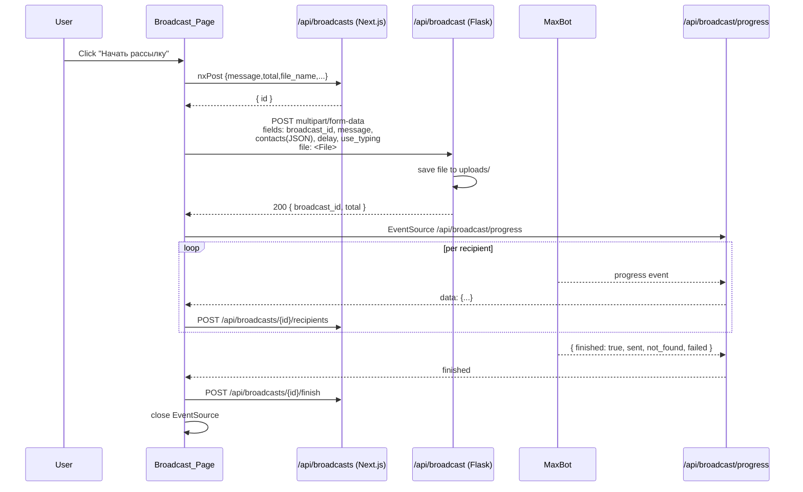
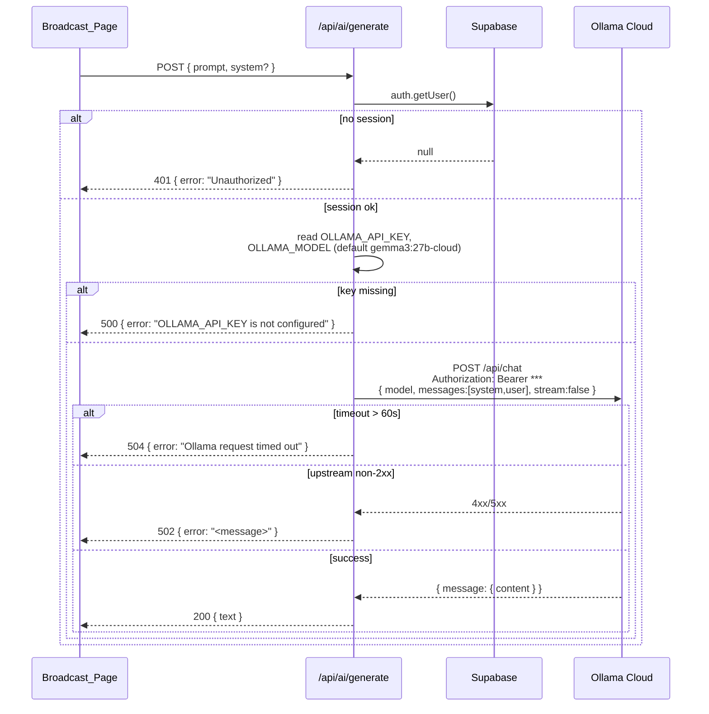
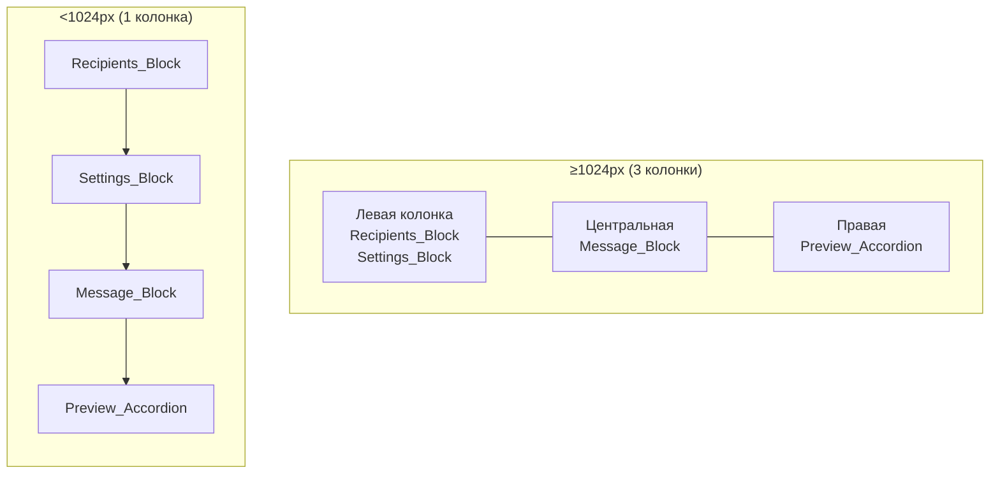

# Design Document

## Overview

Документ описывает архитектуру переработанной страницы `/dashboard/broadcast` (далее — `Broadcast_Page`) и сопутствующих изменений в Next.js API (`Ollama_Proxy`) и Flask backend (`Broadcast_Backend`). Цель — реализовать требования из `requirements.md`:

- трёхколоночный адаптивный макет (`Recipients` + `Settings` слева, `Message` в центре, сворачиваемый `Preview` справа);
- замену URL-вложений на загрузку файлов с устройства (multipart/form-data, лимит 50 MB, любой MIME);
- замену панели переменных/рандом-блоков и кнопки «Проверить текст» на единую кнопку `AI_Generator_Button`, обращающуюся к `Ollama_Cloud` через серверный прокси с защитой ключа;
- авторасширение textarea (5–20 строк, скролл за пределами 20);
- сохранение существующего флоу запуска рассылки (Flask + SSE прогресс).

Ключевые архитектурные решения:

1. **Декомпозиция страницы.** Текущий монолитный `BroadcastPage` (~580 строк) разбивается на чистые презентационные блоки (`Recipients_Block`, `Settings_Block`, `Message_Block`, `Preview_Accordion`) и тонкие компоненты-помощники (`Auto_Grow_Textarea`, `Attachment_Uploader`, `AI_Generator_Button`). Состояние страницы (получатели, текст, вложение, настройки, прогресс) живёт в `Broadcast_Page`; блоки получают `props` и колбэки.
2. **Серверный прокси к Ollama Cloud.** Новый Next.js route handler `frontend/src/app/api/ai/generate/route.ts` использует тот же шаблон Supabase-аутентификации, что и существующие `/api/broadcasts/*`. Ключ читается из `process.env.OLLAMA_API_KEY` и не возвращается клиенту никогда (ни в теле, ни в заголовках).
3. **Multipart-загрузка вложения.** Клиент отправляет multipart/form-data на новый эндпоинт Flask `POST /api/broadcast` (расширяется обработчик так, чтобы принимать как `application/json`, так и `multipart/form-data`), Flask сохраняет файл в `UPLOAD_FOLDER` и передаёт путь в `MaxBot.send_file_by_upload` через адаптер `broadcast_with_uploaded_file`.
4. **Удаление локальной подстановки переменных.** Локальные функции `renderPreviewMessage`/`extractVariables`/`countRandomBlocks` удаляются из `Broadcast_Page`. `Preview_Block` показывает первые пять получателей с одним и тем же текстом сообщения (без рандомизации/подстановки). На стороне Flask существующий `bot.render_message_template` остаётся неизменным, но клиент не оборачивает поля в `{...}` и не предлагает шорткаты — итоговый текст уходит «как есть».

## Architecture

### Высокоуровневая схема

```mermaid
flowchart LR
  subgraph Browser
    BP[Broadcast_Page<br/>page.tsx]
    RB[Recipients_Block]
    SB[Settings_Block]
    MB[Message_Block]
    PA[Preview_Accordion]
    AGT[Auto_Grow_Textarea]
    AU[Attachment_Uploader]
    AI[AI_Generator_Button]
  end

  subgraph "Next.js (server)"
    OP[Ollama_Proxy<br/>/api/ai/generate]
    BR[/api/broadcasts<br/>existing route]
    SUP[Supabase Auth]
  end

  subgraph External
    OC[Ollama Cloud<br/>https://ollama.com/api]
  end

  subgraph "Flask (app.py)"
    FB[/api/broadcast<br/>multipart/json]
    SSE[/api/broadcast/progress]
    UF[(uploads/)]
    BOT[MaxBot.broadcast]
  end

  BP --> RB
  BP --> SB
  BP --> MB
  BP --> PA
  MB --> AGT
  MB --> AU
  MB --> AI

  AI -- POST JSON --> OP
  OP -- session check --> SUP
  OP -- Bearer OLLAMA_API_KEY --> OC

  BP -- nxPost JSON --> BR
  BP -- multipart/form-data --> FB
  FB --> UF
  FB --> BOT
  BP -- EventSource --> SSE
```

### Поток запуска рассылки



### Поток AI-генерации



### Адаптивный макет



CSS реализуется через CSS Grid в существующей дизайн-системе (Tailwind v4, токены из `Design/theme.css`). Контейнер страницы — `grid grid-cols-1 lg:grid-cols-[minmax(280px,360px)_minmax(0,1fr)_minmax(280px,400px)] gap-6`. Левая колонка содержит вертикальный стек `Recipients_Block` → `Settings_Block` (`flex flex-col gap-6`). Кнопка «Начать рассылку» и индикатор прогресса располагаются в нижней части центральной колонки (`Message_Block`), чтобы при адаптиве оставаться доступными в обоих макетах (требование 1.6).

## Components and Interfaces

Все новые компоненты — клиентские (`"use client"`), располагаются в `frontend/src/components/broadcast/`.

### `Broadcast_Page` (`frontend/src/app/dashboard/broadcast/page.tsx`)

Точка входа, держит всё состояние:

```ts
interface BroadcastPageState {
  contacts: BroadcastContact[];
  message: string;
  delay: number;                  // секунды, 1..30
  useTyping: boolean;
  attachment: AttachmentState;    // см. ниже
  aiPending: boolean;
  aiError: string | null;
  uploadError: string | null;
  broadcasting: boolean;
  progress: ProgressEvent | null;
  results: ResultRow[];
  previewExpanded: boolean;       // дефолт true
}

type AttachmentState =
  | { kind: "none" }
  | { kind: "selected"; file: File; sizeBytes: number };
```

Состояние SSE и AbortController хранятся в `useRef`, чтобы корректно очищаться в `useEffect`-cleanup.

### `Recipients_Block`

Презентационный компонент. Поведение и UI идентичны текущему: ввод номера + чипсы + загрузка CSV. Удаляется блок «Доступные переменные из CSV» (требование 4.1) и кнопки `{field}`.

```ts
interface RecipientsBlockProps {
  contacts: BroadcastContact[];
  onAdd(phone: string): void;
  onRemove(index: number): void;
  onCsvUpload(file: File): Promise<void>;
  csvWarnings: string[];
}
```

### `Settings_Block`

```ts
interface SettingsBlockProps {
  delay: number;
  useTyping: boolean;
  onChange(patch: Partial<{ delay: number; useTyping: boolean }>): void;
}
```

Содержит поля «Задержка (сек)» и чекбокс «Имитация набора». UI — переиспользует существующие классы `glass rounded-xl ...`.

### `Message_Block`

```ts
interface MessageBlockProps {
  message: string;
  onMessageChange(value: string): void;
  attachment: AttachmentState;
  onAttachmentSelect(file: File): void;
  onAttachmentRemove(): void;
  uploadError: string | null;
  ai: { pending: boolean; error: string | null; onClick(): void };
  templates: Template[];
  onTemplateSelect(text: string): void;
  canStart: boolean;
  broadcasting: boolean;
  progressPct: number;
  onStart(): void;
  progress: ProgressEvent | null;
  results: ResultRow[];
}
```

Содержит:

- селектор шаблона (если есть);
- `<Auto_Grow_Textarea>`;
- `<Attachment_Uploader>`;
- `<AI_Generator_Button>`;
- кнопку «Начать рассылку» и блок прогресса (требование 1.6).

Удаляется: панель переменных, индикаторы «Переменные» / «Рандом-блоков», кнопка «Проверить текст», текст-помощь про `{name}` / `{a|b|c}`.

### `Auto_Grow_Textarea`

```ts
interface AutoGrowTextareaProps {
  value: string;
  onChange(value: string): void;
  placeholder?: string;
  minLines?: number; // дефолт 5
  maxLines?: number; // дефолт 20
  disabled?: boolean;
}
```

Реализация:

- внутренний `useRef<HTMLTextAreaElement>`;
- при каждом `onChange` и при `useLayoutEffect([value])`:
  1. `el.style.height = 'auto'` (сброс);
  2. читаем `lineHeight` из `getComputedStyle(el)` (если NaN — используется `parseFloat(fontSize) * 1.4`);
  3. `minH = lineHeight * minLines + paddingTop + paddingBottom + borderTop + borderBottom`;
  4. `maxH = lineHeight * maxLines + ...`;
  5. `nextHeight = clamp(el.scrollHeight, minH, maxH)`;
  6. `el.style.height = nextHeight + 'px'`;
  7. `el.style.overflowY = el.scrollHeight > maxH ? 'auto' : 'hidden'`.
- Высота не пересчитывается на `focus`/`blur` — последняя вычисленная сохраняется (требование 5.6). Слушатели событий фокуса не привязываются.

### `Attachment_Uploader`

```ts
interface AttachmentUploaderProps {
  attachment: AttachmentState;
  onSelect(file: File): void;       // вызывается ТОЛЬКО для валидных файлов
  onReject(reason: AttachmentError): void;
  onRemove(): void;
  uploadError: string | null;       // ошибка от Flask из последней попытки
  maxBytes?: number;                // дефолт 50 * 1024 * 1024
}

type AttachmentError =
  | { kind: "too_large"; sizeBytes: number; maxBytes: number };
```

Поведение:

- `<input type="file">` без атрибута `accept` (любой MIME, требование 3.2).
- При выборе файла: если `file.size > maxBytes` → `onReject({ kind: "too_large", ... })`, иначе → `onSelect(file)`.
- При наличии `attachment.kind === "selected"`:
  - показывает имя `attachment.file.name`;
  - показывает размер: `formatBytes(attachment.sizeBytes)` (KiB/MiB);
  - кнопка ✕ → `onRemove()`.
- При наличии `uploadError`: показывает inline-сообщение с кнопкой «Повторить» (которая снаружи перезапускает `startBroadcast`). Файл при этом **не сбрасывается** (требование 3.9).

### `AI_Generator_Button`

```ts
interface AIGeneratorButtonProps {
  pending: boolean;
  onClick(): void;
}
```

Подпись «Использовать AI». При `pending === true`: атрибут `disabled`, спиннер вместо иконки, `aria-busy="true"`. Дополнительно — иконка `Sparkles` из `lucide-react`.

### `Preview_Accordion`

```ts
interface PreviewAccordionProps {
  expanded: boolean;
  onToggle(): void;
  message: string;
  contacts: BroadcastContact[];   // первые 5 — в превью
}
```

Структура:

```html
<section class="glass rounded-xl">
  <header>
    <h3 id="preview-heading">Предпросмотр</h3>
    <button
      type="button"
      aria-expanded={expanded ? "true" : "false"}
      aria-controls="preview-panel"
      onClick={onToggle}>
      <ChevronDown class={expanded ? "rotate-180" : ""}/>
    </button>
  </header>
  {expanded && (
    <div id="preview-panel" role="region" aria-labelledby="preview-heading">
      {contacts.slice(0,5).map(c => (
        <article key={c.phone}>
          <div>{c.phone}</div>
          <div>{message || "Файл без текстовой подписи"}</div>
        </article>
      ))}
      {contacts.length === 0 && <p>Добавьте номера или загрузите CSV...</p>}
    </div>
  )}
</section>
```

`expanded` инициализируется значением `true` (требование 2.6).

### `Ollama_Proxy` (`frontend/src/app/api/ai/generate/route.ts`)

Контракт:

| Поле | Значение |
|------|----------|
| URL  | `POST /api/ai/generate` |
| Auth | Cookie-сессия Supabase (через `createClient()` из `@/lib/supabase/server`) |
| Request body (JSON) | `{ prompt: string; system?: string }` |
| Success response (200) | `{ text: string }` |
| 401 | `{ error: "Unauthorized" }` — если `auth.getUser()` вернул `null` |
| 400 | `{ error: "Invalid body" }` — если `prompt` отсутствует или не строка |
| 500 | `{ error: "OLLAMA_API_KEY is not configured" }` — если `OLLAMA_API_KEY` пуст |
| 502 | `{ error: "<сообщение от Ollama>" }` — если upstream вернул не-2xx |
| 504 | `{ error: "Ollama request timed out" }` — если запрос к Ollama Cloud длился > 60 секунд |

Алгоритм:

```ts
export const dynamic = "force-dynamic";

const OLLAMA_URL = "https://ollama.com/api/chat";
const TIMEOUT_MS = 60_000;
const DEFAULT_MODEL = "gemma3:27b-cloud";

export async function POST(req: NextRequest) {
  const supabase = await createClient();
  const { data: { user } } = await supabase.auth.getUser();
  if (!user) return jsonResponse({ error: "Unauthorized" }, { status: 401 });

  const apiKey = process.env.OLLAMA_API_KEY;
  if (!apiKey) {
    return jsonResponse(
      { error: "OLLAMA_API_KEY is not configured" },
      { status: 500 }
    );
  }
  const model = process.env.OLLAMA_MODEL || DEFAULT_MODEL;

  let body: { prompt?: unknown; system?: unknown };
  try { body = await req.json(); } catch { body = {}; }
  const promptInput = typeof body.prompt === "string" ? body.prompt : "";
  const promptForModel = promptInput.trim()
    || "Сгенерируй маркетинговый текст для рассылки";
  const systemPrompt =
    typeof body.system === "string" && body.system.trim()
      ? body.system
      : buildMarketerSystemPrompt(promptInput);

  const ctrl = new AbortController();
  const timer = setTimeout(() => ctrl.abort(), TIMEOUT_MS);
  let upstream: Response;
  try {
    upstream = await fetch(OLLAMA_URL, {
      method: "POST",
      signal: ctrl.signal,
      headers: {
        "Content-Type": "application/json",
        "Authorization": `Bearer ${apiKey}`,
      },
      body: JSON.stringify({
        model,
        stream: false,
        messages: [
          { role: "system", content: systemPrompt },
          { role: "user", content: promptForModel },
        ],
      }),
    });
  } catch (err: any) {
    clearTimeout(timer);
    if (err?.name === "AbortError") {
      return jsonResponse(
        { error: "Ollama request timed out" },
        { status: 504 }
      );
    }
    return jsonResponse(
      { error: "Ollama upstream error" },
      { status: 502 }
    );
  }
  clearTimeout(timer);

  if (!upstream.ok) {
    const errBody = await upstream.text().catch(() => "");
    const message = extractUpstreamMessage(errBody) || upstream.statusText;
    return jsonResponse({ error: message }, { status: 502 });
  }

  const data = await upstream.json();
  const text: string = (data?.message?.content ?? data?.response ?? "").toString();
  return jsonResponse({ text });
}
```

Особенности:

- `apiKey` читается на сервере, никогда не присутствует в response (только в `Authorization` upstream-запроса).
- `dynamic = "force-dynamic"` — иначе Next может закэшировать.
- Используется встроенный `AbortController` для таймаута 60 c (требование 6.11).
- Поддерживаются оба формата ответа Ollama (`message.content` для `/api/chat`, `response` для `/api/generate`) — для совместимости при возможной смене эндпоинта.

### `Marketer_System_Prompt`

Конструктор системного промпта вынесен в чистый модуль `frontend/src/lib/ai/marketer-prompt.ts`:

```ts
export function isPredominantlyCyrillic(input: string): boolean {
  let cyrillic = 0;
  let latin = 0;
  for (const ch of input) {
    if (/[\p{Script=Cyrillic}]/u.test(ch)) cyrillic++;
    else if (/[\p{Script=Latin}]/u.test(ch)) latin++;
  }
  const total = cyrillic + latin;
  if (total === 0) return true;        // пустой/нелатинский ввод → русский
  return cyrillic / total >= 0.5;
}

export function buildMarketerSystemPrompt(userInput: string): string {
  const ru = isPredominantlyCyrillic(userInput);
  const lang = ru
    ? "Отвечай только на русском языке."
    : "Reply in the same language the user used.";
  return [
    "Ты — AI-маркетолог, специализирующийся на коротких маркетинговых сообщениях для массовых рассылок.",
    "Твоя задача — написать готовый текст рассылки.",
    "Возвращай ТОЛЬКО итоговый текст рассылки, без поясняющих комментариев и без Markdown-форматирования.",
    lang,
  ].join(" ");
}
```

Правило: счётчик считает **только буквы** (cyrillic vs latin); цифры, пунктуация и пробелы игнорируются. Если буквенных символов нет вообще, считаем ввод русским (и попадает в дефолтный промпт «Сгенерируй маркетинговый текст для рассылки», требование 7.5).

### Изменения в `Broadcast_Backend` (`app.py`)

Эндпоинт `POST /api/broadcast` расширяется так, чтобы принимать **либо** `application/json` (как сейчас), **либо** `multipart/form-data`.

```python
@app.route('/api/broadcast', methods=['POST'])
def api_broadcast():
    global _broadcast_active
    if _broadcast_active:
        return jsonify({'error': 'Рассылка уже запущена'}), 409

    content_type = (request.content_type or '').lower()
    uploaded_path = None
    uploaded_name = None

    if content_type.startswith('multipart/'):
        # multipart form: contacts/phones приходят как JSON-строки
        raw_contacts = json.loads(request.form.get('contacts') or '[]')
        phones = json.loads(request.form.get('phones') or '[]')
        message = (request.form.get('message') or '').strip()
        delay = float(request.form.get('delay') or 3)
        use_typing = (request.form.get('use_typing') or '').lower() in ('1','true','yes','on')
        broadcast_id = request.form.get('broadcast_id') or 1
        f = request.files.get('file')
        if f and f.filename:
            safe_name = secure_filename(f.filename)
            uploaded_name = safe_name
            uploaded_path = os.path.join(UPLOAD_FOLDER, f"bcast_{int(time.time())}_{safe_name}")
            f.save(uploaded_path)
    else:
        data = request.get_json(force=True)
        raw_contacts = data.get('contacts')
        phones = data.get('phones', [])
        message = (data.get('message') or '').strip()
        delay = float(data.get('delay', 3))
        use_typing = bool(data.get('use_typing', False))
        broadcast_id = data.get('broadcast_id') or 1
        # legacy URL-based attachments: больше клиентом не используются,
        # но обработчик принимает их для обратной совместимости
        legacy_url = (data.get('file_url') or '').strip() or None
        legacy_name = (data.get('file_name') or '').strip() or None
        if legacy_url:
            uploaded_path = legacy_url        # маркер «использовать URL»
            uploaded_name = legacy_name or legacy_url.rstrip('/').split('/')[-1] or 'attachment'

    # ... валидация contacts (тот же код, что раньше) ...

    if not message and not uploaded_path:
        return jsonify({'error': 'Укажите сообщение или файл'}), 400

    request_bot = current_bot()

    def run():
        global _broadcast_active
        _broadcast_active = True
        try:
            if uploaded_path and content_type.startswith('multipart/'):
                request_bot.broadcast_with_uploaded_file(
                    contacts, message, uploaded_path, uploaded_name,
                    delay=delay, use_typing=use_typing,
                    progress_cb=progress_cb,
                )
            else:
                request_bot.broadcast(
                    contacts, message, delay=delay,
                    progress_cb=progress_cb,
                    use_typing=use_typing,
                    file_url=uploaded_path, file_name=uploaded_name,
                )
        finally:
            if uploaded_path and content_type.startswith('multipart/'):
                try: os.remove(uploaded_path)
                except OSError: pass
            sse_push({'done': len(contacts), 'total': len(contacts),
                      'finished': True, 'broadcast_id': broadcast_id, **counters})
            _broadcast_active = False

    threading.Thread(target=run, daemon=True).start()
    return jsonify({'broadcast_id': broadcast_id, 'total': len(contacts)})
```

В `bot.py` добавляется тонкая обёртка:

```python
def broadcast_with_uploaded_file(self, contacts, message, file_path, file_name,
                                 delay=2.0, use_typing=False, progress_cb=None):
    """Загружает файл в GREEN-API один раз и рассылает по полученному URL."""
    upload = self._upload_local_file(file_path)  # GREEN-API uploadFile
    if not upload or 'urlFile' not in upload:
        # Считаем все отправки failed (вернётся через progress_cb)
        for i, c in enumerate(contacts):
            phone = (c.get('phone') if isinstance(c, dict) else str(c)) or ''
            result = {'phone': phone, 'status': 'error', 'message_id': None,
                      'rendered_message': message, 'contact_data': c}
            if progress_cb: progress_cb(i+1, len(contacts), result)
        return
    return self.broadcast(contacts, message, delay=delay, progress_cb=progress_cb,
                          use_typing=use_typing,
                          file_url=upload['urlFile'], file_name=file_name)
```

(`_upload_local_file` уже существует внутри `send_file_by_upload` — будет вынесена в отдельный private-метод.)

## Data Models

Никаких изменений в БД (Prisma) и в схеме `Broadcast`/`Recipient` не требуется. Поле `file_url` в таблице `Broadcast` остаётся: при multipart-загрузке туда будет записываться **имя загруженного файла** (без URL) или `null`.

### Клиентские типы

```ts
// frontend/src/components/broadcast/types.ts
export type AttachmentState =
  | { kind: "none" }
  | { kind: "selected"; file: File; sizeBytes: number };

export type AttachmentError =
  | { kind: "too_large"; sizeBytes: number; maxBytes: number };

export interface AIGenerateRequest {
  prompt: string;
  system?: string;
}
export interface AIGenerateResponse {
  text: string;
}
export interface AIGenerateError {
  error: string;
}

export interface ResultRow {
  phone: string;
  status: "sent" | "not_found" | "error";
  rendered_message?: string;
}

export interface ProgressEvent {
  done: number;
  total: number;
  phone?: string;
  status?: "sent" | "not_found" | "error";
  message_id?: string;
  rendered_message?: string;
  contact_data?: Record<string, string>;
  broadcast_id?: number;
  sent?: number;
  not_found?: number;
  failed?: number;
  finished?: boolean;
}
```

### Константы

```ts
export const ATTACHMENT_MAX_BYTES = 50 * 1024 * 1024; // 50 MB
export const TEXTAREA_MIN_LINES = 5;
export const TEXTAREA_MAX_LINES = 20;
export const PREVIEW_RECIPIENT_LIMIT = 5;
export const OLLAMA_TIMEOUT_MS = 60_000;
export const OLLAMA_DEFAULT_MODEL = "gemma3:27b-cloud";
```

### Helper-клиент для AI

```ts
// frontend/src/lib/ai/client.ts
export async function requestAiText(
  prompt: string,
  signal?: AbortSignal,
): Promise<string> {
  const res = await fetch("/api/ai/generate", {
    method: "POST",
    signal,
    headers: { "Content-Type": "application/json" },
    body: JSON.stringify({ prompt }),
  });
  if (!res.ok) {
    const body = await res.json().catch(() => ({}));
    throw new Error(body?.error || res.statusText);
  }
  const data = await res.json() as { text: string };
  return data.text || "";
}
```

### Helper-загрузчик рассылки

```ts
// frontend/src/lib/broadcast/start.ts
export async function postBroadcast(payload: {
  broadcast_id: number;
  message: string;
  contacts: BroadcastContact[];
  delay: number;
  use_typing: boolean;
  attachment: File | null;
}): Promise<{ broadcast_id: number; total: number }> {
  const fd = new FormData();
  fd.append("broadcast_id", String(payload.broadcast_id));
  fd.append("message", payload.message);
  fd.append("contacts", JSON.stringify(payload.contacts));
  fd.append("phones", JSON.stringify(payload.contacts.map(c => c.phone)));
  fd.append("delay", String(payload.delay));
  fd.append("use_typing", payload.use_typing ? "1" : "0");
  if (payload.attachment) fd.append("file", payload.attachment, payload.attachment.name);
  return apiUpload("/api/broadcast", fd);
}
```


## Correctness Properties

*Свойство (property) — это характеристика или поведение, которое должно выполняться во всех валидных исполнениях системы. Свойства служат мостом между человеко-читаемой спецификацией и машинно-проверяемыми гарантиями корректности: каждое свойство ниже сформулировано как универсальный квантор «для любого…» и сопровождается ссылкой на акцептационные критерии, которые оно валидирует.*

После пре-аналитической классификации (см. вызов `prework`) акцептационные критерии были сгруппированы и сведены к 13 неизбыточным свойствам. Свойства покрывают: валидацию вложения, авторасширение textarea, выбор языка маркетинг-промпта, секретность API-ключа, маппинг статусов прокси, дефолтное сообщение, аккордеон превью, адаптивный макет, правило активации кнопки запуска, формат multipart-payload, отсутствие публичных переменных окружения с ключом, корректную очистку SSE при размонтировании.

### Property 1: Валидация вложения по размеру

*For any* выбранного `File`, валидация в `Attachment_Uploader` SHALL детерминированно зависеть только от `file.size`: если `file.size <= 50 * 1024 * 1024`, то `onSelect(file)` вызывается ровно один раз, состояние принимает значение `{ kind: "selected", file, sizeBytes: file.size }` и `uploadError` не выставляется; если `file.size > 50 * 1024 * 1024`, то `onSelect` не вызывается, `onReject({ kind: "too_large", sizeBytes, maxBytes })` вызывается ровно один раз, состояние остаётся `{ kind: "none" }`, и UI показывает сообщение об ошибке с указанием максимального размера.

**Validates: Requirements 3.2, 3.4, 3.6**

### Property 2: Высота `Auto_Grow_Textarea`

*For any* значения `value` поля `Auto_Grow_Textarea` после `useLayoutEffect`-пересчёта SHALL выполняться:
1. `el.style.height` (в пикселях) равен `clamp(el.scrollHeight, minH, maxH)`, где `minH` и `maxH` посчитаны из `lineHeight`, padding и border при `minLines=5`, `maxLines=20`;
2. `el.style.overflowY === "auto"` тогда и только тогда, когда `scrollHeight > maxH`, иначе `overflowY === "hidden"`.

**Validates: Requirements 5.2, 5.3, 5.4, 5.5**

### Property 3: Идемпотентность фокуса в `Auto_Grow_Textarea`

*For any* значения `value` события `focus` и `blur` на элементе `Auto_Grow_Textarea` SHALL не изменять `el.style.height`: высота, измеренная до серии любых focus/blur-событий, равна высоте, измеренной после.

**Validates: Requirements 5.6**

### Property 4: Чистая функция `isPredominantlyCyrillic`

*For any* строки `s` функция `isPredominantlyCyrillic(s)` SHALL возвращать `true` тогда и только тогда, когда `cyrillic_letters(s) / (cyrillic_letters(s) + latin_letters(s)) >= 0.5`, где счётчики `cyrillic_letters` и `latin_letters` учитывают только кодовые точки со скриптом `Cyrillic`/`Latin` и игнорируют цифры, пунктуацию и пробельные символы; для строки без латинских и кириллических букв (включая пустую) функция SHALL возвращать `true`.

**Validates: Requirements 7.3**

### Property 5: Инварианты `Marketer_System_Prompt`

*For any* пользовательского ввода `userInput`, результат `buildMarketerSystemPrompt(userInput)` SHALL удовлетворять одновременно:
1. содержит явное упоминание роли маркетолога и маркетинговых рассылок;
2. содержит инструкцию возвращать только итоговый текст без поясняющих комментариев и без Markdown-форматирования;
3. содержит языковую директиву, согласованную с `isPredominantlyCyrillic(userInput)`: если функция вернула `true` — директива требует русского языка, иначе — отвечать на языке пользователя.

**Validates: Requirements 7.2, 7.3, 7.4**

### Property 6: Секретность `OLLAMA_API_KEY`

*For any* HTTP-ответа `Ollama_Proxy` (любого статуса: 200/400/401/500/502/504), значение `process.env.OLLAMA_API_KEY` SHALL не присутствовать ни в теле ответа (после JSON-сериализации), ни в значении любого заголовка ответа, ни в поле `error`.

**Validates: Requirements 6.9, 8.1**

### Property 7: Маппинг статусов `Ollama_Proxy`

*For any* комбинации входных условий, `Ollama_Proxy` SHALL возвращать единственный детерминированный статус и форму тела:

- нет валидной Supabase-сессии → `401 { error: "Unauthorized" }`;
- сессия валидна, `OLLAMA_API_KEY` пуст → `500 { error: "OLLAMA_API_KEY is not configured" }`;
- сессия валидна, ключ задан, тело запроса не разбирается как JSON или `prompt` не строка → `400 { error: "Invalid body" }`;
- upstream-запрос отменён по таймауту 60 с (`AbortError`) → `504 { error: "Ollama request timed out" }`;
- upstream вернул статус вне диапазона 2xx → `502 { error: <извлечённое сообщение> }`;
- upstream вернул 2xx → `200 { text: string }`, где `text` извлечён из `message.content` или `response`.

В каждой ветке upstream-запрос SHALL уходить с заголовком `Authorization: Bearer ${OLLAMA_API_KEY}` и моделью `process.env.OLLAMA_MODEL || "gemma3:27b-cloud"`.

**Validates: Requirements 6.2, 6.3, 6.4, 6.5, 6.6, 6.7, 6.8, 6.10, 6.11, 8.4**

### Property 8: Дефолтный пользовательский запрос

*For any* JSON-тела запроса к `Ollama_Proxy` со строкой `prompt` такой, что `prompt.trim() === ""`, и для любого случая отсутствия поля `prompt`, сообщение с ролью `user`, отправленное в `Ollama_Cloud`, SHALL равняться `"Сгенерируй маркетинговый текст для рассылки"`. В противном случае сообщение `user` SHALL равняться оригинальному `prompt` (без `trim`).

**Validates: Requirements 7.5**

### Property 9: Поведение `Preview_Accordion`

*For any* массива получателей `contacts` и любой последовательности нажатий кнопки переключения `Preview_Accordion` SHALL выполняться:
1. при первом монтировании компонента `aria-expanded === "true"`;
2. атрибут `aria-expanded` на кнопке всегда равен строковому представлению текущего состояния (`"true"`/`"false"`);
3. каждое нажатие кнопки инвертирует состояние; после `k` нажатий состояние равно `initial XOR (k mod 2)`;
4. при `expanded === false` в DOM присутствуют заголовок «Предпросмотр» и кнопка переключения, а список примеров отсутствует;
5. при `expanded === true` в DOM присутствуют ровно `min(contacts.length, 5)` карточек примеров.

**Validates: Requirements 2.3, 2.4, 2.5, 2.6, 2.7**

### Property 10: Адаптивный макет `Broadcast_Page`

*For any* ширины viewport `w`:
- если `w >= 1024` пикселей, `Broadcast_Page` SHALL рендерить ровно три grid-колонки в порядке слева направо: левая колонка содержит `Recipients_Block`, затем `Settings_Block`; центральная — `Message_Block`; правая — `Preview_Accordion`;
- если `w < 1024` пикселей, `Broadcast_Page` SHALL рендерить одну колонку в порядке `Recipients_Block` → `Settings_Block` → `Message_Block` → `Preview_Accordion`;
- независимо от `w`, в DOM присутствуют кнопка «Начать рассылку» и контейнер прогресса.

**Validates: Requirements 1.1, 1.2, 1.3, 1.4, 1.5, 1.6**

### Property 11: Правило активации кнопки запуска рассылки

*For any* состояния `Broadcast_Page` атрибут `disabled` кнопки «Начать рассылку» SHALL быть `true` тогда и только тогда, когда `state.message.trim() === ""` И `state.attachment.kind === "none"`.

**Validates: Requirements 9.3**

### Property 12: Структура multipart-payload запуска рассылки

*For any* состояния `Broadcast_Page` в момент запуска рассылки, `FormData`, отправляемая на `POST /api/broadcast`, SHALL содержать:
1. поля `broadcast_id`, `message`, `contacts` (как JSON-строка), `phones` (как JSON-строка), `delay`, `use_typing` (значения `"0"`/`"1"`);
2. поле `file` тогда и только тогда, когда `state.attachment.kind === "selected"`; в этом случае значение `file` равно исходному объекту `File`, без переименования или преобразования содержимого;
3. при `state.attachment.kind === "none"` поле `file` отсутствует в `FormData` целиком.

**Validates: Requirements 3.7, 9.1**

### Property 13: Очистка `EventSource` при размонтировании

*For any* активной рассылки с открытым SSE-соединением, размонтирование компонента `Broadcast_Page` (или навигация со страницы) SHALL приводить к вызову `EventSource.close()` ровно один раз и установке `state.broadcasting = false`; повторного вызова `close()` или утечки соединения SHALL не происходить.

**Validates: Requirements 9.4**

## Error Handling

Документ описывает, как каждый класс сбоев распространяется через слои клиент → Next.js API → Flask backend и как пользователь видит результат. Все сбои логируются на сервере (без значения `OLLAMA_API_KEY`); клиент показывает локализованные сообщения и сохраняет ввод, чтобы пользователь мог повторить попытку.

### Сбои в `Attachment_Uploader`

| Сценарий | Поведение |
|----------|-----------|
| `file.size > 50 * 1024 * 1024` | `Attachment_Uploader` вызывает `onReject({ kind: "too_large", sizeBytes, maxBytes })`; `Broadcast_Page` показывает inline-ошибку «Файл больше 50 МБ» рядом с полем загрузки; файл **не сохраняется** в `state.attachment` (остаётся `{ kind: "none" }`). |
| Сбой при загрузке (`POST /api/broadcast` вернул не-2xx или сеть недоступна) | `Broadcast_Page` устанавливает `state.uploadError` со сформулированным сообщением, **но не сбрасывает** `state.attachment` (требование 3.9). `Attachment_Uploader` показывает кнопку «Повторить»; повторный запуск использует тот же объект `File` без повторного выбора пользователем. |

### Сбои в AI-генерации (`AI_Generator_Button` + `Ollama_Proxy`)

| Сценарий | Поведение |
|----------|-----------|
| Параллельный клик пока `aiPending === true` | Кнопка имеет `disabled`/`aria-busy="true"`; повторный клик игнорируется на уровне DOM и не порождает второго `fetch`. |
| `Ollama_Proxy` вернул не-2xx | Клиент `requestAiText` бросает `Error(body.error || statusText)`; `Broadcast_Page` сохраняет исходный `state.message` без изменений (требование 4.8) и устанавливает `state.aiError`. |
| Размонтирование/отмена в момент запроса | Клиент держит `AbortController`; в cleanup `useEffect` вызывает `controller.abort()`; ошибка `AbortError` поглощается без установки `aiError`. |
| Отсутствует `OLLAMA_API_KEY` | `Ollama_Proxy` возвращает `500 { error: "OLLAMA_API_KEY is not configured" }`; в логах отображается отсутствие конфигурации без вывода других секретов. |
| Нет валидной Supabase-сессии | `Ollama_Proxy` возвращает `401 { error: "Unauthorized" }`; клиент перенаправляет пользователя на `/login` (через существующий слой обработчиков 401). |
| Невалидное тело запроса (не JSON, `prompt` не строка) | `Ollama_Proxy` возвращает `400 { error: "Invalid body" }`. |
| Upstream Ollama вернул не-2xx | `Ollama_Proxy` возвращает `502 { error: <извлечённое сообщение> }`. Извлечение реализуется как best-effort парсинг JSON; если парсинг падает — используется `upstream.statusText`. |
| Таймаут 60 с | `AbortController` срабатывает через `setTimeout(60_000)`; `Ollama_Proxy` ловит `AbortError`, возвращает `504 { error: "Ollama request timed out" }` и логирует продолжительность запроса. |

### Сбои запуска рассылки (`POST /api/broadcast`)

| HTTP-код | Причина | Поведение клиента |
|----------|---------|-------------------|
| `409` | `_broadcast_active === True` (рассылка уже запущена другим процессом/вкладкой) | `Broadcast_Page` показывает баннер «Рассылка уже запущена», не сбрасывает `state.message`/`state.attachment`. |
| `400` | Контакты пустые/невалидные, либо `message` и `attachment` оба пусты | Клиент показывает inline-ошибку, не очищает форму. |
| `5xx` (включая ошибки парсинга multipart) | Внутренняя ошибка Flask | Клиент устанавливает `state.uploadError`; `state.attachment` сохраняется для retry. |

### Сбои SSE прогресса

| Сценарий | Поведение |
|----------|-----------|
| `EventSource.onerror` | Обработчик закрывает соединение через `es.close()`, выставляет `state.broadcasting = false` и показывает баннер «Соединение прервано». |
| Размонтирование `Broadcast_Page` во время активного соединения | `useEffect` cleanup вызывает `esRef.current?.close()`; ссылка обнуляется (`esRef.current = null`), повторного `close()` не происходит. |
| Получение `finished: true` | Клиент закрывает соединение, шлёт `POST /api/broadcasts/{id}/finish`, переходит в режим показа итогов. |

### Очистка временных файлов на стороне Flask

Эндпоинт `POST /api/broadcast` сохраняет загруженный файл в `UPLOAD_FOLDER` под уникальным именем `bcast_{ts}_{secure_name}`. Поток рассылки `run()` обёрнут в `try/finally`: блок `finally` гарантирует `os.remove(uploaded_path)` даже при исключении внутри `MaxBot.broadcast_with_uploaded_file`. Ошибки `OSError` при удалении проглатываются (но логируются), чтобы не маскировать первичную ошибку рассылки.

### Сбои в `/api/broadcasts` (Next.js API)

`POST /api/broadcasts` создаёт запись в Prisma и возвращает `id`. Если Prisma бросила исключение, клиент получает `500`, показывает `state.uploadError` и сохраняет `state.message`/`state.contacts`/`state.attachment` без изменений. Дальнейший запуск Flask не выполняется, пока `id` не получен. Для ошибок 4xx из этого роутера ошибка отображается как inline-сообщение возле кнопки запуска без сброса формы.

### Логирование

Все ошибки, видимые пользователю, дополнительно логируются на сервере с уровнем `error`, но без значений `OLLAMA_API_KEY`, `Authorization`-заголовков и тел `multipart/form-data` (только метаданные: имя файла, размер, MIME).

## Testing Strategy

Стратегия тестирования сочетает unit-тесты, property-based тесты, тесты Next.js route-handler-ов с моками и компонентные React-тесты. Property-based тестирование применимо в этой фиче: значительная часть логики (валидация, маппинг статусов, чистые функции, layout-инварианты, формат payload) допускает универсальные кванторы и значительно выигрывает от 100+ итераций. UI-эстетика и инфраструктура (Supabase auth, реальные обращения к Ollama Cloud) тестируются примерами или интеграционно.

### 1. Unit-тесты (Vitest или Jest)

Расположение: `frontend/src/**/__tests__/*.test.ts` для модулей и `*.test.tsx` для компонентов.

- `lib/ai/marketer-prompt.ts`:
  - таблица примеров для `isPredominantlyCyrillic`: `""`, `"Hello"`, `"Привет"`, `"Hi там"`, `"123!"`, mixed Cyrillic-Latin с разной долей;
  - таблица для `buildMarketerSystemPrompt`: проверка наличия ключевых подстрок («маркетолог», «без Markdown», русская/английская директива);
- `lib/ai/client.ts` — `requestAiText`:
  - 200 → возвращает `text`;
  - 400/401/500/502/504 → бросает `Error` с правильным сообщением;
- `lib/broadcast/start.ts` — `postBroadcast`:
  - формирует ожидаемые поля FormData при наличии и отсутствии файла.

### 2. Property-based тесты (`fast-check`)

Каждый property test минимум 100 итераций, тэг в комментарии: `// Feature: broadcast-page-redesign, Property N: <текст>`.

| Property | Генераторы | Что проверяем |
|----------|-----------|---------------|
| 1 — Валидация вложения | `fc.record({ name, size, type })` для File-like, varying size around 50MB boundary | детерминированный split на accept/reject + state |
| 2 — Auto_Grow_Textarea высота | `fc.string` (включая многострочные) | `clamp(scrollHeight, minH, maxH)` + overflowY |
| 3 — Идемпотентность фокуса | random sequences of `focus`/`blur` events | высота не меняется |
| 4 — `isPredominantlyCyrillic` | `fc.stringOf(fc.constantFrom(...cyrillicChars, ...latinChars, ...digits, ...punct))` | сверка с reference impl, edge case empty |
| 5 — `Marketer_System_Prompt` инварианты | произвольные `userInput` | подстроки + соответствие `isPredominantlyCyrillic` |
| 6 — Секретность ключа | произвольные ключи (`fc.string({minLength:1,maxLength:200})`), произвольные сценарии (auth/no-auth/upstream-status) | ключ не появляется ни в одном поле response |
| 7 — Маппинг статусов | tuple (auth: bool, key: string?, body: any, upstreamStatus: int or "abort") | детерминированный (status, body) |
| 8 — Дефолтный prompt | `fc.string` ∪ строки только из whitespace | upstream messages\[1\].content |
| 9 — `Preview_Accordion` | `fc.array(fc.boolean)` (последовательность кликов) + произвольный `contacts` | aria-expanded, items count, header presence |
| 10 — Layout breakpoint | `fc.integer({min:200,max:2400})` (ширина) | grid columns / single-column order |
| 11 — Start-button disabled | tuple (message: string, attachment: AttachmentState) | соответствие правилу |
| 12 — Multipart payload | произвольные state-снимки | поля FormData |
| 13 — EventSource cleanup | произвольные сценарии mount/unmount | `close()` вызвался ровно 1 раз |

Property-based тесты для DOM-инвариантов (`9`, `10`, `13`) запускаются через React Testing Library с jsdom; реальный браузерный layout заменяется проверкой структурных классов (`lg:grid-cols-...`) и порядка `getAllByTestId(...)`.

### 3. Route-handler integration tests (`/api/ai/generate`)

Расположение: `frontend/src/app/api/ai/generate/__tests__/route.test.ts`.

Моки:
- `@/lib/supabase/server` → `createClient` возвращает фейк с `auth.getUser()` (управляемый);
- глобальный `fetch` подменяется через `vi.stubGlobal("fetch", ...)`;
- `process.env.OLLAMA_API_KEY` и `OLLAMA_MODEL` подменяются через `vi.stubEnv`.

Сценарии (по одному на каждую ветку маппинга):
- 200 (success: упfront-стрим возвращает `{ message: { content: "ok" } }`);
- 400 (тело — невалидный JSON; `prompt` — число);
- 401 (auth.getUser() → null);
- 500 (нет `OLLAMA_API_KEY`);
- 502 (upstream вернул 503 с JSON `{error:"x"}` и без него);
- 504 (`fetch` бросает `AbortError`).

Также один property-based тест поверх этого роутера для Property 7 — генератор tuple входных условий и проверка детерминированности.

### 4. React Testing Library — компонентные тесты

- `Preview_Accordion.test.tsx`:
  - дефолт `aria-expanded="true"`;
  - click → `aria-expanded="false"`, items не в DOM;
  - 7 контактов → отображается ровно 5 в раскрытом виде.
- `Message_Block.test.tsx`:
  - кнопка «Начать рассылку» disabled при пустом message+attachment;
  - не disabled при наличии message;
  - не disabled при наличии attachment.
- `AI_Generator_Button.test.tsx`:
  - `pending=true` → `disabled` и `aria-busy="true"`, спиннер;
  - `pending=false` → активна, иконка `Sparkles`.
- `Attachment_Uploader.test.tsx`:
  - выбор файла > 50 MB не вызывает `onSelect`, показывает ошибку;
  - валидный файл вызывает `onSelect`, показывает имя и форматированный размер;
  - кнопка ✕ вызывает `onRemove`.
- `Auto_Grow_Textarea.test.tsx`:
  - проверка через mock `getComputedStyle` и `scrollHeight` — высота лежит в `[minH, maxH]`.

### 5. End-to-end (опционально, Playwright)

Расположение: `frontend/e2e/broadcast.spec.ts`. Запускается локально/в CI с поднятым Flask-моком.

- Брейкпоинт `1024px`: при ширине окна 1280 видны 3 колонки в правильном порядке; при 800 — одна.
- Полный сценарий: добавить контакт → ввести текст → прикрепить файл 1 KB → запустить рассылку → дождаться `finished` → итоги.
- AI-кнопка (Ollama замокана через MSW или dev-роут): нажатие меняет текст в textarea.

### 6. Backend (Python)

Расположение: `tests/test_app_broadcast.py` (pytest + Flask `test_client`).

- `multipart` payload: контакты JSON, файл сохраняется в `UPLOAD_FOLDER`, удаляется после `run()` (`finally`);
- legacy `application/json` путь работает с `file_url`;
- 409 при `_broadcast_active = True`;
- 400 при пустом message и отсутствии файла;
- невалидный JSON в полях `contacts`/`phones` обрабатывается без 500 (возвращается 400 с понятным сообщением).

`MaxBot.broadcast_with_uploaded_file` тестируется отдельно с замоканым `_upload_local_file`: при сбое upload все получатели проходят через `progress_cb` со статусом `error`.

### 7. Manual QA-чеклист

Перед релизом:

- проверка трёх адаптивных брейкпоинтов: 1440 / 1024 / 768 / 375;
- прикрепление файлов разных MIME (`.pdf`, `.png`, `.mp4`, `.zip`, `.exe`, без расширения);
- попытка прикрепления файла > 50 MB (например, 60 MB MP4) — отклоняется с inline-ошибкой;
- AI-кнопка: пустой prompt, кириллический prompt, латинский prompt, смешанный;
- сценарий offline: отключить сеть на этапе `POST /api/broadcast` — увидеть `uploadError` и кнопку «Повторить», файл сохранён;
- закрытие вкладки во время активной рассылки — сервер не зависает, временный файл удалён.

### 8. Покрытие и CI

- Минимальное покрытие unit+property: 80% для `lib/ai/*`, `lib/broadcast/*`, `components/broadcast/*`.
- В CI прогон: `pnpm test` (jest/vitest), `pytest`, опционально `pnpm exec playwright test --reporter=list`.
- Property-based тесты конфигурируются на 100 итераций (`fc.configureGlobal({ numRuns: 100 })`); счётчик seed логируется при падении для воспроизводимости.
