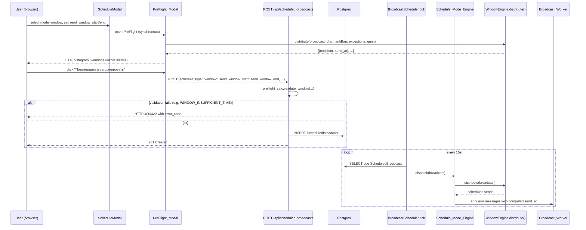
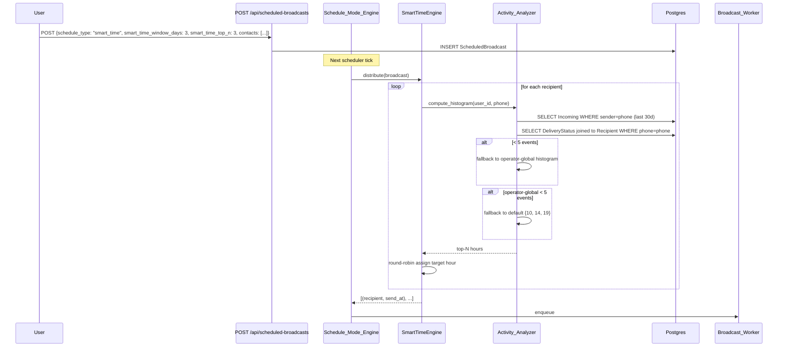
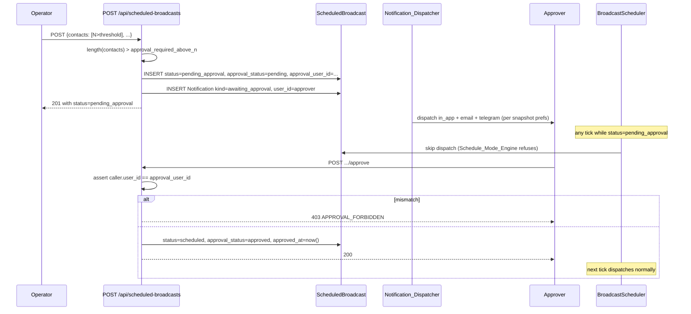
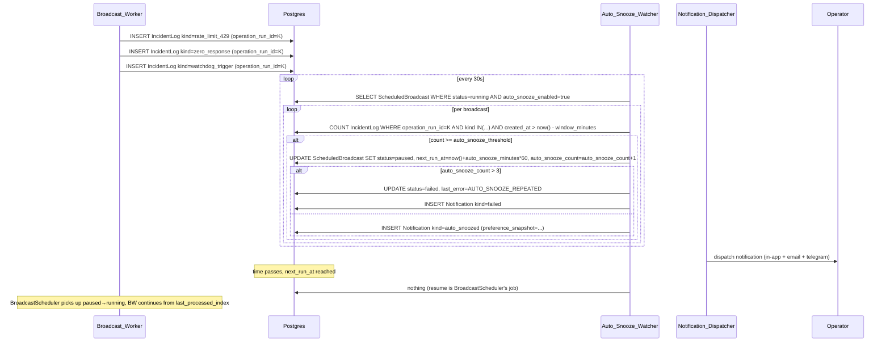
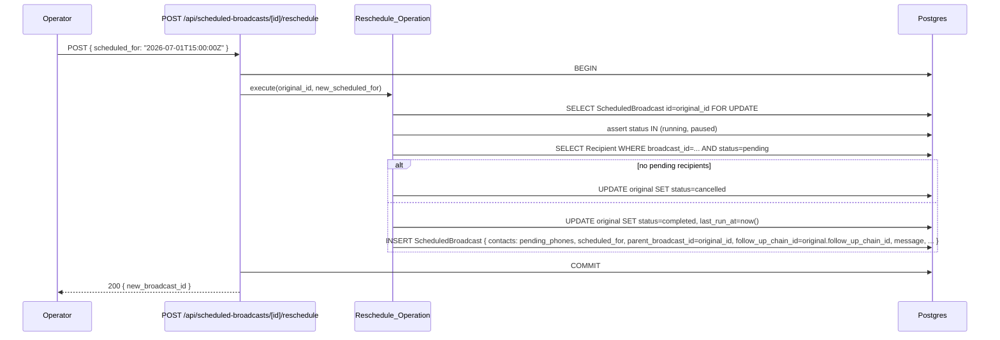
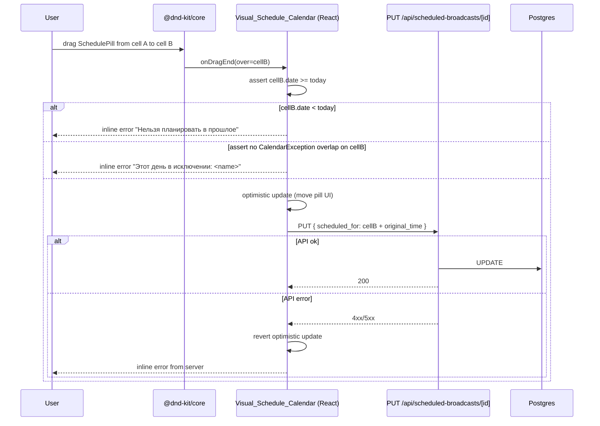

# Design Document

## Overview

Фича `broadcast-scheduling-suite` — это **расширение** уже работающей системы `enhanced-broadcast-scheduling`. Все её модули встают **рядом** с существующим планировщиком, broadcast worker, моделями `ScheduledBroadcast`, `FollowUpChain`, `ABTest`, `CalendarException`, `ScheduleTemplate`, `AntiBanConfig` и `Adaptive_Throttle`. Этот документ описывает, как именно новые режимы (`window`, `smart_time`, `ab_time`, `burst`), визуальный календарь, PreFlight Preview, Snooze, Approval, Auto-Snooze, Notifications и Active Broadcast Controls подключаются к уже имеющейся архитектуре, не переписывая её.

### Что НЕ переписывается

- `ScheduledBroadcast` — расширяется новыми колонками, но не переименовывается, не переразделяется и не переносится в другую таблицу.
- `FollowUpChain`, `FollowUpRecipient`, `ABTest`, `ABTestRecipient`, `CalendarException`, `ScheduleTemplate`, `GreenInstance`, `AntiBanConfig`, `IncidentLog`, `OperationRun` — используются как есть.
- `adaptive_throttle.py`, broadcast worker, scheduler tick (15 секунд), `Rate_Limiter`, `Watchdog`, `State_Monitor` — переиспользуются. Burst Mode и Auto-Snooze хукаются в существующие точки расширения, а не дублируют их.

### Что добавляется

| Подсистема | Расположение | Назначение |
|------------|--------------|------------|
| `Schedule_Mode_Engine` | Flask, новый модуль `scheduling/` | Диспетчеризация по `schedule_type`. Каждый режим — отдельная стратегия (`WindowEngine`, `SmartTimeEngine`, `ABTimeEngine`, `BurstEngine`). Старые режимы (`exact`, `drip`, `recurring`) продолжают обслуживаться существующим scheduler tick. |
| `Activity_Analyzer` | Flask, `scheduling/activity_analyzer.py` | Pure-функция, агрегирует `Incoming` + `DeliveryStatus` за 30 дней, кэширует Activity_Histogram на 1 час. |
| `Visual_Schedule_Calendar` | Next.js, `/dashboard/scheduled/calendar` | Клиентский календарь на `@dnd-kit/core` с drag-and-drop. Drop вызывает существующий `PUT /api/scheduled-broadcasts/[id]`. |
| `PreFlight_Engine` | Next.js (TS), синхронный | Расчёт ETA + warnings в браузере. Серверный mirror `preflight_calc.py` — для повторной валидации перед записью в БД. |
| `Auto_Snooze_Watcher` | Flask, отдельный thread | Запускается из `app.py` рядом с `Scheduler`, периодически считает инциденты и пауcит broadcast'ы. |
| `Notification_Dispatcher` | Flask, отдельный thread | Snapshot-preferences-at-creation, доставляет in-app/email/Telegram, retry с back-off. |
| `Approval_Workflow` | расширение `ScheduledBroadcast` | Новые колонки `approval_*` + два API-эндпойнта (`/approve`, `/reject`). Без отдельной таблицы. |
| `Burst_Mode` | флаг в broadcast worker | Не отдельный worker, а конфигурация существующего: пропуск длинных пауз, `delay_min` без джиттера, принудительный `Adaptive_Throttle`. |
| `Reschedule_Operation` | Next.js API + транзакция | Атомарно: создание нового `ScheduledBroadcast` для оставшихся получателей, статус оригинала меняется на `completed`/`cancelled`, копируется `follow_up_chain_id`. |

### Ключевые архитектурные решения

- **Schedule_Mode_Engine — strategy pattern.** `ScheduledBroadcast.schedule_type` остаётся единым полем. Диспетчер регистрирует словарь `{schedule_type → engine}`. Старые значения (`exact`, `drip`, `recurring`) обслуживаются существующим путём. Новые (`window`, `smart_time`, `ab_time`, `burst`) делегируют новым стратегиям. Это даёт расширяемость без изменения внешнего контракта `ScheduledBroadcast`.
- **Pure functions for distribution.** `WindowEngine.distribute(...)`, `SmartTimeEngine.distribute(...)`, `ABTimeEngine.distribute(...)` — pure-функции, возвращающие массив пар `(recipient, send_at)`. Это критично для property-based тестов (детерминированность, отсутствие side-эффектов) и для PreFlight Preview, который вызывает ту же логику без записи в БД.
- **Detailed-server-side-mirror для PreFlight.** Расчёт ETA в браузере (TypeScript) и на сервере (Python) использует ОДИНАКОВУЮ формулу. Property-test проверяет, что результаты совпадают — это защищает от рассогласования.
- **Activity_Analyzer кэшируется per-recipient на 1 час** в памяти процесса (LRU). Без Redis: для текущего масштаба (десятки тысяч контактов в день, один Flask-процесс) этого достаточно. Если возрастёт нагрузка, кэш переедет в Redis без изменения интерфейса.
- **`@dnd-kit/core` как drag-and-drop библиотека.** Выбор обоснован: лучшая accessibility (клавиатурная навигация, screen reader announcements из коробки), нативная поддержка TypeScript, активное сопровождение, не привязан к React-DnD-backend (HTML5 drag events работают в любом браузере). Альтернативы (`react-dnd`, `react-beautiful-dnd`) либо deprecated, либо требуют HTML5 backend, который плохо работает на сенсорных устройствах.
- **`nodemailer` для email на Next.js, `python-telegram-bot` (или прямой `httpx.post` к Bot API) для Telegram из Flask.** Email отправляется со стороны Next.js потому, что там же лежит SMTP-конфиг и сами шаблоны in-app уведомлений. Telegram отправляется со стороны Flask, потому что Notification_Dispatcher живёт там и тут проще держать единое место retry/back-off.
- **Snooze переиспользует существующее поле `next_run_at`.** Никаких новых таблиц или колонок. Snooze — это атомарный `UPDATE ... SET next_run_at = next_run_at + interval ...`. Для `pending_approval` и `paused` следующий tick планировщика подберёт новое значение автоматически.
- **Auto-Snooze не дублирует Adaptive_Throttle.** Adaptive_Throttle меняет паузу между сообщениями (микро-уровень). Auto-Snooze останавливает рассылку целиком на `auto_snooze_minutes` (макро-уровень). Они работают на разных временных шкалах и подсчитывают разные метрики. Auto-Snooze считает `IncidentLog`, Adaptive_Throttle — Delivery_Score внутри одной рассылки.
- **Snapshot-preferences-at-creation для Notifications.** В момент создания строки `Notification` пишется `preference_snapshot Json` с актуальной картой `{event_kind: {channel: enabled}}`. Dispatcher читает этот snapshot, а не текущие `NotificationPreference`. Это закрывает Requirement 10.4 (если оператор отключил канал после создания уведомления, оно всё равно уйдёт через старую подписку).
- **Approval — расширение `ScheduledBroadcast`, без отдельной таблицы.** Колонки `approval_*` дают полный жизненный цикл одобрения. Отдельный `ApprovalRequest` потребовал бы JOIN-ов на каждом запросе списка рассылок и не даёт никакой выгоды на текущем этапе. Когда появится ролевая модель команды (см. Requirement 7.11), отдельная таблица будет создана уже в той фиче.

### Источники

- [GREEN-API: How to reduce risk of blocking](https://green-api.com/v3/docs/faq/how-to-reduce-risk-of-blocking/) — обоснование Burst_Recipient_Limit и пороговых значений Auto_Snooze.
- [@dnd-kit/core docs](https://docs.dndkit.com/) — accessibility и keyboard navigation для drag-and-drop.
- [Telegram Bot API: sendMessage](https://core.telegram.org/bots/api#sendmessage) — формат Telegram-уведомлений.
- Существующий `enhanced-broadcast-scheduling/design.md` — паттерны Adaptive_Throttle, scheduler tick, broadcast worker.
- Существующий `anti-ban-protection/design.md` — паттерны IncidentLog, OperationRun, Watchdog.


## Architecture

### Высокоуровневая схема

```mermaid
flowchart TB
  subgraph UI["Next.js Frontend"]
    VSC["Visual_Schedule_Calendar<br/>/dashboard/scheduled/calendar"]
    PFM["PreFlight_Modal"]
    SB["SnoozeButton (dropdown)"]
    AD["ApprovalDashboard<br/>/dashboard/scheduled/awaiting-approval"]
    NC["NotificationCenter (header badge)"]
    BC["BroadcastControls<br/>pause / resume / cancel / reschedule<br/>/dashboard/scheduled/[id]"]
    ATC["AB_Time_Test_Creator"]
    WC["Window/SmartTime mode pickers in ScheduleModal"]
  end

  subgraph API["Next.js API routes (new)"]
    SNZ["POST /api/scheduled-broadcasts/[id]/snooze"]
    APR["POST .../approve"]
    REJ["POST .../reject"]
    PSE["POST .../pause"]
    RSM["POST .../resume"]
    CNL["POST .../cancel"]
    RSC["POST .../reschedule"]
    RA["GET /api/recipient-activity"]
    NOT["GET /api/notifications<br/>POST /api/notifications/[id]/read"]
    NPR["GET/PUT /api/notification-preferences"]
    ABTC["POST /api/ab-time-tests<br/>GET /api/ab-time-tests/[id]<br/>POST .../apply-winner"]
  end

  subgraph FLASK["Flask backend (new modules in scheduling/)"]
    SME["Schedule_Mode_Engine (dispatcher)"]
    WE["window_engine.py"]
    STE["smart_time_engine.py"]
    ATE["ab_time_engine.py"]
    BE["burst_engine.py"]
    PFC["preflight_calc.py (server mirror)"]
    ASW["auto_snooze_watcher.py (thread)"]
    ND["notification_dispatcher.py (thread)"]
    AA["activity_analyzer.py"]
    RO["reschedule_op.py"]
  end

  subgraph EXIST["Existing (NOT rewritten)"]
    SCHED["BroadcastScheduler<br/>tick every 15s"]
    BW["Broadcast_Worker"]
    AT["adaptive_throttle"]
    SBM["ScheduledBroadcast model"]
    FUC["FollowUpChain"]
    AB["ABTest"]
    CE["CalendarException"]
    ST["ScheduleTemplate"]
    GI["GreenInstance"]
    INC["IncidentLog"]
    OPR["OperationRun"]
    INC_DATA["Incoming + DeliveryStatus"]
  end

  subgraph DB["PostgreSQL / Prisma (new tables)"]
    ABT_DB[("ABTimeTest")]
    ABTR_DB[("ABTimeTestRecipient")]
    NOTIF_DB[("Notification")]
    PREF_DB[("NotificationPreference")]
  end

  VSC --> API
  PFM --> SME
  PFM --> PFC
  SB --> SNZ
  AD --> APR
  AD --> REJ
  NC --> NOT
  BC --> PSE & RSM & CNL & RSC
  ATC --> ABTC
  WC --> API

  SNZ --> SBM
  APR --> SBM
  REJ --> SBM
  PSE --> SBM
  RSM --> SBM
  CNL --> SBM
  RSC --> RO
  RO --> SBM
  RA --> AA
  NOT --> NOTIF_DB
  NPR --> PREF_DB
  ABTC --> ABT_DB & ABTR_DB

  SCHED --> SME
  SME --> WE & STE & ATE & BE
  STE --> AA
  AA --> INC_DATA
  ATE --> ABT_DB & ABTR_DB
  BE --> BW
  BW --> AT

  ASW --> INC
  ASW --> SBM
  ASW --> NOTIF_DB

  ND --> NOTIF_DB
  ND --> PREF_DB
```



### Потоковая модель Flask backend

| Поток | Жизненный цикл | Запускается из | Ответственность |
|-------|-----------------|----------------|-----------------|
| `BroadcastScheduler` (существует) | daemon, tick 15s | `app.py` | + На каждом tick зовёт `Schedule_Mode_Engine.dispatch_due()` для broadcast'ов в новых режимах. |
| `Auto_Snooze_Watcher` (новый) | daemon, tick 30s | `app.py` рядом с Scheduler | Считывает running broadcast'ы с `auto_snooze_enabled = true`, сверяет `IncidentLog`, ставит на паузу. |
| `Notification_Dispatcher` (новый) | daemon, tick 5s | `app.py` рядом с Scheduler | Берёт записи `Notification` со `dispatch_status = 'pending'`, отправляет по каналам, обновляет статус. |
| `Broadcast_Worker` (существует) | per-broadcast | scheduler tick | + В burst-режиме — `delay = AntiBanConfig.delay_min` без long-pause. |

### Sequence: Send Window Mode



### Sequence: Smart-Time Mode



### Sequence: Approval Workflow



### Sequence: Auto-Snooze on Incident



### Sequence: Reschedule Operation



### Sequence: Visual Schedule Calendar drag-and-drop




## Components and Interfaces

### 1. Frontend Components (Next.js, TypeScript)

#### `Visual_Schedule_Calendar`

```tsx
// src/components/scheduling/VisualScheduleCalendar.tsx

type CalendarView = "month" | "week";
type BroadcastStatus =
  | "scheduled" | "running" | "paused" | "pending_approval"
  | "completed" | "failed" | "cancelled" | "rejected";

interface SchedulePillProps {
  broadcast: ScheduledBroadcastSummary;
  onClick: (id: number) => void;
  onDragEnd: (id: number, target: Date) => void;
  draggable: boolean;            // false when status not in {scheduled, paused, pending_approval}
}

interface VisualScheduleCalendarProps {
  initialView?: CalendarView;       // default "month"
  initialMonth?: Date;
}

export function VisualScheduleCalendar(props: VisualScheduleCalendarProps): JSX.Element;
```

Использует `@dnd-kit/core`:
```tsx
import { DndContext, useDraggable, useDroppable } from "@dnd-kit/core";
```

Каждая ячейка дня — `useDroppable({ id: yyyy_mm_dd })`. Каждая `SchedulePill` — `useDraggable({ id: broadcast.id, disabled: !draggable })`.

#### `PreFlight_Modal`

```tsx
// src/components/scheduling/PreFlightModal.tsx

interface PreFlightWarning {
  kind:
    | "quiet_hours_postpone"
    | "calendar_exception_postpone"
    | "daily_limit_exceeded"
    | "instance_unhealthy";
  message: string;
  affectedCount?: number;
}

interface PreFlightResult {
  recipientCount: number;          // deduplicated
  firstSendEta: string;            // "HH:MM" in user_tz
  lastSendEta: string;
  histogram: number[];             // length 24
  warnings: PreFlightWarning[];
  computeMs: number;
}

interface PreFlightModalProps {
  draft: ScheduledBroadcastDraft;
  antiBan: AntiBanConfig;
  exceptions: CalendarException[];
  instance: GreenInstance;
  onConfirm: () => Promise<void>;
  onCancel: () => void;
}

export function PreFlightModal(props: PreFlightModalProps): JSX.Element;
```

#### `SnoozeButton`

```tsx
type SnoozePreset = "1h" | "1d" | "7d" | "next_business_day" | "custom";

interface SnoozeButtonProps {
  broadcastId: number;
  status: BroadcastStatus;          // disables for terminal statuses
  onSnoozed: (newScheduledFor: string) => void;
}

export function SnoozeButton(props: SnoozeButtonProps): JSX.Element;
```

#### `ApprovalDashboard`

```tsx
// src/app/dashboard/scheduled/awaiting-approval/page.tsx

interface AwaitingApprovalRow {
  id: number;
  name: string | null;
  message: string;
  recipientCount: number;
  scheduledFor: string;
  requestedBy: string;              // creator email/name
  createdAt: string;
}

interface ApprovalDashboardProps { rows: AwaitingApprovalRow[]; }

export default function ApprovalDashboardPage(): JSX.Element;
```

Per-row actions: `Approve`, `Reject (with reason)`.

#### `NotificationCenter`

```tsx
// src/components/header/NotificationCenter.tsx

interface NotificationView {
  id: number;
  kind: NotificationEventKind;
  payload: Record<string, unknown>;
  readAt: string | null;
  createdAt: string;
}

type NotificationEventKind =
  | "scheduled" | "started" | "paused" | "resumed"
  | "completed" | "failed" | "anti_ban_threshold"
  | "awaiting_approval" | "ab_time_completed" | "auto_snoozed";

interface NotificationCenterProps {}
export function NotificationCenter(props: NotificationCenterProps): JSX.Element;
```

Использует hook `useNotifications` (см. ниже). Бэйдж в шапке отображает `unreadCount`.

#### `BroadcastControls`

```tsx
// src/components/scheduling/BroadcastControls.tsx

interface BroadcastControlsProps {
  broadcastId: number;
  status: BroadcastStatus;
  approvalStatus: "none" | "pending" | "approved" | "rejected";
  onChange: (newStatus: BroadcastStatus) => void;
}

// Кнопки рендерятся условно по status:
//   scheduled            → Snooze | Cancel
//   pending_approval     → Cancel | Snooze       (per Req 11.11)
//   running              → Pause | Cancel | Reschedule
//   paused               → Resume | Cancel | Reschedule
//   completed/failed/... → ничего
export function BroadcastControls(props: BroadcastControlsProps): JSX.Element;
```

#### `AB_Time_Test_Creator`

```tsx
// src/components/scheduling/ABTimeTestCreator.tsx

interface ABTimeTestDraft {
  scheduledBroadcastId: number;
  slots: number[];                  // 2-4 distinct hours 0-23
  waitHours: number;                // 1..168
}

interface ABTimeTestCreatorProps {
  scheduledBroadcastId: number;
  onCreated: (testId: number) => void;
}

export function ABTimeTestCreator(props: ABTimeTestCreatorProps): JSX.Element;
```

#### React Hooks (new)

```ts
// src/hooks/useNotifications.ts
export function useNotifications(): {
  items: NotificationView[];
  unreadCount: number;
  markRead: (id: number) => Promise<void>;
  refetch: () => Promise<void>;
};
// Polls GET /api/notifications every 15s. Calls POST /api/notifications/[id]/read.
```

```ts
// src/hooks/useScheduleCalendar.ts
export function useScheduleCalendar(month: Date): {
  byDay: Map<string, ScheduledBroadcastSummary[]>;  // key: yyyy-mm-dd
  loading: boolean;
  reschedule: (id: number, target: Date) => Promise<void>;  // optimistic + revert on error
  refetch: () => Promise<void>;
};
```

```ts
// src/hooks/usePreflight.ts
export function usePreflight(
  draft: ScheduledBroadcastDraft,
  antiBan: AntiBanConfig,
  exceptions: CalendarException[],
  instance: GreenInstance | null,
): { result: PreFlightResult | null; computing: boolean; error: string | null };
// Synchronous; uses useMemo + AbortController for the 300ms hard deadline.
```

#### `PreFlight_Engine` (TypeScript)

```ts
// src/lib/scheduling/preflightEngine.ts

export interface PreFlightInput {
  draft: ScheduledBroadcastDraft;
  antiBan: AntiBanConfig;
  exceptions: CalendarException[];
  instance: GreenInstance | null;
  recipientHistograms?: Map<string, number[]>;   // optional cached for smart_time
}

export function runPreFlight(input: PreFlightInput): PreFlightResult;

// Internal pure functions (each unit-tested):
export function dedupePhones(contacts: { phone: string }[]): string[];
export function computeHistogram(sends: { send_at: Date }[], userTz: string): number[];
export function buildWarnings(input: PreFlightInput, sends: { phone: string; send_at: Date }[]): PreFlightWarning[];
```

`runPreFlight` имеет жёсткий бюджет 300 ms на 5000 контактов (Req 5.12). Реализация:
1. Дедуплицирует телефоны.
2. Вызывает `simulateDistribution(input)` — ту же формулу, что и серверный `Schedule_Mode_Engine` для выбранного режима.
3. Считает histogram + warnings.
4. Если внутренний таймер превышает 280 ms — возвращает `null` (модалка покажет «не успели рассчитать, попробуйте уменьшить количество получателей»).

### 2. Backend Modules (Flask, Python)

#### `Schedule_Mode_Engine` (dispatcher)

```python
# scheduling/engine.py

from typing import Protocol
from datetime import datetime
from dataclasses import dataclass

@dataclass(frozen=True)
class ScheduledSend:
    phone: str
    send_at: datetime
    metadata: dict  # e.g. {"slot": 14, "fallback": "default_fallback"}

class ScheduleModeStrategy(Protocol):
    def distribute(
        self,
        broadcast: "ScheduledBroadcast",
        anti_ban: "AntiBanConfig",
        exceptions: list["CalendarException"],
    ) -> list[ScheduledSend]: ...

class ScheduleModeEngine:
    def __init__(self) -> None:
        self._strategies: dict[str, ScheduleModeStrategy] = {}

    def register(self, schedule_type: str, strategy: ScheduleModeStrategy) -> None: ...

    def dispatch_due(self) -> None:
        """Called from BroadcastScheduler tick. Picks broadcasts where
        schedule_type in {'window','smart_time','ab_time','burst'} AND
        status='scheduled' AND next_run_at <= now AND approval_status != 'pending',
        and asks the registered strategy to plan sends."""

    def distribute(
        self,
        broadcast: "ScheduledBroadcast",
        anti_ban: "AntiBanConfig",
        exceptions: list["CalendarException"],
    ) -> list[ScheduledSend]:
        if broadcast.schedule_type not in self._strategies:
            raise ValueError(f"unsupported schedule_type={broadcast.schedule_type}")
        return self._strategies[broadcast.schedule_type].distribute(broadcast, anti_ban, exceptions)
```

Регистрация при старте Flask:
```python
engine = ScheduleModeEngine()
engine.register("window", WindowEngine())
engine.register("smart_time", SmartTimeEngine(activity_analyzer))
engine.register("ab_time", ABTimeEngine(activity_analyzer))
engine.register("burst", BurstEngine())
```

#### `WindowEngine.distribute(...)` — pure function

```python
# scheduling/window_engine.py

class WindowEngine:
    def distribute(
        self,
        broadcast: ScheduledBroadcast,
        anti_ban: AntiBanConfig,
        exceptions: list[CalendarException],
    ) -> list[ScheduledSend]:
        n = len(broadcast.contacts)
        usable = self._compute_usable_intervals(
            broadcast.send_window_start,
            broadcast.send_window_end,
            broadcast.quiet_hours_enabled,
            broadcast.quiet_hours_start,
            broadcast.quiet_hours_end,
            broadcast.user_tz,
            exceptions,
        )
        usable_seconds = sum((b - a).total_seconds() for a, b in usable)
        if usable_seconds < n * anti_ban.delay_min:
            raise SchedulingError("WINDOW_INSUFFICIENT_TIME")

        base_interval = usable_seconds / n
        rng = seeded_rng(broadcast.id)        # deterministic by broadcast.id
        sends = []
        for i, phone in enumerate(broadcast.contacts):
            jitter_max = min(60.0, base_interval / 4.0)
            jitter = rng.uniform(-jitter_max, jitter_max)
            offset = i * base_interval + jitter
            send_at = self._project_offset_into_intervals(usable, offset)
            sends.append(ScheduledSend(phone=phone, send_at=send_at, metadata={}))
        return sends

    def _compute_usable_intervals(self, start, end, qh_enabled, qh_start, qh_end, tz, exceptions):
        """Returns list[(datetime, datetime)] with quiet-hours and exceptions removed."""
        ...

    def _project_offset_into_intervals(self, intervals, offset_seconds) -> datetime:
        """Walk the intervals, consuming offset_seconds, returning the resulting wall-clock time."""
        ...
```

#### `SmartTimeEngine.distribute(...)`

```python
# scheduling/smart_time_engine.py

class SmartTimeEngine:
    def __init__(self, activity_analyzer: "ActivityAnalyzer"):
        self.activity_analyzer = activity_analyzer

    def distribute(self, broadcast, anti_ban, exceptions) -> list[ScheduledSend]:
        sends = []
        per_hour_count: dict[tuple[date, int], int] = defaultdict(int)
        rr_index = defaultdict(int)         # per-recipient round-robin pointer

        for phone in broadcast.contacts:
            slots, source = self.activity_analyzer.top_slots(
                broadcast.user_id, phone, broadcast.smart_time_top_n
            )
            target_hour = slots[rr_index[phone] % len(slots)]
            rr_index[phone] += 1
            send_at = self._place_in_window(
                target_hour,
                broadcast.scheduled_for,
                broadcast.smart_time_window_days,
                anti_ban.hourly_check_limit,
                per_hour_count,
                broadcast.quiet_hours_enabled,
                broadcast.quiet_hours_start,
                broadcast.quiet_hours_end,
                exceptions,
            )
            sends.append(ScheduledSend(
                phone=phone, send_at=send_at,
                metadata={"slot": target_hour, "fallback": source},
            ))
        return sends

    def _place_in_window(
        self, target_hour, anchor, window_days, hourly_limit,
        per_hour_count, qh_enabled, qh_start, qh_end, exceptions,
    ) -> datetime:
        """Find earliest slot in [anchor, anchor+window_days] where:
          - hour == target_hour (or next preferred if shifted by quiet_hours)
          - per_hour_count[(date, hour)] < hourly_limit
          - not inside CalendarException
        Logs 'smart_time_overflow' to IncidentLog if we have to shift."""
        ...
```

#### `ABTimeEngine`

```python
# scheduling/ab_time_engine.py

class ABTimeEngine:
    def __init__(self, activity_analyzer): ...

    def distribute(self, broadcast, anti_ban, exceptions) -> list[ScheduledSend]:
        test = ABTimeTest.find_by_broadcast(broadcast.id)
        slots = test.slots                 # 2..4 hours
        seed = broadcast.id
        groups = deterministic_split(broadcast.contacts, len(slots), seed)  # max-min <= 1
        anchor = broadcast.scheduled_for
        sends = []
        for slot_idx, hour in enumerate(slots):
            for phone in groups[slot_idx]:
                send_at = anchor.replace(hour=hour, minute=0, second=0, microsecond=0)
                sends.append(ScheduledSend(phone, send_at, {"slot": hour}))
                ABTimeTestRecipient.upsert(test.id, phone, hour)
        return sends

    def compute_winner(self, test_id: int) -> int | None:
        """Aggregate DeliveryStatus + Incoming per slot, return slot with
        max reply_pct (ties → max read_pct → min hour). None if test is still waiting."""
        ...
```

#### `BurstEngine`

```python
# scheduling/burst_engine.py

class BurstEngine:
    def distribute(self, broadcast, anti_ban, exceptions) -> list[ScheduledSend]:
        # Burst doesn't pre-compute send_at per recipient.
        # It tells the worker: "send all, sequentially, with delay = anti_ban.delay_min".
        # The actual schedule is produced by Broadcast_Worker at run time.
        anchor = broadcast.scheduled_for or now()
        return [
            ScheduledSend(
                phone=phone,
                send_at=anchor,                              # all share anchor; worker enforces delay
                metadata={"burst": True, "index": i},
            )
            for i, phone in enumerate(broadcast.contacts)
        ]

    @staticmethod
    def delay_for(message_index: int, anti_ban: AntiBanConfig, throttle_state: str) -> float:
        """Worker calls this for each message:
           normal: anti_ban.delay_min  (no jitter, no long pause)
           slowed: anti_ban.delay_min * 1.5
           paused: should not be called (worker pauses broadcast)
        """
        base = anti_ban.delay_min
        if throttle_state == "slowed":
            return base * 1.5
        return base
```

#### `PreFlightCalc` (Python mirror)

```python
# scheduling/preflight_calc.py

@dataclass
class PreFlightServerResult:
    recipient_count: int
    first_send_eta: datetime
    last_send_eta: datetime
    histogram: list[int]                # length 24
    warnings: list[dict]

def run_preflight(
    draft: dict,
    anti_ban: AntiBanConfig,
    exceptions: list[CalendarException],
    instance: GreenInstance | None,
    activity_analyzer: ActivityAnalyzer,
) -> PreFlightServerResult:
    """Server-side mirror of TypeScript runPreFlight. Used inside POST /api/scheduled-broadcasts
    BEFORE INSERT to validate schedulability and to surface the same warnings the user saw."""
    ...
```

Property-test проверяет, что `runPreFlight` (TS) и `run_preflight` (PY) на идентичных входах возвращают одинаковые `histogram` и `warnings`.

#### `Auto_Snooze_Watcher`

```python
# scheduling/auto_snooze_watcher.py

class AutoSnoozeWatcher:
    POLL_INTERVAL_SECONDS = 30

    def __init__(self):
        self._stop_event = threading.Event()
        self._thread: threading.Thread | None = None

    def start(self) -> None:
        self._thread = threading.Thread(target=self._run, name="auto-snooze-watcher", daemon=True)
        self._thread.start()

    def stop(self) -> None: ...

    def _run(self) -> None:
        while not self._stop_event.is_set():
            try:
                self._tick()
            except Exception:
                logger.exception("AutoSnoozeWatcher tick failed")
            self._stop_event.wait(self.POLL_INTERVAL_SECONDS)

    def _tick(self) -> None:
        running = ScheduledBroadcast.find_running_with_auto_snooze()
        for b in running:
            count = self._count_incidents(
                operation_run_id=b.operation_run_id,
                kinds={"rate_limit_429", "zero_response", "watchdog_trigger", "throttle_paused"},
                window_minutes=b.auto_snooze_window_minutes,
            )
            if count >= b.auto_snooze_threshold:
                self._auto_snooze(b)

    def _count_incidents(self, operation_run_id, kinds, window_minutes) -> int:
        """Strictly scoped to operation_run_id (Req 9.8)."""
        ...

    def _auto_snooze(self, broadcast) -> None:
        with db.transaction():
            broadcast.auto_snooze_count += 1
            if broadcast.auto_snooze_count > 3:
                broadcast.status = "failed"
                broadcast.last_error = "AUTO_SNOOZE_REPEATED"
                Notification.create_for_user(
                    user_id=broadcast.user_id,
                    kind="failed",
                    payload={"reason": "AUTO_SNOOZE_REPEATED", "broadcast_id": broadcast.id},
                )
            else:
                broadcast.status = "paused"
                broadcast.next_run_at = now() + timedelta(minutes=broadcast.auto_snooze_minutes)
                Notification.create_for_user(
                    user_id=broadcast.user_id,
                    kind="auto_snoozed",
                    payload={
                        "broadcast_id": broadcast.id,
                        "incident_count": ...,
                        "threshold": broadcast.auto_snooze_threshold,
                        "resume_at": broadcast.next_run_at.isoformat(),
                    },
                )
            broadcast.save()
        # Notification dispatch is independent: failures do NOT roll back the pause (Req 9.5).
```

#### `Notification_Dispatcher`

```python
# scheduling/notification_dispatcher.py

class NotificationDispatcher:
    POLL_INTERVAL_SECONDS = 5
    BACKOFF_SECONDS = [15, 60, 240]
    MAX_ATTEMPTS = 3

    def _tick(self) -> None:
        pending = Notification.find_pending(limit=50)
        for notif in pending:
            snapshot = notif.preference_snapshot or {}
            channels_for_kind = snapshot.get(notif.kind, {})
            for channel, enabled in channels_for_kind.items():
                if not enabled:
                    continue
                if channel in notif.dispatched_channels:
                    continue
                if self._should_wait_for_backoff(notif):
                    continue
                ok = self._send(notif, channel)
                if ok:
                    notif.dispatched_channels.append(channel)
                    notif.save()
                else:
                    notif.dispatch_attempts += 1
                    if notif.dispatch_attempts >= self.MAX_ATTEMPTS:
                        notif.dispatch_status = "failed"
                        notif.dispatch_error = self._last_error
                    notif.save()
            if all_required_channels_done(notif):
                notif.dispatch_status = "delivered"
                notif.save()

    def _send(self, notif: Notification, channel: str) -> bool:
        if channel == "in_app":
            return True                   # in_app is just persisted; UI polls
        if channel == "email":
            return self._send_email(notif)        # via Next.js /api/notifications/email-relay
        if channel == "telegram":
            return self._send_telegram(notif)     # via httpx.post(bot_api_url + sendMessage)
        return False
```

In-app — это просто запись `Notification` (UI poll-ит `/api/notifications`). Email отправляется через Next.js relay (там лежат SMTP-секреты). Telegram — прямой вызов Bot API из Flask.

#### `Activity_Analyzer`

```python
# scheduling/activity_analyzer.py

class ActivityAnalyzer:
    def __init__(self, db, ttl_seconds: int = 3600):
        self.db = db
        self._cache: dict[tuple[str, str], tuple[datetime, list[int]]] = {}
        self._ttl = ttl_seconds

    def compute_histogram(self, user_id: str, phone: str) -> list[int]:
        """Returns 24-bucket histogram of activity in the last 30 days.
        Cached for 1 hour per (user_id, phone)."""
        key = (user_id, phone)
        cached = self._cache.get(key)
        if cached and (now() - cached[0]).total_seconds() < self._ttl:
            return cached[1]

        hist = [0] * 24
        for inc in Incoming.select_last_30_days(user_id=user_id, sender=phone):
            hist[inc.received_at.hour] += 1
        for ds in DeliveryStatus.select_last_30_days_for_user_and_phone(user_id, phone):
            if ds.status in {"read", "played", "viewed"}:
                hist[ds.timestamp.hour] += 1

        self._cache[key] = (now(), hist)
        return hist

    def top_slots(self, user_id: str, phone: str, top_n: int) -> tuple[list[int], str]:
        """Returns (slots, source) where source ∈ {recipient, operator_global, default_fallback}."""
        hist = self.compute_histogram(user_id, phone)
        if sum(hist) >= 5:
            return self._select_top_n(hist, top_n), "recipient"

        global_hist = self._operator_global_histogram(user_id)
        if sum(global_hist) >= 5:
            return self._select_top_n(global_hist, top_n), "operator_global"

        return self._select_top_n([0]*9 + [1] + [0]*3 + [1] + [0]*4 + [1] + [0]*4, top_n), "default_fallback"
        # peaks at {10, 14, 19} (1-indexed visually; 0-indexed in array)

    def _select_top_n(self, hist: list[int], top_n: int) -> list[int]:
        # Tie-break: ascending hour value (Req 2.6)
        return [
            h for h, _ in sorted(
                enumerate(hist), key=lambda p: (-p[1], p[0])
            )[:top_n]
        ]
```

#### `Reschedule_Operation`

```python
# scheduling/reschedule_op.py

@dataclass
class RescheduleResult:
    new_broadcast_id: int
    pending_recipient_count: int
    original_status_after: str

def execute(original_id: int, scheduled_for: datetime, user_id: str) -> RescheduleResult:
    """Atomic: lock original, snapshot pending recipients, create new broadcast, update original."""
    with db.transaction():
        original = ScheduledBroadcast.lock_for_update(original_id, user_id)
        if original.status not in {"running", "paused"}:
            raise SchedulingError("RESCHEDULE_INVALID_STATUS", http=409)
        if scheduled_for <= now():
            raise SchedulingError("RESCHEDULE_IN_PAST", http=400)

        pending_phones = list(Recipient.select_pending(broadcast_id=original.broadcast_id_link))

        if not pending_phones:
            original.status = "cancelled"
            original.save()
            return RescheduleResult(new_broadcast_id=0, pending_recipient_count=0,
                                    original_status_after="cancelled")

        new_b = ScheduledBroadcast(
            user_id=original.user_id,
            name=original.name,
            message=original.message,
            personalized_messages=original.personalized_messages,
            contacts=pending_phones,
            use_typing=original.use_typing,
            delay_seconds=original.delay_seconds,
            file_url=original.file_url,
            file_name=original.file_name,
            schedule_type=original.schedule_type,
            scheduled_for=scheduled_for,
            quiet_hours_enabled=original.quiet_hours_enabled,
            quiet_hours_start=original.quiet_hours_start,
            quiet_hours_end=original.quiet_hours_end,
            respect_recipient_tz=original.respect_recipient_tz,
            user_tz=original.user_tz,
            instance_id=original.instance_id,
            adaptive_throttle=original.adaptive_throttle,
            follow_up_chain_id=original.follow_up_chain_id,    # Req 11.7: exact value copy
            parent_broadcast_id=original.id,                    # Req 11.6
            status="scheduled",
        )
        new_b.save()

        original.status = "completed"
        original.last_run_at = now()
        original.save()

        return RescheduleResult(
            new_broadcast_id=new_b.id,
            pending_recipient_count=len(pending_phones),
            original_status_after="completed",
        )
```

### 3. Next.js API Routes (new — 14 endpoints)

| Method | Path | Body | Response |
|--------|------|------|----------|
| POST | `/api/scheduled-broadcasts/[id]/snooze` | `{ preset: "1h"\|"1d"\|"7d"\|"next_business_day"\|"custom", custom_minutes?: number }` | `200 { id, scheduled_for, next_run_at }` / `400 SNOOZE_CUSTOM_INVALID` / `409 SNOOZE_INVALID_STATUS` |
| POST | `/api/scheduled-broadcasts/[id]/approve` | `{}` | `200 { id, status, approval_status, approved_at }` / `403 APPROVAL_FORBIDDEN` |
| POST | `/api/scheduled-broadcasts/[id]/reject` | `{ rejection_reason: string }` (non-empty) | `200` / `403 APPROVAL_FORBIDDEN` / `400` |
| POST | `/api/scheduled-broadcasts/[id]/pause` | `{}` | `200 { id, status: "paused" }` / `409` |
| POST | `/api/scheduled-broadcasts/[id]/resume` | `{}` | `200 { id, status: "running" }` / `409` |
| POST | `/api/scheduled-broadcasts/[id]/cancel` | `{}` | `200 { id, status: "cancelled" }` |
| POST | `/api/scheduled-broadcasts/[id]/reschedule` | `{ scheduled_for: ISOString }` | `200 { new_broadcast_id, original_status_after }` / `400 RESCHEDULE_IN_PAST` / `409 RESCHEDULE_INVALID_STATUS` |
| GET  | `/api/recipient-activity?phone=...` | — | `200 { phone, histogram: number[24], top_slots: number[], source: "recipient"\|"operator_global"\|"default_fallback" }` |
| GET  | `/api/notifications` | — | `200 { items: NotificationView[], unread_count: number }` |
| POST | `/api/notifications/[id]/read` | `{}` | `200 { id, read_at }` |
| GET  | `/api/notification-preferences` | — | `200 { items: NotificationPreference[] }` |
| PUT  | `/api/notification-preferences` | `{ event_kind, channel, enabled }` (upsert by `(user_id, event_kind, channel)`) | `200 { event_kind, channel, enabled }` |
| POST | `/api/ab-time-tests` | `{ scheduled_broadcast_id, slots: number[], wait_hours: number }` | `201 { id, status: "running" }` / `400 ABTIME_SLOTS_INVALID` / `409 ABTEST_KIND_CONFLICT` |
| GET  | `/api/ab-time-tests/[id]` | — | `200 { id, slots, winner_slot, status, metrics: {hour, delivery_pct, read_pct, reply_pct}[] }` |
| POST | `/api/ab-time-tests/[id]/apply-winner` | `{ template_name?: string }` | `200 { schedule_template_id }` / `409 ABTIME_WINNER_NOT_READY` |

Все endpoint'ы используют существующий middleware Supabase auth: `user_id` извлекается из JWT, не из тела запроса. Все возвращают `application/json`. Все error responses имеют форму `{ error: string, code: string }` где `code` — машинно-читаемый идентификатор из таблицы Error Handling ниже.


## Data Models

Все изменения схемы — расширение существующей `ScheduledBroadcast` плюс четыре новые таблицы. Существующие модели (`FollowUpChain`, `ABTest`, `CalendarException`, `ScheduleTemplate`, `GreenInstance`, `AntiBanConfig`, `Profile`) остаются без изменений; на них только ссылаются.

### Расширение `ScheduledBroadcast`

```prisma
// Добавляется к существующей model ScheduledBroadcast в schema.prisma:
model ScheduledBroadcast {
  // ...все существующие поля...

  // === Send Window ===
  send_window_start          DateTime?
  send_window_end            DateTime?

  // === Smart-Time ===
  smart_time_window_days     Int?
  smart_time_top_n           Int?

  // === A/B Time Test ===
  ab_time_test_id            BigInt?

  // === Auto-Snooze ===
  auto_snooze_enabled        Boolean   @default(false)
  auto_snooze_threshold      Int       @default(3)
  auto_snooze_minutes        Int       @default(30)
  auto_snooze_window_minutes Int       @default(15)
  auto_snooze_count          Int       @default(0)

  // === Approval ===
  approval_required          Boolean   @default(false)
  approval_status            String    @default("none")    // none | pending | approved | rejected
  approval_user_id           String?   @db.Uuid
  approved_at                DateTime?
  rejection_reason           String?

  // === Reschedule ===
  parent_broadcast_id        BigInt?

  @@index([status, next_run_at])                            // existing
  @@index([approval_user_id, approval_status])              // new — for ApprovalDashboard
  @@index([parent_broadcast_id])                            // new
}
```

`schedule_type` остаётся `String`. Расширение списка допустимых значений (`window`, `smart_time`, `ab_time`, `burst`) валидируется на уровне API/Schedule_Mode_Engine, а не constraint'ом БД, чтобы не блокировать миграцию старых данных.

### `ABTimeTest`

```prisma
model ABTimeTest {
  id                     BigInt    @id @default(autoincrement())
  user_id                String    @db.Uuid
  scheduled_broadcast_id BigInt
  slots                  Json                              // int[2..4], hours 0-23, distinct
  winner_slot            Int?
  wait_hours             Int       @default(24)
  status                 String    @default("running")     // running | waiting | completed | cancelled
  started_at             DateTime  @default(now())
  completed_at           DateTime?

  @@index([user_id, status])
  @@index([scheduled_broadcast_id])
  @@map("ab_time_tests")
}
```

`slots`-формат: `[10, 14, 19]`. Валидация: `len in [2..4]`, все элементы distinct, каждый `0 <= h <= 23`.

### `ABTimeTestRecipient`

```prisma
model ABTimeTestRecipient {
  id              BigInt    @id @default(autoincrement())
  ab_time_test_id BigInt
  phone           String
  slot_hour       Int                                     // 0-23, the assigned slot
  delivered       Boolean   @default(false)
  read            Boolean   @default(false)
  replied         Boolean   @default(false)
  sent_at         DateTime?

  @@unique([ab_time_test_id, phone])
  @@index([ab_time_test_id, slot_hour])
  @@map("ab_time_test_recipients")
}
```

### `Notification`

```prisma
model Notification {
  id                  BigInt    @id @default(autoincrement())
  user_id             String    @db.Uuid
  kind                String                                // Notification_Event_Kind
  payload             Json
  preference_snapshot Json                                  // { event_kind: { channel: enabled } } at creation
  read_at             DateTime?
  dispatch_status     String    @default("pending")         // pending | delivered | failed
  dispatch_attempts   Int       @default(0)
  dispatch_error      String?
  dispatched_channels String[]                              // ["in_app", "email"]
  created_at          DateTime  @default(now())

  @@index([user_id, read_at])
  @@index([dispatch_status, created_at])
  @@map("notifications")
}
```

`payload` — структура зависит от `kind`. Например:
- `auto_snoozed`: `{ broadcast_id, incident_count, threshold, resume_at }`
- `awaiting_approval`: `{ broadcast_id, requested_by, recipient_count }`
- `ab_time_completed`: `{ ab_time_test_id, winner_slot }`
- `paused`/`resumed`/`completed`/`failed`: `{ broadcast_id, name, status }`
- `scheduled`: `{ broadcast_id, scheduled_for }`

`preference_snapshot` — снимок `NotificationPreference` для данного пользователя на момент создания строки (Req 10.4).

### `NotificationPreference`

```prisma
model NotificationPreference {
  id         BigInt   @id @default(autoincrement())
  user_id    String   @db.Uuid
  event_kind String                                          // see glossary
  channel    String                                          // in_app | email | telegram
  enabled    Boolean  @default(true)
  created_at DateTime @default(now())
  updated_at DateTime @updatedAt

  @@unique([user_id, event_kind, channel])
  @@index([user_id])
  @@map("notification_preferences")
}
```

При первом обращении пользователя к UI уведомлений сервер делает upsert дефолтных строк (in_app=true для всех `event_kind`, email/telegram=false).

### Operator-level конфигурация

Существующая модель `Profile` расширяется тремя полями:

```prisma
model Profile {
  // ...existing fields...
  approval_required_above_n  Int       @default(0)            // 0 = disabled
  burst_recipient_limit      Int       @default(100)
  telegram_bot_token         String?                          // encrypted (same scheme as GreenInstance.api_token)
  telegram_chat_id           String?
}
```

Это сознательное архитектурное решение — не плодить новую таблицу `OperatorConfig`. Поля операторского уровня логически живут на профиле пользователя; единственная причина выделить отдельную таблицу была бы поддержка ролей внутри организации, но Requirement 7.11 явно выводит ролевую модель за пределы спеки.

`telegram_bot_token` шифруется по той же схеме AES-256-GCM, что и `GreenInstance.api_token` (общий ключ `INSTANCE_ENCRYPTION_KEY`).

### SQL миграция

Имя файла: `frontend/prisma/migrations/20260601_broadcast_scheduling_suite/migration.sql`.

Структура:
```sql
-- 1. Extend scheduled_broadcasts
ALTER TABLE "scheduled_broadcasts"
  ADD COLUMN "send_window_start"          TIMESTAMP(3),
  ADD COLUMN "send_window_end"            TIMESTAMP(3),
  ADD COLUMN "smart_time_window_days"     INTEGER,
  ADD COLUMN "smart_time_top_n"           INTEGER,
  ADD COLUMN "ab_time_test_id"            BIGINT,
  ADD COLUMN "auto_snooze_enabled"        BOOLEAN NOT NULL DEFAULT false,
  ADD COLUMN "auto_snooze_threshold"      INTEGER NOT NULL DEFAULT 3,
  ADD COLUMN "auto_snooze_minutes"        INTEGER NOT NULL DEFAULT 30,
  ADD COLUMN "auto_snooze_window_minutes" INTEGER NOT NULL DEFAULT 15,
  ADD COLUMN "auto_snooze_count"          INTEGER NOT NULL DEFAULT 0,
  ADD COLUMN "approval_required"          BOOLEAN NOT NULL DEFAULT false,
  ADD COLUMN "approval_status"            TEXT    NOT NULL DEFAULT 'none',
  ADD COLUMN "approval_user_id"           UUID,
  ADD COLUMN "approved_at"                TIMESTAMP(3),
  ADD COLUMN "rejection_reason"           TEXT,
  ADD COLUMN "parent_broadcast_id"        BIGINT;

CREATE INDEX "scheduled_broadcasts_approval_idx"
  ON "scheduled_broadcasts" ("approval_user_id", "approval_status");
CREATE INDEX "scheduled_broadcasts_parent_idx"
  ON "scheduled_broadcasts" ("parent_broadcast_id");

-- 2. Extend profiles
ALTER TABLE "profiles"
  ADD COLUMN "approval_required_above_n" INTEGER NOT NULL DEFAULT 0,
  ADD COLUMN "burst_recipient_limit"     INTEGER NOT NULL DEFAULT 100,
  ADD COLUMN "telegram_bot_token"        TEXT,
  ADD COLUMN "telegram_chat_id"          TEXT;

-- 3. ABTimeTest
CREATE TABLE "ab_time_tests" (
  "id"                     BIGSERIAL    PRIMARY KEY,
  "user_id"                UUID         NOT NULL,
  "scheduled_broadcast_id" BIGINT       NOT NULL,
  "slots"                  JSONB        NOT NULL,
  "winner_slot"            INTEGER,
  "wait_hours"             INTEGER      NOT NULL DEFAULT 24,
  "status"                 TEXT         NOT NULL DEFAULT 'running',
  "started_at"             TIMESTAMP(3) NOT NULL DEFAULT CURRENT_TIMESTAMP,
  "completed_at"           TIMESTAMP(3)
);
CREATE INDEX "ab_time_tests_user_status_idx"   ON "ab_time_tests" ("user_id", "status");
CREATE INDEX "ab_time_tests_broadcast_idx"     ON "ab_time_tests" ("scheduled_broadcast_id");

-- 4. ABTimeTestRecipient
CREATE TABLE "ab_time_test_recipients" (
  "id"              BIGSERIAL PRIMARY KEY,
  "ab_time_test_id" BIGINT       NOT NULL,
  "phone"           TEXT         NOT NULL,
  "slot_hour"       INTEGER      NOT NULL,
  "delivered"       BOOLEAN      NOT NULL DEFAULT false,
  "read"            BOOLEAN      NOT NULL DEFAULT false,
  "replied"         BOOLEAN      NOT NULL DEFAULT false,
  "sent_at"         TIMESTAMP(3)
);
CREATE UNIQUE INDEX "ab_time_test_recipients_unique"
  ON "ab_time_test_recipients" ("ab_time_test_id", "phone");
CREATE INDEX "ab_time_test_recipients_slot_idx"
  ON "ab_time_test_recipients" ("ab_time_test_id", "slot_hour");

-- 5. Notification
CREATE TABLE "notifications" (
  "id"                   BIGSERIAL PRIMARY KEY,
  "user_id"              UUID         NOT NULL,
  "kind"                 TEXT         NOT NULL,
  "payload"              JSONB        NOT NULL,
  "preference_snapshot"  JSONB        NOT NULL,
  "read_at"              TIMESTAMP(3),
  "dispatch_status"      TEXT         NOT NULL DEFAULT 'pending',
  "dispatch_attempts"    INTEGER      NOT NULL DEFAULT 0,
  "dispatch_error"       TEXT,
  "dispatched_channels"  TEXT[]       NOT NULL DEFAULT ARRAY[]::TEXT[],
  "created_at"           TIMESTAMP(3) NOT NULL DEFAULT CURRENT_TIMESTAMP
);
CREATE INDEX "notifications_user_read_idx" ON "notifications" ("user_id", "read_at");
CREATE INDEX "notifications_dispatch_idx"  ON "notifications" ("dispatch_status", "created_at");

-- 6. NotificationPreference
CREATE TABLE "notification_preferences" (
  "id"         BIGSERIAL PRIMARY KEY,
  "user_id"    UUID         NOT NULL,
  "event_kind" TEXT         NOT NULL,
  "channel"    TEXT         NOT NULL,
  "enabled"    BOOLEAN      NOT NULL DEFAULT true,
  "created_at" TIMESTAMP(3) NOT NULL DEFAULT CURRENT_TIMESTAMP,
  "updated_at" TIMESTAMP(3) NOT NULL DEFAULT CURRENT_TIMESTAMP
);
CREATE UNIQUE INDEX "notification_preferences_unique"
  ON "notification_preferences" ("user_id", "event_kind", "channel");
CREATE INDEX "notification_preferences_user_idx"
  ON "notification_preferences" ("user_id");

-- 7. Foreign keys (deferrable; some Prisma migrations skip these and rely on app-level FK)
-- (Optional; align with project convention from 20260522_add_enhanced_broadcast_models)
```

Миграция нерушительная: все новые колонки `NULL`-able или имеют `DEFAULT`, существующие данные не трогаются. Откат — `DROP TABLE` четырёх новых таблиц + `ALTER TABLE ... DROP COLUMN ...`.


## Correctness Properties

*A property is a characteristic or behavior that should hold true across all valid executions of a system — essentially, a formal statement about what the system should do. Properties serve as the bridge between human-readable specifications and machine-verifiable correctness guarantees.*

Тесты на свойства используют `hypothesis` (Python) для backend-логики и `fast-check` (TypeScript) для frontend-логики. Каждое property выполняется минимум 100 итераций и тегируется комментарием `// Feature: broadcast-scheduling-suite, Property N: <title>`.

Перед формулированием каждого свойства мы прошли prework — классификацию каждого acceptance criterion из 11 требований по типу теста (PROPERTY / EXAMPLE / EDGE_CASE / INTEGRATION / SMOKE) и затем reflection-этап для устранения логически избыточных формулировок (например, объединили «нет отправки в quiet hours» из Window-режима и Smart-Time-режима в одно общее свойство, объединили JSON round-trip для Smart-Time и AB-Time-конфигов в одно параметризуемое). Финальный список ниже даёт 24 уникальных properties, каждое валидирует минимум одно требование, ни одно не подразумевается соседним.

### Property 1: Window distribution covers all recipients

*For any* `ScheduledBroadcast` in `window` mode with N recipients and a usable window of size U seconds where `U >= N * AntiBanConfig.delay_min`, `WindowEngine.distribute(broadcast, anti_ban, exceptions)` SHALL return a list of exactly N `ScheduledSend` entries, one per recipient, with no duplicates and no missing recipients.

**Validates: Requirements 1.5**

### Property 2: Window distribution respects delay_min

*For any* successful output of `WindowEngine.distribute(...)` of size N >= 2, sorted by `send_at`, the difference `send_at[i+1] - send_at[i]` SHALL be greater than or equal to `AntiBanConfig.delay_min` seconds for every consecutive pair `i` in `[0, N-2]`.

**Validates: Requirements 1.10**

### Property 3: Schedule_Mode_Engine determinism by broadcast id

*For any* `ScheduledBroadcast` `b` in any of the modes `window`, `smart_time`, `ab_time`, two consecutive evaluations of `Schedule_Mode_Engine.distribute(b, ...)` against the same inputs SHALL return identical `ScheduledSend` lists (same order, same `send_at` values, same metadata) — i.e. the schedule is a pure function of `(b.id, b.contacts, mode parameters, anti_ban, exceptions)`.

**Validates: Requirements 1.6, 3.3**

### Property 4: No scheduled send overlaps quiet hours

*For any* `ScheduledBroadcast` with `quiet_hours_enabled = true` in any mode `m` ∈ {`window`, `smart_time`, `ab_time`}, no `ScheduledSend.send_at` returned by `Schedule_Mode_Engine.distribute(...)` SHALL fall inside the half-open interval `[quiet_hours_start, quiet_hours_end)` evaluated in `broadcast.user_tz`.

**Validates: Requirements 1.7, 2.8**

### Property 5: No scheduled send overlaps a CalendarException

*For any* `ScheduledBroadcast` and any non-empty list of `CalendarException` records belonging to the same user, no `ScheduledSend.send_at` returned by `Schedule_Mode_Engine.distribute(...)` SHALL fall inside any exception's date range (or its recurring expansion: weekly by `day_of_week`, monthly by `day_of_month`, yearly by `month + day`).

**Validates: Requirements 1.8, 2.8**

### Property 6: WINDOW_INSUFFICIENT_TIME takes precedence

*For any* draft `ScheduledBroadcast` with `schedule_type = "window"` whose usable window after applying quiet hours and calendar exceptions is shorter than `len(contacts) * AntiBanConfig.delay_min`, the API SHALL return HTTP 422 with `error.code = "WINDOW_INSUFFICIENT_TIME"`, even when the same draft would also fail validations 1.2, 1.3 or 1.4.

**Validates: Requirements 1.9**

### Property 7: Smart-Time fallback chain is total

*For any* recipient `(user_id, phone)` and any history of `Incoming` and `DeliveryStatus` records (including the empty history), `ActivityAnalyzer.top_slots(user_id, phone, top_n)` SHALL return a non-empty list of integer hours of length `min(top_n, 24)`, each hour in `[0, 23]`, together with a `source` label in `{"recipient", "operator_global", "default_fallback"}`. The label SHALL equal `"recipient"` iff the recipient's own histogram has total >= 5, `"operator_global"` iff the recipient's total < 5 but the operator's global total >= 5, and `"default_fallback"` otherwise.

**Validates: Requirements 2.4, 2.5, 2.6**

### Property 8: Schedule_Mode config JSON round-trip

*For any* schedule-mode configuration object — whether `{schedule_type: "smart_time", smart_time_window_days, smart_time_top_n}` or `{slots: number[2..4], wait_hours, scheduled_broadcast_id}` for AB-Time — serializing to JSON and parsing it back SHALL produce an object structurally and semantically equal to the original (same keys, same values, same primitive types, no precision loss for `wait_hours` integers and slot integers in `[0, 23]`).

**Validates: Requirements 2.10, 3.9**

### Property 9: AB Time recipient distribution is balanced and deterministic

*For any* recipient list of size T and any `slots` array of length V with 2 <= V <= 4 and distinct hours in `[0, 23]`, `ABTimeEngine.distribute(...)` seeded by `scheduled_broadcast_id` SHALL produce groups whose `max_size − min_size <= 1`, every recipient appears in exactly one group, and a re-evaluation with the same seed produces the identical groups.

**Validates: Requirements 3.3, 3.4**

### Property 10: AB Time winner selection rule

*For any* mapping `{slot_hour → (delivery_pct, read_pct, reply_pct)}` for the slots of a completed `ABTimeTest`, `ABTimeEngine.compute_winner(test_id)` SHALL return the slot maximising `reply_pct`; ties broken by maximum `read_pct`; further ties broken by minimum hour value. The returned slot SHALL be a member of `ABTimeTest.slots`.

**Validates: Requirements 3.5**

### Property 11: Snooze status guard

*For any* `ScheduledBroadcast` and any valid snooze preset, the `POST /snooze` endpoint SHALL succeed (200) iff the broadcast's current `status` is in `{scheduled, paused, pending_approval}`, and SHALL return HTTP 409 with `error.code = "SNOOZE_INVALID_STATUS"` otherwise — in particular for every status in `{completed, failed, cancelled, rejected}`.

**Validates: Requirements 6.5**

### Property 12: Snooze custom_minutes range

*For any* request body `{ preset: "custom", custom_minutes: x }`, the endpoint SHALL accept the request iff `x` is an integer with `1 <= x <= 43200`, and SHALL return HTTP 400 with `error.code = "SNOOZE_CUSTOM_INVALID"` for any `x` that is null, missing, non-integer, less than 1, or greater than 43200.

**Validates: Requirements 6.4**

### Property 13: Approval bypass is impossible

*For any* `ScheduledBroadcast` with `status = "pending_approval"`, evaluating `BroadcastScheduler._tick()` and `Schedule_Mode_Engine.dispatch_due()` against any wall-clock time t (including t > `next_run_at`) SHALL NOT enqueue any send for that broadcast and SHALL leave the `Recipient.status` of every recipient at `pending`.

**Validates: Requirements 7.4**

### Property 14: Approval endpoints enforce caller identity

*For any* `ScheduledBroadcast` in `pending_approval` and any caller user `c`, the `POST /approve` and `POST /reject` endpoints SHALL succeed iff `c.user_id == broadcast.approval_user_id`, and SHALL return HTTP 403 with `error.code = "APPROVAL_FORBIDDEN"` while leaving `approval_status`, `approved_at`, `rejection_reason`, and `status` unchanged otherwise.

**Validates: Requirements 7.9**

### Property 15: Burst respects delay_min

*For any* `ScheduledBroadcast` with `schedule_type = "burst"`, any `AntiBanConfig`, and any `throttle_state` in `{normal, slowed}`, `BurstEngine.delay_for(i, anti_ban, throttle_state)` SHALL return a value greater than or equal to `anti_ban.delay_min` for every message index `i`. Equivalently, the cumulative time to send N messages in burst mode under steady `normal` state SHALL be at least `(N - 1) * anti_ban.delay_min`.

**Validates: Requirements 8.2, 8.3**

### Property 16: Burst incompatibility validations

*For any* draft `ScheduledBroadcast` with `schedule_type = "burst"`, the API SHALL reject the request with HTTP 400 / 422 and the precise error code: `BURST_INCOMPATIBLE_QUIET_HOURS` iff `quiet_hours_enabled = true`; `BURST_INCOMPATIBLE_EXTENSION` iff any of `follow_up_chain_id`, `ab_test_id`, `ab_time_test_id` is non-null; `BURST_RECIPIENT_LIMIT_EXCEEDED` iff `len(contacts) > Profile.burst_recipient_limit`. When more than one condition holds, exactly one error is returned and it MUST be one of these three codes.

**Validates: Requirements 8.7, 8.8, 8.9**

### Property 17: Auto-Snooze counts only same-run incidents

*For any* `ScheduledBroadcast` `b` with `auto_snooze_enabled = true` and any mixed set of `IncidentLog` records — some with `operation_run_id == b.operation_run_id` and others with different run ids — the count returned by `Auto_Snooze_Watcher._count_incidents(...)` SHALL equal exactly the number of records whose `operation_run_id == b.operation_run_id`, whose `kind ∈ {rate_limit_429, zero_response, watchdog_trigger, throttle_paused}`, and whose `created_at` is within the last `auto_snooze_window_minutes` minutes. Records from other runs SHALL NOT contribute.

**Validates: Requirements 9.8**

### Property 18: Auto-Snooze escalation is permanent

*For any* `ScheduledBroadcast` that has been auto-snoozed 3 times within a single run, the next triggering of `Auto_Snooze_Watcher` SHALL set `status = "failed"` with `last_error = "AUTO_SNOOZE_REPEATED"`, and any subsequent attempt to call `POST /resume` or to put the broadcast back into `running` via the API SHALL leave the status at `failed`.

**Validates: Requirements 9.6**

### Property 19: Notification snapshot semantics

*For any* `Notification` row created at time T0 with `preference_snapshot[kind][channel] = true`, even when the corresponding `NotificationPreference.enabled` is set to `false` at any time T1 > T0, `Notification_Dispatcher` SHALL still attempt to dispatch the notification through that channel. Conversely, if `preference_snapshot[kind][channel]` was `false` at creation, the dispatcher SHALL NOT dispatch through that channel even if the live preference is later flipped to `true`.

**Validates: Requirements 10.4**

### Property 20: Notification dispatch_failed only after 3 retries

*For any* `Notification` row whose dispatch attempts have failed exactly k times with `0 <= k < 3`, `Notification.dispatch_status` SHALL remain `"pending"`. Only after the third failed attempt SHALL `dispatch_status` transition to `"failed"`. The retry intervals SHALL be `15, 60, 240` seconds (back-off sequence), so a failed dispatch is not declared until at least `15 + 60 + 240 = 315` seconds after the first attempt.

**Validates: Requirements 10.11**

### Property 21: Reschedule preserves follow_up_chain_id exactly

*For any* `ScheduledBroadcast` `original` (in `running` or `paused`) with arbitrary `follow_up_chain_id` value `f` (including `null`), `Reschedule_Operation.execute(...)` SHALL produce a new `ScheduledBroadcast` `new` such that `new.follow_up_chain_id == f` (bit-for-bit copy, no transformation, no regeneration). When `f` is non-null, `new.follow_up_chain_id` SHALL refer to the same `FollowUpChain` row.

**Validates: Requirements 11.7**

### Property 22: Reschedule excludes already-sent recipients

*For any* `original` `ScheduledBroadcast` with `Recipient` set R partitioned into `R_sent` (status != `pending`) and `R_pending` (status == `pending`), the new `ScheduledBroadcast` produced by `Reschedule_Operation` SHALL have `contacts == phones(R_pending)`, with `phones(R_sent) ∩ phones(new.contacts) == ∅`. When `R_pending == ∅`, no new broadcast is created and `original.status` becomes `cancelled`.

**Validates: Requirements 11.5**

### Property 23: Reschedule rejects past timestamps

*For any* request body `{ scheduled_for: t }` to `POST /reschedule`, the endpoint SHALL return HTTP 400 with `error.code = "RESCHEDULE_IN_PAST"` iff `t <= now()` (server clock), and SHALL not modify either the original or any new `ScheduledBroadcast` in that case.

**Validates: Requirements 11.8**

### Property 24: Calendar drag rejects past dates and exception days

*For any* drop event in `Visual_Schedule_Calendar` with target date `D`, the component SHALL NOT issue the `PUT /api/scheduled-broadcasts/[id]` API call when `D < today()` (in `user_tz`) OR when `D` overlaps any of the user's `CalendarException` records (including recurring expansions). Every drop event that passes both checks AND targets a broadcast whose `status ∈ {scheduled, paused, pending_approval}` SHALL trigger exactly one PUT request with `scheduled_for` set to D combined with the original wall-clock time.

**Validates: Requirements 4.8, 4.9, 4.10**


## Error Handling

### HTTP error codes (machine-readable)

Все API возвращают error в форме `{ error: string, code: string, details?: object }`. Поле `code` стабильно и используется UI для локализованного сообщения.

| Код | HTTP | Endpoint(s) | Условие | Поведение |
|-----|------|-------------|---------|-----------|
| `WINDOW_INVALID_RANGE` | 400 | `POST /api/scheduled-broadcasts` | `schedule_type=window` AND `send_window_end <= send_window_start` | Не создавать запись. Показать UI inline. |
| `WINDOW_IN_PAST` | 400 | `POST /api/scheduled-broadcasts` | `schedule_type=window` AND `send_window_start < now()` | Не создавать запись. |
| `WINDOW_INSUFFICIENT_TIME` | 422 | `POST /api/scheduled-broadcasts` | `usable_seconds < N * delay_min` после применения QH+exceptions. **Имеет приоритет** над всеми остальными window-валидациями (Req 1.9). | Не создавать запись. UI: «Окно слишком короткое для N сообщений с учётом анти-бан, тихих часов и календарных исключений. Расширьте окно или уменьшите получателей». |
| `ABTIME_SLOTS_INVALID` | 400 | `POST /api/ab-time-tests` | `len(slots) < 2 OR > 4 OR not distinct OR any out of [0,23]` | Не создавать. |
| `ABTIME_WINNER_NOT_READY` | 409 | `POST /api/ab-time-tests/[id]/apply-winner` | `status != completed OR winner_slot is null` | Не создавать `ScheduleTemplate`. UI скрывает кнопку, но если запрос всё-таки придёт — 409. |
| `ABTEST_KIND_CONFLICT` | 409 | `POST /api/scheduled-broadcasts`, `POST /api/ab-time-tests` | `ScheduledBroadcast` уже имеет non-null `ab_test_id` ИЛИ `ab_time_test_id` и пытаются прицепить второй | Откатить транзакцию. UI: «У рассылки уже есть A/B-тест другого типа». |
| `SNOOZE_CUSTOM_INVALID` | 400 | `POST .../snooze` | `preset=custom` AND (`custom_minutes` null/missing OR `<= 0` OR `> 43200`) | Не менять `scheduled_for`. |
| `SNOOZE_INVALID_STATUS` | 409 | `POST .../snooze` | `status not in {scheduled, paused, pending_approval}` (т.е. `completed`/`failed`/`cancelled`/`rejected` — терминальные статусы) | Не менять. UI: «Эту рассылку уже нельзя отложить». |
| `APPROVAL_USER_NOT_FOUND` | 422 | `POST /api/scheduled-broadcasts` | `approval_user_id` передан как email и не резолвится в Supabase | Откатить INSERT. UI: «Апрувер с таким email не найден». |
| `APPROVAL_FORBIDDEN` | 403 | `POST .../approve`, `POST .../reject` | `caller.user_id != broadcast.approval_user_id` | Не менять статус, не записывать `approved_at` / `rejection_reason`. |
| `BURST_RECIPIENT_LIMIT_EXCEEDED` | 422 | `POST /api/scheduled-broadcasts` | `schedule_type=burst` AND `len(contacts) > Profile.burst_recipient_limit` | Не создавать. |
| `BURST_INCOMPATIBLE_QUIET_HOURS` | 400 | `POST /api/scheduled-broadcasts` | `schedule_type=burst` AND `quiet_hours_enabled=true` | Не создавать. |
| `BURST_INCOMPATIBLE_EXTENSION` | 400 | `POST /api/scheduled-broadcasts` | `schedule_type=burst` AND any of `follow_up_chain_id`, `ab_test_id`, `ab_time_test_id` non-null | Не создавать. |
| `RESCHEDULE_IN_PAST` | 400 | `POST .../reschedule` | `scheduled_for <= now()` | Не создавать новую рассылку. Не трогать оригинал. |
| `RESCHEDULE_INVALID_STATUS` | 409 | `POST .../reschedule` | `status not in {running, paused}` | Не создавать новую. |

### Auto-Snooze notification failure

Per Requirement 9.5 **«broadcast protection > notification delivery»**:
- Если при auto-snooze попытка `Notification.create_for_user(...)` сама падает с исключением (например, БД временно недоступна), `Auto_Snooze_Watcher` всё равно фиксирует пауза в `ScheduledBroadcast` (`status=paused`, `next_run_at` обновлён, `auto_snooze_count++`) — это критично для защиты GREEN API инстанса.
- Запись в `Notification` создаётся в той же транзакции, что и pause (best-effort). При ошибке транзакции — pause всё равно делаем во второй транзакции (catch + retry pause).
- Если `Notification` создалась, но `Notification_Dispatcher` не смог доставить через канал — он применяет общий retry-механизм 15s/60s/240s (Req 10.11), пауза при этом не снимается.

### Notification dispatch retry

| Попытка | Задержка перед попыткой | После неудачи |
|---------|------------------------|---------------|
| 1 | 0s (сразу) | `dispatch_attempts=1`, `dispatch_status=pending` |
| 2 | 15s | `dispatch_attempts=2`, `dispatch_status=pending` |
| 3 | 60s | `dispatch_attempts=3`, `dispatch_status=pending` |
| 4 | 240s | если падает — `dispatch_status=failed`, `dispatch_error` записан |

Отсчёт задержек ведётся от момента первой попытки. Канал считается успешным после первого `200 OK` от соответствующего сервиса; повторных вызовов того же канала после успеха не происходит (Req 10.12).

### Calendar drag-and-drop server failure

Сценарий: пользователь перетащил pill с понедельника на среду, UI оптимистически обновился, `PUT /api/scheduled-broadcasts/[id]` упал (5xx, network).

Поведение:
1. Локальный optimistic state pill'а откатывается на исходную ячейку (понедельник).
2. UI показывает inline-error toast с server message (или generic «Не удалось обновить — попробуйте ещё раз»).
3. Состояние `useScheduleCalendar` помечает pill как `error: true` на 3 секунды (визуальная подсветка), затем сбрасывает.

Это поведение реализовано в hook `useScheduleCalendar.reschedule(id, target)` через try/catch с локальным rollback.

### PreFlight перерасход бюджета

Если `runPreFlight` не успел уложиться в 300 ms (Req 5.12), модалка **не отображает частичный результат**. Вместо histogram'а и warnings показывается сообщение «Слишком много получателей для предпросмотра. Сократите список или продолжите без preview». Кнопка `Подтвердить и запланировать` остаётся доступной — фактическая валидация всё равно произойдёт на сервере через `preflight_calc.run_preflight`.

### Encryption key issues

`telegram_bot_token` и `GreenInstance.api_token` шифруются общим `INSTANCE_ENCRYPTION_KEY`. Если ключ отсутствует или ротировался без миграции:
- `POST /api/notification-preferences` с `channel=telegram` — возвращает HTTP 503 «Encryption not configured».
- `Notification_Dispatcher` при попытке расшифровать токен — записывает `dispatch_error="ENCRYPTION_KEY_INVALID"` и помечает уведомление `failed` после стандартного retry-cycle, чтобы не блокировать другие каналы.

### Fail-safe в scheduler/auto-snooze тиках

Существующее правило (см. `enhanced-broadcast-scheduling/design.md`): исключение в обработке одной рассылки в tick не должно ронять весь thread. Для `Schedule_Mode_Engine.dispatch_due()`, `Auto_Snooze_Watcher._tick()`, `Notification_Dispatcher._tick()` логика такая же: each-iteration `try/except` логирует и продолжает следующий элемент.


## Testing Strategy

### Unit Tests (example-based)

**Backend (pytest, `tests/scheduling/`):**
- `WindowEngine`: примеры окна 8 часов / 100 контактов / `delay_min=3` — проверить число sends == 100, средний interval ≈ 4.8 минуты.
- `WindowEngine` граничный случай: окно ровно `N * delay_min` — sends равномерны, без сдвигов.
- `SmartTimeEngine` fallback: получатель без истории + оператор без истории → slots == [10, 14, 19], `source == "default_fallback"`.
- `ABTimeEngine.compute_winner`: фиксированные метрики per slot — winner совпадает с slot, имеющим max `reply_pct`.
- `ABTimeEngine.compute_winner` тai-break: два slots с одинаковым `reply_pct` → выигрывает с большим `read_pct`; при полной ничьей — меньший hour.
- `Reschedule_Operation`: оригинал с 100 контактов, 30 sent, 70 pending → новая рассылка с 70 contacts, оригинал `completed`.
- `Reschedule_Operation`: оригинал с 100 контактов, 100 sent, 0 pending → оригинал `cancelled`, новая не создана.
- `Auto_Snooze_Watcher` first auto-snooze: 3 incidents за `auto_snooze_window_minutes=15` → `status=paused`, `auto_snooze_count=1`.
- `Auto_Snooze_Watcher` 4-й auto-snooze: `auto_snooze_count==3` перед, новые 3 incidents → `status=failed`, `last_error=AUTO_SNOOZE_REPEATED`.
- `Notification_Dispatcher` snapshot: создаём `Notification` с snapshot `{telegram: true}`, далее меняем `NotificationPreference.enabled=false` для telegram, dispatcher всё равно отправляет.
- `Notification_Dispatcher` retry: моки telegram возвращают 500 → `dispatch_attempts` растёт 0→1→2→3, после 3-й попытки `dispatch_status=failed`.
- `Activity_Analyzer` cache: два подряд вызова `compute_histogram` — второй возвращается из кэша (mock БД, проверить ноль query'ев на втором вызове).
- `preflight_calc.run_preflight` warnings: окно с 1000 контактов, `daily_message_limit=500` → присутствует warning `daily_limit_exceeded` с `overage=500`.

**Frontend (vitest, `frontend/src/__tests__/scheduling/`):**
- `runPreFlight` дедупликация: список `["+7-901-111-22-33", "+79011112233", "8(901)111-22-33"]` → `recipientCount == 1`.
- `runPreFlight` ETA: фиксированный draft → `firstSendEta` и `lastSendEta` совпадают с ожидаемыми строками.
- `BroadcastControls` rendering: `status=running` → отображены Pause, Cancel, Reschedule (без Snooze). `status=pending_approval` → только Cancel и Snooze (Req 11.11).
- `SnoozeButton` dropdown: открывается, четыре пресета + «Своё значение».
- `Visual_Schedule_Calendar` renders: pills с правильными цветами по статусу (snapshot test).
- `useNotifications`: poll каждые 15s, `markRead` отправляет POST.

### Property-Based Tests

Backend (`hypothesis`):
- Property 1, 2 (Window distribution covers + respects delay_min) — generators для `(start, end, N, delay_min)`.
- Property 3 (Determinism) — два вызова с одинаковым `broadcast.id` → equality.
- Property 4 (No QH overlap) — generators для `(quiet_hours_*, sends)`.
- Property 5 (No exception overlap) — generators для `(exceptions[], sends)`.
- Property 6 (`WINDOW_INSUFFICIENT_TIME` precedence) — generators специально создающих overlapping validation failures.
- Property 7 (Smart-Time fallback chain total) — generators для history sizes 0..1000.
- Property 9, 10 (AB Time distribution + winner selection) — generators для recipient counts, slots, metrics.
- Property 13 (Approval bypass impossible) — generators для wall-clock times и broadcast в `pending_approval`.
- Property 15 (Burst delay_min) — generators для `(AntiBanConfig, throttle_state)`.
- Property 17 (Auto-Snooze scope) — generators для mixed `IncidentLog` records с разными `operation_run_id`.
- Property 18 (Auto-Snooze escalation permanent) — simulate sequence of 4+ incident bursts.
- Property 19 (Notification snapshot) — generators для `(snapshot, current_pref, expected_dispatch)`.
- Property 20 (Notification retry threshold) — simulate failures 0..3 times.
- Property 21, 22 (Reschedule preserves chain id, excludes sent) — generators для `(original, sent_phones, pending_phones)`.
- Property 23 (Reschedule rejects past) — generators для wall-clock times.

Frontend (`fast-check`):
- Property 8 (Schedule_Mode config JSON round-trip) — `fc.record({...})` для smart-time и ab-time configs.
- Property 11 (Snooze status guard) — `fc.constantFrom(...allStatuses)` × `fc.constantFrom(...allPresets)`.
- Property 12 (Snooze custom_minutes) — `fc.oneof(fc.integer(), fc.constant(null), fc.constant(undefined))` × range checks.
- Property 14 (Approval forbidden non-approver) — `fc.uuid()` × `fc.uuid()` чтобы покрыть match/mismatch case.
- Property 16 (Burst incompatibility) — `fc.record({quiet_hours_enabled, follow_up_chain_id, ab_test_id, ab_time_test_id, recipient_count, burst_recipient_limit})`.
- Property 24 (Calendar drag rejects past + exceptions) — `fc.record({today, target_date, exceptions, status})`.

Cross-language property:
- Property: `runPreFlight` (TS) vs `run_preflight` (PY) на идентичных входах возвращают одинаковые `histogram`, `warnings.kind`, `warnings.affectedCount`. Тест запускается из Python, вызывает frontend через `node` subprocess с фиксированным input, сравнивает результаты. Это критично для синхронизации Req 5.3 (UI и server должны видеть одно и то же).

Все property-тесты:
- минимум 100 итераций (`@given` settings или `fc.assert(prop, { numRuns: 100 })`),
- помечены комментарием `# Feature: broadcast-scheduling-suite, Property N: <title>` (или `// ` для TS),
- используют seeded RNG для воспроизводимости падений.

### Integration Tests

Каждый из 14 новых API routes тестируется против тестовой БД (Postgres test container) с next.js test runner / Playwright API mode:

| Route | Сценарий |
|-------|----------|
| `POST .../snooze` | preset=`1d`: `scheduled_for` сдвигается на 24 часа; `Notification` row создан. |
| `POST .../approve` | как approver: status=scheduled, approved_at заполнен. Как другой user: 403. |
| `POST .../reject` | reason="too risky": status=rejected, rejection_reason записан. |
| `POST .../pause` | `running` → `paused`, `next_run_at` сохранён. |
| `POST .../resume` | `paused` → `running`, scheduler tick подхватывает с `last_processed_index`. |
| `POST .../cancel` | из всех статусов кроме `completed`/`failed`/`cancelled`/`rejected` → `cancelled`. |
| `POST .../reschedule` | оригинал с pending recipients → new broadcast создан, parent_broadcast_id заполнен, follow_up_chain_id скопирован. |
| `GET /api/recipient-activity?phone=...` | мокаем `Incoming` + `DeliveryStatus`, проверяем histogram[h]. |
| `GET /api/notifications` | возвращает список + `unread_count`. |
| `POST /api/notifications/[id]/read` | устанавливает `read_at`. |
| `GET /api/notification-preferences` | возвращает CRUD-список с дефолтами. |
| `PUT /api/notification-preferences` | upsert по `(user_id, event_kind, channel)`. |
| `POST /api/ab-time-tests` | slots=[10, 14, 19] валидно; slots=[10] → 400 ABTIME_SLOTS_INVALID. |
| `POST /api/ab-time-tests/[id]/apply-winner` | до завершения → 409 ABTIME_WINNER_NOT_READY; после → создан `ScheduleTemplate`. |

Также:
- **Multi-instance + Auto-Snooze e2e**: создать broadcast в running, вставить 3 IncidentLog за 15 минут → `Auto_Snooze_Watcher` ставит на паузу, в БД появляется Notification, через `auto_snooze_minutes` минут (фейк-таймер) — продолжается с правильным `last_processed_index`.
- **Approval flow e2e**: оператор создаёт broadcast выше threshold, апрувер логинится во второй сессии, видит broadcast в `/awaiting-approval`, нажимает Approve, broadcast уходит в обычный flow.

### E2E Test (Playwright)

Один сквозной сценарий, покрывающий happy-path для оператора:

```
test "schedule window broadcast → preflight → calendar → snooze"
  1. Login as operator.
  2. Navigate to /dashboard/broadcast.
  3. Upload contacts (50 phones), enter message.
  4. Click "Запланировать", select schedule_type="window".
  5. Set send_window_start=tomorrow 10:00, send_window_end=tomorrow 18:00.
  6. Click "Подтвердить" — PreFlight modal opens.
  7. Assert: histogram visible (24 bars), warnings list visible, ETA shown as "10:00 → 17:54" (or similar).
  8. Click "Подтвердить и запланировать" — modal closes, redirect to /dashboard/scheduled.
  9. Click "Календарь" tab → /dashboard/scheduled/calendar opens.
 10. Assert: pill on tomorrow's day cell, blue color (status=scheduled).
 11. Hover pill — tooltip shows name, recipient count = 50.
 12. Click "Snooze" button on pill → dropdown.
 13. Select "+1d" preset.
 14. Assert: pill moves to day-after-tomorrow cell.
 15. Refresh page — pill still on day-after-tomorrow.
```

### Smoke Tests

- Все четыре новые таблицы (`ABTimeTest`, `ABTimeTestRecipient`, `Notification`, `NotificationPreference`) существуют после миграции.
- Все новые колонки на `ScheduledBroadcast` существуют, имеют правильные дефолты.
- `INSTANCE_ENCRYPTION_KEY` валиден при старте Flask.
- `Auto_Snooze_Watcher` thread стартует.
- `Notification_Dispatcher` thread стартует.
- `Schedule_Mode_Engine` зарегистрирован со всеми 4 стратегиями.
- Next.js endpoint `/dashboard/scheduled/calendar` рендерится без ошибок (без данных).
- `@dnd-kit/core` доступен в `package.json` как dependency.

### Test Configuration

- Backend property-tests: `pytest -m property --hypothesis-show-statistics`. Конфигурация hypothesis: `max_examples=100, deadline=2000ms`.
- Frontend property-tests: `vitest run --testNamePattern=property`. Конфигурация fast-check: `{ numRuns: 100, verbose: 1 }`.
- Integration tests: отдельный Postgres test container (через `docker-compose -f docker-compose.test.yml up`), миграция применяется в `setUp`.
- E2E: Playwright против `next dev` + `flask` + Postgres test container, headless по умолчанию.
