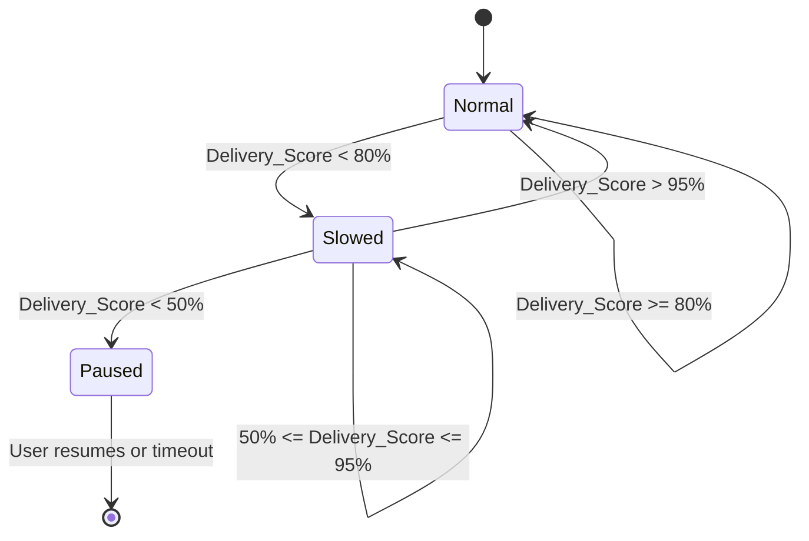
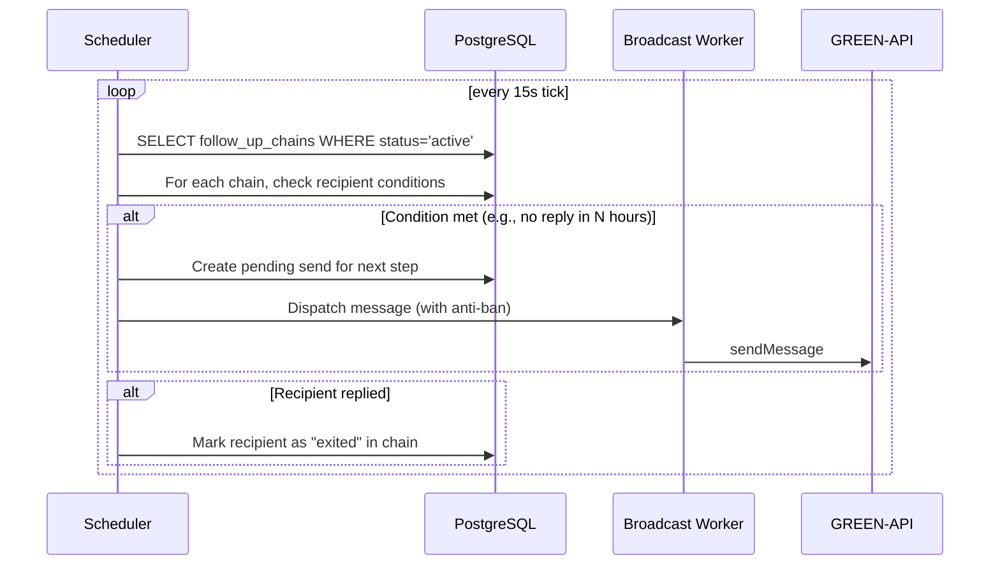

# Design Document

## Overview

Фича `enhanced-broadcast-scheduling` расширяет систему MAX тремя направлениями:

1. **Улучшение UX анти-бан настроек** — замена технической формы с 24+ полями на интуитивный интерфейс со сценарными карточками, индикаторами риска и интерактивной временной шкалой симуляции отправки.

2. **Подключение внешнего GREEN API инстанса** — пошаговый мастер подключения стороннего инстанса (без доступа к консоли green-api.com), поддержка до 5 инстансов на аккаунт с выбором активного при рассылке.

3. **Расширенное планирование рассылок** — follow-up цепочки с условными триггерами, A/B-тестирование сообщений, адаптивная скорость отправки на основе Delivery_Score, календарные исключения (blackout-периоды) и шаблоны расписаний.

### Ключевые решения

- **Scenario Cards как primary UX** вместо raw-полей: пользователь выбирает сценарий, система заполняет все параметры. Продвинутые пользователи могут переключиться в «ручной режим». Это снижает когнитивную нагрузку и ошибки конфигурации.

- **Risk Indicator — чистая функция от значения параметра**: `computeRiskLevel(param, value) → "safe" | "moderate" | "high"`. Пороги захардкожены на основе рекомендаций GREEN API. Обновление < 200ms гарантируется тем, что вычисление синхронное (без сетевых запросов).

- **Timeline Simulation — детерминированная функция**: `simulateTimeline(config, messageCount=10) → TimelineEvent[]`. Использует ту же формулу ETA, что и `PreFlightModal`, но визуализирует каждый шаг.

- **Multi-instance через новую модель `GreenInstance`** вместо расширения `Profile`: позволяет хранить N инстансов с независимыми статусами. `Profile.green_api_*` остаётся как legacy/primary для обратной совместимости.

- **Follow-up chains — JSON steps в Postgres**: шаги цепочки хранятся как `Json` поле (аналогично `OperationRun.payload`). Планировщик Flask обрабатывает цепочки на каждом tick, проверяя условия триггеров.

- **A/B testing — статистически корректное распределение**: используется детерминированный shuffle (seeded random по broadcast_id) для воспроизводимости распределения получателей по вариантам.

- **Adaptive Throttle — feedback loop в worker-потоке**: каждые 20 сообщений вычисляется Delivery_Score. Логика замедления/восстановления/паузы реализуется как state machine внутри broadcast worker.

- **Calendar Exceptions — overlap detection как pure function**: `isDateInException(date, exceptions[]) → boolean` вычисляется при каждом tick планировщика. Рекуррентные исключения разворачиваются в конкретные даты при проверке.

- **Schedule Templates — JSON config blob**: все параметры расписания сериализуются в одно `Json` поле, что упрощает добавление новых параметров без миграций.

### Источники

- [GREEN-API: How to reduce risk of blocking](https://green-api.com/v3/docs/faq/how-to-reduce-risk-of-blocking/) — рекомендации по паузам и мониторингу.
- [GREEN-API: getStateInstance](https://green-api.com/v3/docs/api/account/GetStateInstance/) — значения stateInstance.
- Существующий `anti-ban-protection` spec — архитектурные паттерны Rate_Limiter, Watchdog, OperationRunRegistry.

## Architecture

### Высокоуровневая схема

```mermaid
flowchart TB
  subgraph UI[Next.js Frontend]
    ABS[Anti-Ban Settings Page<br/>Scenario Cards + Risk Indicators + Timeline]
    ICW[Instance Connection Wizard]
    MIS[Multi-Instance Selector]
    FUC[Follow-Up Chain Builder]
    ABT[A/B Test Creator]
    CE[Calendar Exceptions Manager]
    ST[Schedule Templates]
    ATD[Adaptive Throttle Display]
  end

  subgraph API[Next.js API Routes]
    GI_API[/api/green-instances CRUD/]
    FU_API[/api/follow-up-chains CRUD/]
    AB_API[/api/ab-tests CRUD/]
    CE_API[/api/calendar-exceptions CRUD/]
    ST_API[/api/schedule-templates CRUD/]
    SB_API[/api/scheduled-broadcasts/]
  end

  subgraph FLASK[Flask Backend]
    SCHED[Scheduler Thread<br/>tick every 15s]
    FU_PROC[FollowUp Processor]
    AB_PROC[AB Test Processor]
    AT_MOD[Adaptive Throttle Module]
    CE_CHK[Calendar Exception Checker]
    BW[Broadcast Worker]
  end

  subgraph CORE[anti_ban module]
    RL[Rate_Limiter]
    SM[State_Monitor]
  end

  subgraph DB[PostgreSQL / Prisma]
    GI_DB[(GreenInstance)]
    FU_DB[(FollowUpChain)]
    AB_DB[(ABTest)]
    CE_DB[(CalendarException)]
    ST_DB[(ScheduleTemplate)]
    SB_DB[(ScheduledBroadcast)]
  end

  subgraph EXT[External]
    GA[GREEN-API]
  end

  ABS --> API
  ICW --> GI_API
  MIS --> GI_API
  FUC --> FU_API
  ABT --> AB_API
  CE --> CE_API
  ST --> ST_API

  GI_API --> GI_DB
  FU_API --> FU_DB
  AB_API --> AB_DB
  CE_API --> CE_DB
  ST_API --> ST_DB
  SB_API --> SB_DB

  SCHED --> CE_CHK
  SCHED --> FU_PROC
  SCHED --> AB_PROC
  SCHED --> BW
  BW --> AT_MOD
  BW --> RL
  BW --> GA
  CE_CHK --> CE_DB
  FU_PROC --> FU_DB
  AB_PROC --> AB_DB

  ICW --> GA
  SM --> GA
```



### Потоковая модель (Flask backend — расширение)

| Поток | Жизненный цикл | Новая ответственность |
|-------|-----------------|----------------------|
| Scheduler tick | daemon, каждые 15s | + Calendar Exception check, + Follow-up trigger evaluation, + A/B test completion check |
| Broadcast Worker | per-broadcast | + Adaptive Throttle state machine, + Multi-instance credential routing |
| State_Monitor | daemon | + Мониторинг всех подключённых инстансов (round-robin) |

### Поток выполнения: Adaptive Throttle



### Поток выполнения: Follow-Up Chain




## Components and Interfaces

### 1. Anti-Ban Settings UX Components (Frontend)

#### `ScenarioCard` Component

```tsx
interface ScenarioPreset {
  id: "small" | "medium" | "large";
  title: string;           // e.g., "Маленькая рассылка (до 100)"
  description: string;
  config: Partial<AntiBanConfig>;
  icon: LucideIcon;
}

interface ScenarioCardProps {
  preset: ScenarioPreset;
  isActive: boolean;
  onSelect: (preset: ScenarioPreset) => void;
}
```

Три предустановленных сценария:
- **Small** (до 100): `delay_min=5, delay_max=10, batch_size=20, long_pause_every_n=20, long_pause_seconds=30`
- **Medium** (100–500): `delay_min=3, delay_max=7, batch_size=50, long_pause_every_n=50, long_pause_seconds=60`
- **Large** (500+): `delay_min=7, delay_max=15, batch_size=30, long_pause_every_n=30, long_pause_seconds=120`

#### `RiskIndicator` Component

```tsx
type RiskLevel = "safe" | "moderate" | "high";

interface RiskIndicatorProps {
  level: RiskLevel;
  paramName: string;
}

function computeRiskLevel(param: keyof AntiBanConfig, value: number | boolean): RiskLevel;
```

Пороги риска (примеры):
- `delay_min < 2.0` → high, `< 3.0` → moderate, `>= 3.0` → safe
- `batch_size > 100` → high, `> 50` → moderate, `<= 50` → safe
- `daily_message_limit > 1000` → high, `> 500` → moderate, `<= 500` → safe

#### `TimelineSimulation` Component

```tsx
interface TimelineEvent {
  index: number;          // 0-based message index
  startMs: number;        // offset from t=0
  durationMs: number;     // send duration (≈1000ms)
  pauseAfterMs: number;   // pause before next message
  pauseType: "jitter" | "long_pause" | "batch_end";
  explanation: string;    // tooltip text
}

function simulateTimeline(config: AntiBanConfig, count?: number): TimelineEvent[];
```

#### `MetricsPanel` Component

```tsx
interface SettingsMetrics {
  timeFor100: number;     // seconds
  timeFor500: number;     // seconds
  safetyLevel: number;    // 0-100%
}

function computeSettingsMetrics(config: AntiBanConfig): SettingsMetrics;
```

`safetyLevel` вычисляется как процент от «максимально безопасной» конфигурации:
```
safetyLevel = min(100, (delay_min / 7.0) * 30 + (long_pause_seconds / 120) * 30 + (batch_size <= 30 ? 20 : 0) + (daily_message_limit <= 300 ? 20 : 0))
```

### 2. Instance Connection Wizard (Frontend + API)

#### `InstanceConnectionWizard` Component

```tsx
type WizardStep = "credentials" | "checking" | "qr" | "success" | "error";

interface WizardState {
  step: WizardStep;
  idInstance: string;
  apiToken: string;
  apiUrl: string;
  instanceState: string | null;
  phone: string | null;
  error: string | null;
}
```

#### Next.js API: `/api/green-instances`

```ts
// GET  — список инстансов пользователя
// POST — добавить новый инстанс (с проверкой лимита 5)
// PUT  /api/green-instances/[id] — обновить (name, is_primary)
// DELETE /api/green-instances/[id] — удалить

interface CreateGreenInstanceInput {
  name: string;
  id_instance: string;
  api_token: string;       // будет зашифрован перед сохранением
  api_url?: string;
}
```

#### Шифрование токена

Используется AES-256-GCM с ключом из переменной окружения `INSTANCE_ENCRYPTION_KEY`. Формат хранения: `iv:ciphertext:tag` (base64). Расшифровка происходит только на сервере при использовании инстанса.

### 3. Follow-Up Chain (Frontend + Flask)

#### Next.js API: `/api/follow-up-chains`

```ts
interface FollowUpStep {
  step_index: number;
  message: string;
  condition_type: "no_reply" | "read_no_reply" | "time_elapsed";
  condition_hours: number;
  file_url?: string | null;
}

interface CreateFollowUpChainInput {
  scheduled_broadcast_id: number;
  steps: FollowUpStep[];   // 1-5 steps
}
```

#### Flask: `follow_up_processor.py`

```python
class FollowUpProcessor:
    def evaluate_triggers(self, chain: FollowUpChain) -> list[PendingSend]:
        """На каждом tick проверяет условия для каждого получателя."""
        ...

    def check_recipient_replied(self, chain_id: int, recipient_phone: str) -> bool:
        """Проверяет incoming messages для получателя."""
        ...

    def schedule_next_step(self, chain_id: int, recipient_phone: str, step_index: int) -> None:
        """Планирует отправку с учётом quiet hours и anti-ban."""
        ...
```

### 4. A/B Testing (Frontend + Flask)

#### Next.js API: `/api/ab-tests`

```ts
interface ABTestVariant {
  id: string;              // uuid
  message: string;
  file_url?: string | null;
}

interface CreateABTestInput {
  scheduled_broadcast_id: number;
  variants: ABTestVariant[];  // 2-4 variants
  test_percentage: number;    // 10-50
  wait_hours: number;         // hours to wait for responses
}
```

#### Flask: `ab_test_processor.py`

```python
class ABTestProcessor:
    def distribute_recipients(
        self, contacts: list[dict], variants: list[dict],
        test_percentage: int, seed: int
    ) -> dict[str, list[dict]]:
        """Детерминированное распределение получателей по вариантам."""
        ...

    def compute_variant_metrics(self, ab_test_id: int) -> list[VariantMetrics]:
        """Вычисляет delivery%, read%, reply% для каждого варианта."""
        ...

    def schedule_winner(self, ab_test_id: int, winner_variant_id: str) -> None:
        """Планирует отправку победителя оставшимся получателям."""
        ...
```

### 5. Adaptive Throttle (Flask)

#### `adaptive_throttle.py`

```python
@dataclass
class ThrottleState:
    mode: Literal["normal", "slowed", "paused"] = "normal"
    base_delay: float = 5.0
    current_delay: float = 5.0
    messages_since_last_check: int = 0
    delivered_count: int = 0
    total_checked: int = 0

class AdaptiveThrottle:
    def __init__(self, config: AntiBanConfig, base_delay: float): ...

    def record_delivery(self, delivered: bool) -> None:
        """Записывает результат доставки."""
        ...

    def should_check(self) -> bool:
        """True если прошло 20 сообщений с последней проверки."""
        ...

    def evaluate(self) -> ThrottleAction:
        """Вычисляет Delivery_Score и возвращает действие."""
        ...

    @property
    def delivery_score(self) -> float:
        """(delivered + read) / total_sent * 100"""
        ...

    @property
    def effective_delay(self) -> float:
        """Текущая эффективная пауза с учётом throttle state."""
        ...
```

`ThrottleAction`:
- `CONTINUE` — продолжать с текущей паузой
- `SLOW_DOWN` — увеличить паузу на 50%, записать incident
- `RESTORE` — вернуть паузу к базовой, записать incident
- `PAUSE` — приостановить рассылку, уведомить пользователя

### 6. Calendar Exceptions (Frontend + Flask)

#### Next.js API: `/api/calendar-exceptions`

```ts
interface CreateCalendarExceptionInput {
  name: string;
  start_date: string;       // ISO date
  end_date: string;         // ISO date (same as start for single day)
  recurring_type?: "weekly" | "monthly" | "yearly" | null;
  recurring_value?: number | null;  // day of week/month/year
}
```

#### Flask: `calendar_exception_checker.py`

```python
def is_date_in_exception(
    dt: datetime, exceptions: list[CalendarException]
) -> bool:
    """Проверяет, попадает ли datetime в любое из исключений.

    Для recurring exceptions разворачивает паттерн:
    - weekly: проверяет day_of_week
    - monthly: проверяет day_of_month
    - yearly: проверяет month + day
    """
    ...

def compute_next_valid_run(
    original_run_at: datetime, exceptions: list[CalendarException]
) -> datetime:
    """Сдвигает next_run_at за пределы всех перекрывающихся исключений."""
    ...
```

### 7. Schedule Templates (Frontend)

#### Next.js API: `/api/schedule-templates`

```ts
interface ScheduleTemplateConfig {
  schedule_type: ScheduleType;
  recurring_kind?: RecurringKind | null;
  recurring_hour?: number | null;
  recurring_minute?: number | null;
  recurring_day_of_week?: number | null;
  recurring_day_of_month?: number | null;
  quiet_hours_enabled?: boolean;
  quiet_hours_start?: number;
  quiet_hours_end?: number;
  respect_recipient_tz?: boolean;
  user_tz?: string;
  drip_batch_size?: number | null;
  drip_interval_minutes?: number | null;
}

interface CreateScheduleTemplateInput {
  name: string;
  config: ScheduleTemplateConfig;
}
```


## Data Models

### Новые Prisma-модели

```prisma
model GreenInstance {
  id            BigInt   @id @default(autoincrement())
  user_id       String   @db.Uuid
  name          String                    // пользовательское имя ("Рабочий", "Маркетинг")
  id_instance   String                    // GREEN API idInstance
  api_token     String                    // зашифрован AES-256-GCM
  api_url       String   @default("https://api.green-api.com")
  status        String   @default("unknown")  // last known stateInstance
  phone         String?                   // номер телефона инстанса
  is_primary    Boolean  @default(false)
  created_at    DateTime @default(now())
  updated_at    DateTime @updatedAt

  @@unique([user_id, id_instance])
  @@index([user_id])
  @@map("green_instances")
}

model FollowUpChain {
  id                      BigInt   @id @default(autoincrement())
  user_id                 String   @db.Uuid
  scheduled_broadcast_id  BigInt
  steps                   Json     // FollowUpStep[]
  status                  String   @default("active")  // active | completed | cancelled
  created_at              DateTime @default(now())
  updated_at              DateTime @updatedAt

  @@index([user_id, status])
  @@index([scheduled_broadcast_id])
  @@map("follow_up_chains")
}

model FollowUpRecipient {
  id              BigInt   @id @default(autoincrement())
  chain_id        BigInt
  phone           String
  current_step    Int      @default(0)
  status          String   @default("pending")  // pending | waiting | sent | replied | exited
  last_sent_at    DateTime?
  next_trigger_at DateTime?
  exited_at       DateTime?

  @@unique([chain_id, phone])
  @@index([chain_id, status])
  @@index([next_trigger_at])
  @@map("follow_up_recipients")
}

model ABTest {
  id                      BigInt   @id @default(autoincrement())
  user_id                 String   @db.Uuid
  scheduled_broadcast_id  BigInt
  variants                Json     // ABTestVariant[]
  test_percentage         Int      // 10-50
  wait_hours              Int      @default(24)
  winner_variant_id       String?
  status                  String   @default("running")  // running | waiting | completed | cancelled
  started_at              DateTime @default(now())
  completed_at            DateTime?

  @@index([user_id, status])
  @@map("ab_tests")
}

model ABTestRecipient {
  id          BigInt   @id @default(autoincrement())
  ab_test_id  BigInt
  phone       String
  variant_id  String
  delivered   Boolean  @default(false)
  read        Boolean  @default(false)
  replied     Boolean  @default(false)
  sent_at     DateTime?

  @@unique([ab_test_id, phone])
  @@index([ab_test_id, variant_id])
  @@map("ab_test_recipients")
}

model CalendarException {
  id              BigInt   @id @default(autoincrement())
  user_id         String   @db.Uuid
  name            String
  start_date      DateTime @db.Date
  end_date        DateTime @db.Date
  recurring_type  String?              // weekly | monthly | yearly | null
  recurring_value Int?                 // day_of_week (0-6) | day_of_month (1-31) | null
  created_at      DateTime @default(now())

  @@index([user_id])
  @@map("calendar_exceptions")
}

model ScheduleTemplate {
  id         BigInt   @id @default(autoincrement())
  user_id    String   @db.Uuid
  name       String
  config     Json     // ScheduleTemplateConfig
  created_at DateTime @default(now())

  @@index([user_id])
  @@map("schedule_templates")
}
```

### Расширение существующей модели `ScheduledBroadcast`

Добавляются поля для поддержки новых возможностей:

```prisma
// Добавить в ScheduledBroadcast:
  instance_id           BigInt?           // FK → GreenInstance (null = use Profile credentials)
  adaptive_throttle     Boolean  @default(false)
  follow_up_chain_id    BigInt?           // FK → FollowUpChain
  ab_test_id            BigInt?           // FK → ABTest
```

### `FollowUpChain.steps` — формат JSON

```jsonc
[
  {
    "step_index": 0,
    "message": "Здравствуйте! Напоминаю о нашем предложении...",
    "condition_type": "no_reply",
    "condition_hours": 24,
    "file_url": null
  },
  {
    "step_index": 1,
    "message": "Добрый день! Хотел уточнить, получили ли вы...",
    "condition_type": "read_no_reply",
    "condition_hours": 48,
    "file_url": "https://example.com/offer.pdf"
  }
]
```

Обязательные поля: `step_index` (int), `message` (string), `condition_type` (string), `condition_hours` (number).
Опциональные: `file_url` (string | null).

### `ABTest.variants` — формат JSON

```jsonc
[
  {
    "id": "uuid-1",
    "message": "Вариант A: Привет! У нас скидка 20%...",
    "file_url": null
  },
  {
    "id": "uuid-2",
    "message": "Вариант B: Добрый день! Специальное предложение...",
    "file_url": null
  }
]
```

### `ScheduleTemplate.config` — формат JSON

```jsonc
{
  "schedule_type": "recurring",
  "recurring_kind": "weekly",
  "recurring_hour": 10,
  "recurring_minute": 0,
  "recurring_day_of_week": 1,
  "quiet_hours_enabled": true,
  "quiet_hours_start": 22,
  "quiet_hours_end": 8,
  "respect_recipient_tz": true,
  "user_tz": "Europe/Moscow"
}
```


## Correctness Properties

*A property is a characteristic or behavior that should hold true across all valid executions of a system — essentially, a formal statement about what the system should do. Properties serve as the bridge between human-readable specifications and machine-verifiable correctness guarantees.*

Все property-тесты используют `fast-check` (TypeScript) для frontend-логики и `hypothesis` (Python) для Flask-логики. Минимум 100 итераций на каждое property.

### Property 1: Scenario card applies correct config

*For any* scenario card selection from the set {small, medium, large}, applying the scenario to an AntiBanConfig form state SHALL result in all config fields matching the predefined optimal values for that scenario, with no fields left at their previous values.

**Validates: Requirements 1.2**

### Property 2: Risk indicator correctness

*For any* AntiBanConfig parameter value within its valid range, the `computeRiskLevel(param, value)` function SHALL return "safe" when the value is within GREEN API recommended bounds, "moderate" when approaching limits, and "high" when exceeding safe thresholds — and the mapping SHALL be monotonic (increasing risk never decreases as the value moves further from safe bounds).

**Validates: Requirements 1.3**

### Property 3: Timeline simulation consistency

*For any* valid AntiBanConfig (where `delay_min <= delay_max` and all values positive), `simulateTimeline(config, 10)` SHALL produce exactly 10 TimelineEvent entries where: each event's `pauseAfterMs` is >= `delay_min * 1000`, events at indices that are multiples of `long_pause_every_n` have `pauseType == "long_pause"`, and the total simulated time equals the sum of all pauses plus 10 * sendDuration.

**Validates: Requirements 2.1, 2.3**

### Property 4: Settings metrics formula correctness

*For any* valid AntiBanConfig, `computeSettingsMetrics(config)` SHALL return `timeFor100` and `timeFor500` values that equal the ETA formula: `total * ((delay_min + delay_max) / 2 + 1) + (total // long_pause_every_n) * long_pause_seconds` (with `long_pause_every_n == 0` treated as no long pauses), and `safetyLevel` SHALL be in range [0, 100].

**Validates: Requirements 2.3, 2.4**

### Property 5: Instance limit enforcement

*For any* user with N existing GreenInstance records (0 <= N <= 5), creating a new instance SHALL succeed if and only if N < 5. When N >= 5, the API SHALL return HTTP 400 with an appropriate error message.

**Validates: Requirements 4.5**

### Property 6: Unhealthy instance blocks broadcast

*For any* GreenInstance with `status` in {blocked, notAuthorized}, attempting to start a broadcast using that instance SHALL be rejected with an error suggesting to select another instance.

**Validates: Requirements 4.4**

### Property 7: Follow-up chain step count validation

*For any* number of steps N in a Follow_Up_Chain creation request, the API SHALL accept the request if and only if 1 <= N <= 5. Requests with 0 or > 5 steps SHALL return HTTP 400.

**Validates: Requirements 5.1**

### Property 8: Follow-up chain stops on reply

*For any* Follow_Up_Chain with K steps and any recipient who replies at step J (0 <= J < K), the system SHALL not schedule any steps with index > J for that recipient. The recipient's status SHALL be set to "replied" or "exited".

**Validates: Requirements 5.4**

### Property 9: Follow-up steps round-trip serialization

*For any* valid array of FollowUpStep objects (each with `step_index: int`, `message: non-empty string`, `condition_type: "no_reply" | "read_no_reply" | "time_elapsed"`, `condition_hours: positive number`, `file_url: string | null`), serializing to JSON and deserializing back SHALL produce an array equivalent to the original: same length, same order, identical keys and values for each step.

**Validates: Requirements 10.1, 10.2, 10.3**

### Property 10: Follow-up steps validation rejects invalid payloads

*For any* JSON payload that is either: not valid JSON, not an array, or an array containing objects missing any of the required fields (`step_index`, `message`, `condition_type`, `condition_hours`), the system SHALL return HTTP 422 with a descriptive validation error.

**Validates: Requirements 10.4**

### Property 11: A/B test variant count validation

*For any* number of variants N in an A/B test creation request, the API SHALL accept the request if and only if 2 <= N <= 4.

**Validates: Requirements 6.1**

### Property 12: A/B test recipient distribution

*For any* total recipient count T > 0, test_percentage P (10 <= P <= 50), and variant count V (2 <= V <= 4), the distribution function SHALL: allocate exactly `ceil(T * P / 100)` recipients to the test group, distribute the test group across V variants such that the difference between the largest and smallest variant group is at most 1, and leave exactly `T - ceil(T * P / 100)` recipients unassigned (for the winner).

**Validates: Requirements 6.2**

### Property 13: A/B test metrics computation

*For any* set of ABTestRecipient records grouped by variant_id, the metrics computation SHALL correctly calculate: `delivery_pct = delivered_count / total_in_variant * 100`, `read_pct = read_count / total_in_variant * 100`, `reply_pct = replied_count / total_in_variant * 100` for each variant, with all percentages in range [0, 100].

**Validates: Requirements 6.3**

### Property 14: A/B test winner scheduling

*For any* completed A/B test with T total recipients, P% test group, and a selected winner variant, scheduling the winner SHALL target exactly `T - ceil(T * P / 100)` recipients (those not in the test group) with the winner variant's message.

**Validates: Requirements 6.4**

### Property 15: Adaptive throttle state transitions

*For any* sequence of delivery results, the AdaptiveThrottle state machine SHALL: transition from "normal" to "slowed" when Delivery_Score < 80%, transition from "slowed" to "normal" when Delivery_Score > 95%, transition from "slowed" to "paused" when Delivery_Score < 50%, and never transition directly from "normal" to "paused" without passing through "slowed".

**Validates: Requirements 7.2, 7.3, 7.4**

### Property 16: Adaptive throttle delay adjustment

*For any* base_delay value and throttle state: when state is "normal", effective_delay SHALL equal base_delay; when state is "slowed", effective_delay SHALL equal base_delay * 1.5; the Delivery_Score SHALL be computed every 20 messages (evaluation cadence).

**Validates: Requirements 7.1, 7.2, 7.3**

### Property 17: Calendar exception overlap detection

*For any* datetime D and any set of CalendarException records, `is_date_in_exception(D, exceptions)` SHALL return true if and only if D falls within at least one exception's date range (inclusive of start_date, exclusive of end_date + 1 day), accounting for recurring exceptions (weekly: matching day_of_week, monthly: matching day_of_month, yearly: matching month+day).

**Validates: Requirements 8.3, 8.5**

### Property 18: Calendar exception postpones broadcast

*For any* ScheduledBroadcast whose `next_run_at` falls within a CalendarException, `compute_next_valid_run(next_run_at, exceptions)` SHALL return a datetime that is strictly after the end of all overlapping exceptions and does not itself fall within any exception.

**Validates: Requirements 8.3**

### Property 19: Schedule template round-trip

*For any* valid ScheduleTemplateConfig object (with valid `schedule_type`, optional recurring fields, valid quiet hours 0-23, valid timezone string), saving as a ScheduleTemplate and loading it back SHALL produce a config object equivalent to the original: all fields present with identical values.

**Validates: Requirements 9.2**

### Property 20: Broadcast uses selected instance credentials

*For any* valid GreenInstance selection with status "authorized", starting a broadcast SHALL use that instance's `id_instance`, decrypted `api_token`, and `api_url` for all GREEN API requests in that broadcast session.

**Validates: Requirements 4.3**


## Error Handling

### Frontend Errors

| Ситуация | Поведение |
|----------|-----------|
| Instance Connection Wizard: неверные credentials | Показать inline-ошибку «Неверные credentials», не сохранять данные |
| Instance Connection Wizard: сетевая ошибка | Показать «Не удалось подключиться к GREEN API. Проверьте интернет-соединение» |
| Multi-Instance Selector: все инстансы unhealthy | Заблокировать кнопку «Начать рассылку», показать предупреждение |
| Follow-Up Chain: невалидный JSON steps | HTTP 422 с описанием ошибки валидации |
| A/B Test: < 2 или > 4 вариантов | HTTP 400 «Количество вариантов должно быть от 2 до 4» |
| A/B Test: test_percentage вне [10, 50] | HTTP 400 «Процент тестовой группы должен быть от 10% до 50%» |
| Calendar Exception: end_date < start_date | HTTP 400 «Дата окончания не может быть раньше даты начала» |
| Schedule Template: пустое имя | HTTP 400 «Укажите название шаблона» |
| Adaptive Throttle: Delivery_Score < 50% | Приостановить рассылку, показать уведомление с рекомендацией |

### Backend Errors (Flask)

| Ситуация | Поведение |
|----------|-----------|
| Follow-Up: incoming webhook timeout | Retry через 60s, после 3 неудач — пометить recipient как "unknown" |
| A/B Test: не удалось определить winner (все варианты одинаковы) | Оставить статус "waiting", уведомить пользователя |
| Adaptive Throttle: не удалось получить delivery status | Считать как "not delivered" для score (conservative) |
| Calendar Exception: рекурсивное исключение создаёт бесконечный blackout | Ограничить сдвиг next_run_at максимум 30 днями, после — пометить как "failed" |
| GreenInstance: токен не расшифровывается (ключ изменён) | HTTP 500 с логированием, предложить пользователю переподключить инстанс |
| Scheduler tick: исключение в одной задаче | Логировать, продолжить обработку остальных задач (fail-safe) |

### Encryption Key Management

- `INSTANCE_ENCRYPTION_KEY` — обязательная переменная окружения (32 bytes, base64)
- При отсутствии ключа: API `/api/green-instances` возвращает HTTP 503 «Encryption not configured»
- При ротации ключа: необходима миграция (re-encrypt all tokens) — отдельная задача

## Testing Strategy

### Unit Tests (Example-based)

- **Scenario Card presets**: проверить, что каждый из 3 пресетов содержит все обязательные поля AntiBanConfig
- **Risk Indicator thresholds**: конкретные примеры для каждого параметра на границах (delay_min=1.9 → high, 2.0 → moderate, 3.0 → safe)
- **Instance Connection Wizard steps**: mock GREEN API responses для каждого шага (authorized, notAuthorized, error)
- **Calendar Exception edge cases**: исключение на 1 день, пересечение нескольких исключений, recurring weekly на текущий день
- **A/B Test completion**: mock delivery statuses, проверить корректный выбор winner

### Property-Based Tests

Библиотека: `fast-check` (TypeScript, frontend logic) + `hypothesis` (Python, Flask logic).

Каждый property-тест:
- Минимум 100 итераций
- Тегирован комментарием: `// Feature: enhanced-broadcast-scheduling, Property N: <title>`
- Использует DI для детерминизма (seeded random, fake clock)

**Frontend (fast-check):**
- Property 1: Scenario card config application
- Property 2: Risk indicator monotonicity
- Property 3: Timeline simulation structure
- Property 4: Metrics formula correctness
- Property 9: Follow-up steps round-trip
- Property 12: A/B test distribution
- Property 17: Calendar exception overlap detection
- Property 19: Schedule template round-trip

**Backend (hypothesis):**
- Property 5: Instance limit enforcement
- Property 6: Unhealthy instance gate
- Property 7: Follow-up step count validation
- Property 8: Follow-up stops on reply
- Property 10: Follow-up validation rejects invalid
- Property 13: A/B test metrics computation
- Property 14: A/B test winner scheduling
- Property 15: Adaptive throttle state transitions
- Property 16: Adaptive throttle delay adjustment
- Property 18: Calendar exception postpones broadcast
- Property 20: Broadcast uses selected instance

### Integration Tests

- **Instance Connection Wizard end-to-end**: mock GREEN API, test full wizard flow (credentials → check → QR → success)
- **Follow-Up Chain execution**: create chain, simulate time passing, verify correct messages scheduled
- **A/B Test lifecycle**: create test → send variants → wait → compute metrics → schedule winner
- **Adaptive Throttle in broadcast**: simulate varying delivery rates, verify state transitions
- **Calendar Exception with scheduler**: create exception, verify scheduled broadcast is postponed
- **Multi-instance broadcast**: select non-primary instance, verify correct credentials used

### Smoke Tests

- GreenInstance model exists with all required fields
- FollowUpChain model exists with all required fields
- ABTest model exists with all required fields
- CalendarException model exists with all required fields
- ScheduleTemplate model exists with all required fields
- `INSTANCE_ENCRYPTION_KEY` environment variable is set and valid
