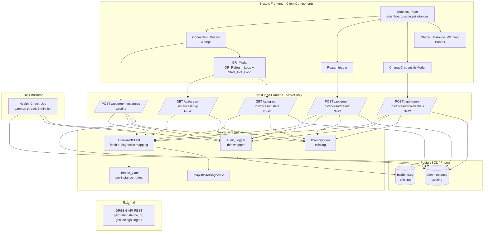
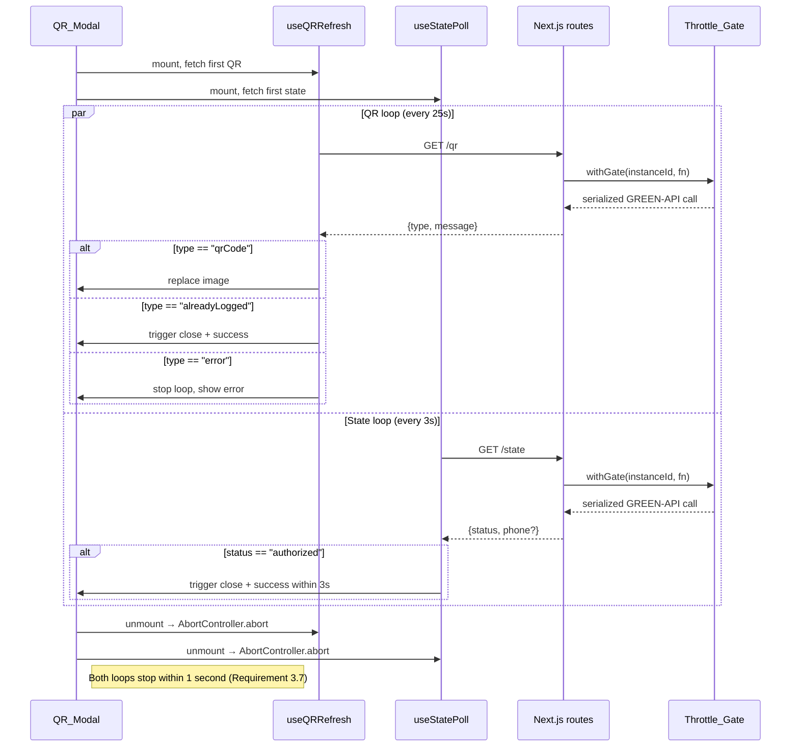
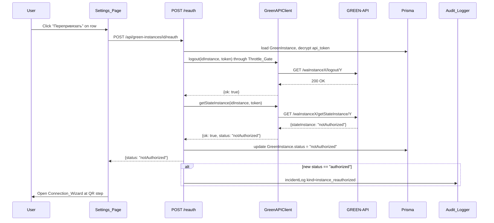
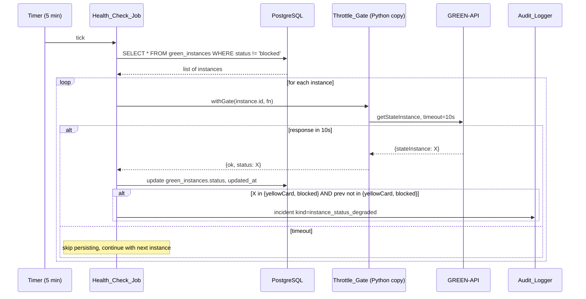

# Design Document

## Overview

Фича `green-api-shared-instance-auth` добавляет UX-мастер привязки MAX к **чужому** инстансу GREEN API. Спека работает поверх уже существующей инфраструктуры и **ничего из неё не переписывает**:

- Prisma-модель `GreenInstance` (`frontend/prisma/schema.prisma`).
- Шифрование `@/lib/encryption` (`encrypt`, `ensureEncryptionKey`, `EncryptionKeyMissingError`).
- Supabase Auth через `createClient` из `@/lib/supabase/server`.
- Существующий `POST /api/green-instances` (создание инстанса с первичной валидацией).
- Модель `IncidentLog` для журналирования.
- Лимит 5 инстансов на пользователя (уже зашит в `POST /api/green-instances`).

### Ключевые архитектурные решения

- **Backend-only обращения к GREEN API.** Расшифрованный `apiTokenInstance` никогда не покидает сервер. Все four новых эндпойнта инкапсулируют расшифровку токена внутри Next.js API route handler (Requirement 6). Frontend никогда не видит ни токен, ни URL, содержащий токен.

- **`Throttle_Gate` как in-memory mutex per-instance.** `Map<instanceId, { mutex: Promise<void>, lastCallTimestamp: number }>` сериализует обращения к GREEN API на одном инстансе и обеспечивает минимальный интервал 1.5 секунды между вызовами (Requirement 6.6, 6.7). In-memory достаточно: один Next.js процесс держит все API-обработчики, а Health_Check_Job на стороне Flask использует свой собственный экземпляр (он работает с другим инстансом БД и не разделяет память с Next.js).

- **`Health_Check_Job` — фоновый Python-thread в Flask.** Реализован по образцу существующего `anti_ban/state_monitor.py`: daemon-thread, прерываемый sleep через `Event.wait`, инжектируемые часы и фабрика бота для тестируемости. Работает раз в 5 минут (Requirement 7.1) и обходит все `green_instances` без явного `blocked` статуса. Единственное отличие от `StateMonitor` — обходит коллекцию инстансов, а не один глобальный.

- **`Connection_Wizard` как клиентский 4-шаговый компонент.** Использует state machine `instructions → credentials → status_branch → terminal`, где `terminal` распадается на `success | qr | starting | yellow_card | blocked | sleep_mode | error`. Не переизобретает создание инстанса — вызывает существующий `POST /api/green-instances`.

- **`QR_Modal` с двумя независимыми циклами.** `QR_Refresh_Loop` обновляет картинку каждые 25 секунд через `GET /qr`. `State_Poll_Loop` опрашивает `GET /state` каждые 3 секунды. Lifecycle-cleanup гарантирует остановку обоих в течение 1 секунды при закрытии модалки (Requirement 3.7).

- **`Diagnostic_Message` — серверная нормализация.** Маппинг HTTP-статусов GREEN API в семантически значимые HTTP-коды Next.js + русскоязычные тексты. Mapping тотален (Property 4): любой реальный HTTP-код 401/403/404/429/466/timeout всегда даёт user-friendly сообщение.

- **`Audit_Logger` переиспользует `IncidentLog`.** Тонкая обёртка `auditLog(eventKind, userId, details)` поверх `prisma.incidentLog.create`. Никаких новых таблиц.

### Out of scope

- Рассылка через подключённый инстанс (это existing flow, использующий `bot_id_instance`/`bot_api_token` из `ScheduledBroadcast`).
- Удаление и переименование инстанса (это уже есть в `PUT/DELETE /api/green-instances/[id]`).
- Перенос фронтового рендеринга QR в Server Components (Phase 2).

### Источники

- [GREEN-API: getStateInstance](https://green-api.com/v3/docs/api/account/GetStateInstance/) — значения `stateInstance`.
- [GREEN-API: getQR](https://green-api.com/v3/docs/api/account/QR/) — формат `{ type: "qrCode" | "alreadyLogged" | "error", message }`.
- [GREEN-API: getSettings](https://green-api.com/v3/docs/api/account/GetSettings/) — `webhookUrl`, `outgoingWebhook`, `wid`.
- [GREEN-API: Logout](https://green-api.com/v3/docs/api/account/Logout/) — для Reauth_Flow.
- Существующий `anti_ban/state_monitor.py` — паттерн daemon-thread с DI.

## Architecture

### Высокоуровневая схема



### Sequence: Connection_Wizard happy path (notAuthorized → QR → authorized)

```mermaid
sequenceDiagram
  participant U as User
  participant CW as Connection_Wizard
  participant API as POST /api/green-instances
  participant GAC as GreenAPIClient
  participant GA as GREEN-API
  participant DB as Prisma

  U->>CW: Open wizard, click Next
  CW->>U: Render Instructions_Step
  U->>CW: Click Next
  CW->>U: Render Credentials_Form
  U->>CW: Submit {idInstance, apiToken, name?}
  CW->>API: POST {name, id_instance, api_token, api_url}
  API->>GAC: getStateInstance(idInstance, apiToken)
  GAC->>GA: GET /waInstanceX/getStateInstance/Y
  GA-->>GAC: 200 {stateInstance: "notAuthorized"}
  GAC-->>API: {ok: true, status: "notAuthorized"}
  API->>DB: encrypt(apiToken); create GreenInstance
  API->>DB: incidentLog.create kind=instance_connected
  API-->>CW: 201 {id, status: "notAuthorized", ...}
  CW->>U: Switch to QR_Modal(id)

  loop QR_Refresh_Loop every 25s
    CW->>GET_QR: GET /api/green-instances/id/qr
    GET_QR->>GAC: getQR through Throttle_Gate
    GAC-->>GET_QR: {type: "qrCode", message: <png-base64>}
    GET_QR-->>CW: {type, message, server_timestamp}
    CW->>U: Render new QR image
  end

  loop State_Poll_Loop every 3s
    CW->>GET_STATE: GET /api/green-instances/id/state
    GET_STATE->>GAC: getStateInstance through Throttle_Gate
    GAC-->>GET_STATE: {ok: true, status: "notAuthorized"}
    GET_STATE->>DB: update GreenInstance.status
    GET_STATE-->>CW: {status: "notAuthorized"}
  end

  Note over U,GA: User scans QR with MAX phone

  CW->>GET_STATE: GET /api/green-instances/id/state
  GET_STATE->>GAC: getStateInstance
  GAC-->>GET_STATE: {ok: true, status: "authorized"}
  GET_STATE->>GAC: getSettings (for phone + shared_instance_warning)
  GAC-->>GET_STATE: {wid: "79991234567@c.us", webhookUrl: "..."}
  GET_STATE->>DB: update status=authorized, phone, shared=true
  GET_STATE-->>CW: {status: "authorized", phone, shared_instance_warning: true}
  CW->>CW: Stop QR_Refresh_Loop and State_Poll_Loop
  CW->>U: Show success screen + warning banner
```

### Sequence: QR_Modal двойной цикл



### Sequence: Reauth_Flow (logout → state → notAuthorized → QR)



### Sequence: Health_Check_Job tick



### Поток управления и потоки

| Поток | Жизненный цикл | Ответственность |
|-------|-----------------|------------------|
| Next.js request handler | per-request | Расшифровка токена, вызовы GREEN API через `Throttle_Gate`, запись `IncidentLog` |
| `Throttle_Gate` | глобальный singleton (per-process) | Сериализация запросов к одному инстансу, минимальный интервал 1.5s |
| `Health_Check_Job` | daemon-thread, стартует в `app.py` | Периодический обход `green_instances`, обновление статуса, инциденты при деградации |

## Components and Interfaces

### Frontend (TypeScript, React, Next.js App Router)

#### `ConnectionWizard`

Клиентский компонент-state machine.

```ts
type WizardStep =
  | "instructions"
  | "credentials"
  | "status_branch"  // transient: показывает спиннер пока летит POST
  | "qr"
  | "starting"
  | "success"
  | "yellow_card"
  | "blocked"
  | "sleep_mode"
  | "error";

interface WizardState {
  step: WizardStep;
  instanceId: bigint | null;     // populated после POST
  idInstance: string;
  apiToken: string;
  name: string;
  apiUrl: string;
  status: InstanceStatus | null;
  phone: string | null;
  sharedInstanceWarning: boolean;
  diagnosticMessage: string | null;
}

interface ConnectionWizardProps {
  open: boolean;
  onClose: () => void;
  onSuccess: (instance: GreenInstanceSummary) => void;
  // если задан — wizard стартует сразу с QR_Modal для существующего id (Reauth_Flow)
  reauthInstanceId?: bigint;
}
```

State-машина переходов:

```
instructions ──Next──> credentials ──Submit──> status_branch
status_branch ──"authorized"────> success
status_branch ──"notAuthorized"─> qr
status_branch ──"starting"──────> starting (с State_Poll_Loop)
status_branch ──"yellowCard"────> yellow_card
status_branch ──"blocked"───────> blocked
status_branch ──"sleepMode"─────> sleep_mode
status_branch ──http_error──────> error
qr ──State_Poll authorized──────> success
qr ──QR type="alreadyLogged"────> success
qr ──QR type="error"────────────> error
qr ──user closes────────────────> closed (cleanup loops)
starting ──State_Poll notAuthorized──> qr
starting ──State_Poll authorized────> success
```

#### `InstructionsStep`

Статический компонент. Рендерит инструкцию с двумя выделенными полями `idInstance` и `apiTokenInstance`, ссылку на разъяснение «попросите у владельца аккаунта», иконкой `lucide-react`/`Info` (Engagement Gold для иконок-инструкций).

#### `CredentialsForm`

```ts
interface CredentialsFormProps {
  initialIdInstance?: string;
  initialApiToken?: string;
  initialName?: string;
  onSubmit: (values: { idInstance: string; apiToken: string; name: string; apiUrl: string }) => void;
  isSubmitting: boolean;
  error: string | null;
}
```

Валидация:
- `idInstance`: required, non-empty after trim, регекс `/^\d{10,}$/` (мягкое предупреждение, не блок).
- `apiTokenInstance`: required, non-empty after trim.
- `name`: optional. Если пусто, default — `Инстанс ${idInstance.slice(-4)}` (Requirement 1.6).
- `apiUrl`: hidden by default, default `https://api.green-api.com`.

#### `QRModal`

```ts
interface QRModalProps {
  instanceId: bigint;
  open: boolean;
  onAuthorized: (snapshot: { phone: string | null; sharedInstanceWarning: boolean }) => void;
  onClose: () => void;
  onError: (message: string) => void;
}
```

Внутри:
- `useQRRefresh(instanceId, { onAlreadyLogged, onError })` — циклит `GET /qr` каждые 25с.
- `useStatePoll(instanceId, { onAuthorized })` — циклит `GET /state` каждые 3с.
- При `open === false` оба хука размонтируют свои таймеры и вызывают `AbortController.abort` на in-flight запросах в течение ≤ 1 секунды (Requirement 3.7).

#### `useQRRefresh`

```ts
interface UseQRRefreshOptions {
  intervalMs?: number;  // default 25000
  onAlreadyLogged: () => void;
  onError: (message: string) => void;
}

interface UseQRRefreshResult {
  qrImageBase64: string | null;  // PNG base64 без `data:image/png;base64,` префикса
  isFetching: boolean;
  serverTimestamp: number | null;
}

function useQRRefresh(instanceId: bigint, options: UseQRRefreshOptions): UseQRRefreshResult;
```

#### `useStatePoll`

```ts
interface UseStatePollOptions {
  intervalMs?: number;  // default 3000
  onAuthorized: (snapshot: { phone: string | null; sharedInstanceWarning: boolean }) => void;
  onTransition?: (from: InstanceStatus, to: InstanceStatus) => void;
}

interface UseStatePollResult {
  currentStatus: InstanceStatus | null;
  lastError: string | null;
}

function useStatePoll(instanceId: bigint, options: UseStatePollOptions): UseStatePollResult;
```

#### `SharedInstanceWarningBanner`

```ts
interface SharedInstanceWarningBannerProps {
  visible: boolean;
  onDismiss?: () => void;
}
```

Стиль: `bg-canary-yellow/40` фон, `text-midnight-ink` текст, `lucide-react`/`AlertTriangle` иконка. Текст из Requirement 10.3.

#### `InstancesSettingsPage`

Страница `/dashboard/settings/instances`. Использует `GET /api/green-instances` для списка. Каждая строка:

| Колонка | Источник | Действия |
|---------|----------|----------|
| Имя | `instance.name` | — |
| idInstance | `instance.id_instance` | копировать |
| Phone | `instance.phone` (если есть) | — |
| Статус | `instance.status` | бейдж + DiagnosticMessage tooltip |
| `is_primary` | `instance.is_primary` | переключатель |
| Действия | — | «Перепривязать», «Проверить сейчас», «Сменить credentials», «Удалить» |

Цвета бейджей статуса (только дизайн-токены из `Design/DESIGN.md`):
- `authorized` → `bg-mint-green` + `text-midnight-ink`.
- `starting` → `bg-subtle-lavender` + `text-midnight-ink`.
- `notAuthorized` → `bg-light-taupe` + `text-muted-ash`.
- `yellowCard` → `bg-canary-yellow` + `text-midnight-ink`.
- `sleepMode` → `bg-whisper-gray` + `text-muted-ash`.
- `blocked` → `bg-leadgen-red/15` + `text-leadgen-red`.
- `unknown` → `bg-whisper-gray` + `text-muted-ash`.

#### `ChangeCredentialsModal`

```ts
interface ChangeCredentialsModalProps {
  instanceId: bigint;
  currentIdInstance: string;
  open: boolean;
  onClose: () => void;
  onSuccess: (snapshot: { status: InstanceStatus; phone: string | null }) => void;
}
```

Поля: новые `idInstance`, `apiTokenInstance`, опционально `apiUrl`. Submit вызывает `POST /api/green-instances/[id]/credentials`. На ответ:
- 200 → закрыть модалку, показать toast с новым статусом.
- 400 «Неверные credentials» → inline-ошибка под полями.

#### `DiagnosticMessage`

```ts
interface DiagnosticMessageProps {
  status?: InstanceStatus;          // показывает Diagnostic_Message для статуса
  errorCode?: DiagnosticErrorCode;  // показывает Diagnostic_Message для серверной ошибки
  variant?: "inline" | "toast" | "banner";
}
```

Маппинг статус → текст и errorCode → текст реализован как чистая функция `diagnosticTextFor(input): string`. Тексты из Requirement 8 (см. таблицу в Error Handling).

### Backend (server-side TypeScript helpers)

Размещение: `frontend/src/lib/green-api/`.

#### `GreenAPIClient`

```ts
// frontend/src/lib/green-api/client.ts

export type DiagnosticErrorCode =
  | "invalid_credentials"  // 401, 403
  | "quota_exceeded"       // 466
  | "rate_limited"         // 429
  | "timeout"              // network timeout (15s)
  | "not_found"            // 404
  | "server_error"         // 5xx
  | "network_error"
  | "unknown";

export interface DiagnosticError {
  code: DiagnosticErrorCode;
  httpStatus: number;       // HTTP-статус, который Next.js должен вернуть клиенту
  message: string;          // user-facing русский текст
  upstreamHttpStatus: number | null;
  upstreamBody: string | null;  // обрезанный (≤ 512 chars) для server-side log, не возвращается клиенту
}

export type ClientResult<T> = { ok: true; data: T } | { ok: false; error: DiagnosticError };

export interface GetStateInstanceData {
  stateInstance: InstanceStatus;
}

export interface GetQRData {
  type: "qrCode" | "alreadyLogged" | "error";
  message: string;          // base64-PNG для qrCode, текст ошибки для error
}

export interface GetSettingsData {
  wid?: string;             // "79991234567@c.us"
  webhookUrl?: string;
  outgoingWebhook?: "yes" | "no";
}

export interface LogoutData {
  isLogout: boolean;
}

export class GreenAPIClient {
  constructor(
    private readonly throttleGate: ThrottleGate,
    private readonly fetchImpl: typeof fetch = fetch,
    private readonly timeoutMs: number = 15000,
  ) {}

  getStateInstance(
    instanceDbId: bigint,
    idInstance: string,
    apiToken: string,
    apiUrl: string,
  ): Promise<ClientResult<GetStateInstanceData>>;

  getQR(
    instanceDbId: bigint,
    idInstance: string,
    apiToken: string,
    apiUrl: string,
  ): Promise<ClientResult<GetQRData>>;

  getSettings(
    instanceDbId: bigint,
    idInstance: string,
    apiToken: string,
    apiUrl: string,
  ): Promise<ClientResult<GetSettingsData>>;

  logout(
    instanceDbId: bigint,
    idInstance: string,
    apiToken: string,
    apiUrl: string,
  ): Promise<ClientResult<LogoutData>>;
}
```

Все методы:
1. Берут блокировку через `throttleGate.withGate(instanceDbId, fn)`.
2. Делают `fetch` с `AbortSignal.timeout(this.timeoutMs)`.
3. На любую ошибку маппят результат через `mapHttpToDiagnostic`.
4. Никогда не возвращают и не логируют расшифрованный `apiToken` (toString redact).

#### `ThrottleGate`

```ts
// frontend/src/lib/green-api/throttle.ts

interface InstanceLane {
  mutex: Promise<void>;       // chain of in-flight calls
  lastCallTimestamp: number;  // ms, monotonic clock
}

export class ThrottleGate {
  private readonly lanes = new Map<bigint, InstanceLane>();

  constructor(
    private readonly minIntervalMs: number = 1500,
    private readonly maxQueueWaitMs: number = 5000,
    private readonly nowFn: () => number = () => Date.now(),
    private readonly sleepFn: (ms: number) => Promise<void> =
      (ms) => new Promise((r) => setTimeout(r, ms)),
  ) {}

  /**
   * Сериализует вызов fn для данного instanceId. Гарантирует:
   * - Не более 1 inflight-запроса для instanceId (Property 3, Requirement 6.6)
   * - Минимум minIntervalMs между двумя последовательными запросами (Property 2, Requirement 6.7)
   * - Если ожидание в очереди превышает maxQueueWaitMs — бросает ThrottleTimeoutError
   */
  async withGate<T>(instanceId: bigint, fn: () => Promise<T>): Promise<T>;
}

export class ThrottleTimeoutError extends Error {
  constructor() {
    super("ThrottleGate: queue wait exceeded 5000ms");
    this.name = "ThrottleTimeoutError";
  }
}
```

Алгоритм:
1. Если `lanes` нет записи для `instanceId` — создать с `mutex = Promise.resolve()`, `lastCallTimestamp = 0`.
2. Сохранить `prev = lane.mutex`.
3. Создать `next = (async () => { await prev; const now = nowFn(); const wait = max(0, lane.lastCallTimestamp + minIntervalMs - now); if (wait > 0) await sleepFn(wait); lane.lastCallTimestamp = nowFn(); return await fn(); })()`.
4. `lane.mutex = next.catch(() => {})` (chain не должен прерываться при ошибках `fn`).
5. Race с `maxQueueWaitMs` таймером (`Promise.race([prev, timeout])`); если timeout сработал до `prev` — бросить `ThrottleTimeoutError`.
6. Вернуть `await next`.

Глобальный singleton:
```ts
// frontend/src/lib/green-api/index.ts
export const throttleGate = new ThrottleGate();
export const greenApiClient = new GreenAPIClient(throttleGate);
```

#### `mapHttpToDiagnostic`

```ts
// frontend/src/lib/green-api/diagnostic.ts

export function mapHttpToDiagnostic(
  upstreamHttpStatus: number | null,    // null если timeout/network error
  upstreamBody: string | null,
  cause?: "timeout" | "network" | "abort",
): DiagnosticError;
```

Таблица маппинга (тотальная для realистичных кодов — Property 4):

| upstreamHttpStatus / cause | code | httpStatus | message |
|----------------------------|------|------------|---------|
| 401, 403 | `invalid_credentials` | 400 | «Неверные credentials: проверьте idInstance и apiTokenInstance» |
| 466 | `quota_exceeded` | 402 | «Превышена квота инстанса: подписка на стороне владельца исчерпана или закончилась. Обратитесь к владельцу аккаунта GREEN API» |
| 429 | `rate_limited` | 429 | «Слишком частые запросы к GREEN API. Подождите 30 секунд и повторите» |
| 404 | `not_found` | 404 | «Инстанс не найден на стороне GREEN API. Проверьте idInstance» |
| 500–599 | `server_error` | 502 | «GREEN API временно недоступен. Повторите попытку через минуту» |
| `timeout` | `timeout` | 504 | «GREEN API не ответил за 15 секунд. Повторите попытку через минуту» |
| `network` | `network_error` | 503 | «Не удалось подключиться к GREEN API. Проверьте интернет-соединение» |
| любой другой 4xx | `unknown` | 500 | «Неизвестная ошибка GREEN API (HTTP {status}). Свяжитесь с поддержкой» |

Функция тотальна по построению: `default` ветка для произвольного кода → `unknown`.

#### `Audit_Logger`

```ts
// frontend/src/lib/green-api/audit.ts

export type AuditEventKind =
  | "instance_connected"
  | "instance_reauthorized"
  | "instance_credentials_changed"
  | "instance_status_degraded";  // также пишется Health_Check_Job (Python)

export interface AuditEventDetails {
  green_instance_id: string;     // BigInt сериализован как string для JSON
  id_instance: string;
  previous_status?: InstanceStatus;
  new_status?: InstanceStatus;
  previous_id_instance?: string; // для credentials_changed
  shared_instance_warning?: boolean; // для instance_connected
}

export async function auditLog(
  eventKind: AuditEventKind,
  userId: string,             // UUID
  details: AuditEventDetails,
): Promise<void>;
```

Реализация — единственный вызов `prisma.incidentLog.create({ data: { user_id, kind, details, operation_run_id: null } })`. На ошибку `prisma` ловится в catch и пишется `console.warn("audit_log_write_failed", { eventKind, userId, error })`. Originating action продолжает быть успешным (Requirement 9.6).

### Новые API routes (Next.js, App Router)

Все четыре route включают одинаковый prelude:
1. `ensureEncryptionKey()` → 503 если ключ не сконфигурирован.
2. `createClient()` + `auth.getUser()` → 401 если не залогинен.
3. `prisma.greenInstance.findUnique({ id })` + ownership check (`row.user_id === user.id`) → 404 если чужой/нет.
4. Расшифровка `decrypt(row.api_token)` (внутри обработчика, никогда не возвращается).

#### `GET /api/green-instances/[id]/state`

```ts
// Response shape (success)
interface GetStateResponse {
  status: InstanceStatus;
  phone: string | null;
  shared_instance_warning: boolean;
  // НЕТ полей api_token, api_url с токеном
}
```

Логика:
1. Prelude.
2. `greenApiClient.getStateInstance(...)` через `Throttle_Gate`.
3. Если `ok: false` → вернуть `{ error: error.message }` с `status: error.httpStatus`.
4. Если `data.stateInstance === "authorized"`: вторым вызовом `getSettings`. Извлечь `wid` → `phone = wid.replace("@c.us", "")`. Установить `shared_instance_warning = !!webhookUrl || outgoingWebhook === "yes"`.
5. `prisma.greenInstance.update({ id, data: { status, phone? } })`.
6. Вернуть `{ status, phone, shared_instance_warning }` с 200.

#### `GET /api/green-instances/[id]/qr`

```ts
interface GetQRResponse {
  type: "qrCode" | "alreadyLogged" | "error";
  message?: string;        // base64 PNG для qrCode, текст для error
  server_timestamp: number; // ms epoch, для frontend race-detection
  // НЕТ url или иных полей с токеном
}
```

Логика:
1. Prelude.
2. `greenApiClient.getQR(...)` через `Throttle_Gate`.
3. Если `ok: false` → `{ error: error.message }` с `error.httpStatus`.
4. Если `data.type === "alreadyLogged"`: дополнительно вызвать `getStateInstance` + `getSettings` для синхронизации БД (как в `/state`).
5. Вернуть `{ type, message, server_timestamp: Date.now() }`.

#### `POST /api/green-instances/[id]/reauth`

```ts
interface PostReauthResponse {
  status: InstanceStatus;
  phone: string | null;
  shared_instance_warning: boolean;
}
```

Логика:
1. Prelude. Запомнить `previousStatus = row.status`.
2. `greenApiClient.logout(...)` через `Throttle_Gate`. Если `ok: false` и `error.code` ∈ `{invalid_credentials, not_found}` → пробросить (HTTP 400/404). Прочие — продолжить.
3. `greenApiClient.getStateInstance(...)`. Если `ok: false` → пробросить.
4. Если `status === "authorized"`: дополнительно `getSettings` для phone и shared.
5. `prisma.greenInstance.update({ id, data: { status, phone? } })` (поля `is_primary`, `name` НЕ трогаются — Property 5).
6. Если `status === "authorized"` и `previousStatus !== "authorized"`: `auditLog("instance_reauthorized", user.id, { ..., previous_status: previousStatus, new_status: "authorized" })`.
7. Вернуть `{ status, phone, shared_instance_warning }`.

#### `POST /api/green-instances/[id]/credentials`

```ts
interface PostCredentialsRequest {
  id_instance: string;
  api_token: string;
  api_url?: string;
}

interface PostCredentialsResponse {
  status: InstanceStatus;
  phone: string | null;
  id_instance: string;       // новый
  api_url: string;
  // НЕТ api_token
}
```

Логика:
1. Prelude (с проверкой ownership на старый row).
2. Валидация body: оба поля непустые после trim.
3. **До** записи в БД: `greenApiClient.getStateInstance(newIdInstance, newToken, newApiUrl)`. Если `ok: false` с `code === "invalid_credentials"` → 400 «Неверные credentials» (Requirement 5.3). Если `ok: false` с другим кодом → пробросить.
4. Если `data.stateInstance === "authorized"`: `getSettings` для phone.
5. **Атомарно** в одной `prisma.$transaction`:
   - `prisma.greenInstance.update({ where: { id }, data: { id_instance: newIdInstance, api_token: encrypt(newToken), api_url: normalizedNewApiUrl, status: newStatus, phone: newPhone ?? row.phone } })`.
6. После транзакции: `auditLog("instance_credentials_changed", user.id, { green_instance_id, id_instance: newId, previous_id_instance: row.id_instance })` (Requirement 5.5).
7. Вернуть `{ status, phone, id_instance, api_url }`.

Атомарность (Property 6): если `prisma.$transaction` упадёт — ни одно из четырёх полей (`id_instance`, `api_token`, `api_url`, `status`) не изменится. `auditLog` после — Requirement 9.6 (даже если он упадёт, action всё равно успешен).

### Расширение существующего `POST /api/green-instances`

Добавляем в существующий route (`frontend/src/app/api/green-instances/route.ts`):

1. После того как `getStateInstance` вернул `authorized` и `getSettings` извлёк `phone`: использовать тот же ответ `getSettings` для определения `shared_instance_warning = !!webhookUrl || outgoingWebhook === "yes"`. Включить это поле в response body (Requirement 10.2).
2. После успешного `prisma.greenInstance.create`: вызвать `auditLog("instance_connected", user.id, { green_instance_id, id_instance, new_status: instanceStatus, shared_instance_warning })` (Requirement 9.1).
3. Заменить inline `fetch` вызовы на `greenApiClient` для единообразия с `Throttle_Gate`. Поведение при ошибках сохраняется (через `mapHttpToDiagnostic`).

Существующий `GET /api/green-instances` уже не возвращает `api_token` — корректно (Requirement 6.3). Existing `PUT/DELETE /api/green-instances/[id]` не затрагиваются.

### Health_Check_Job (Python, Flask)

Файл: `anti_ban/instance_health_monitor.py`. Паттерн повторяет `anti_ban/state_monitor.py`.

```python
# anti_ban/instance_health_monitor.py

class InstanceHealthMonitor(threading.Thread):
    """
    Daemon-thread, обходит все green_instances кроме status='blocked' и
    обновляет их статус через getStateInstance.

    Tick: каждые tick_interval_seconds (default 300 = 5 min).
    Per-instance timeout: 10s.
    Использует общий ThrottleGate (Python-эквивалент TS-версии) для защиты от 429.
    """

    def __init__(
        self,
        *,
        tick_interval_seconds: int = 300,
        per_instance_timeout_seconds: int = 10,
        db_session_factory: Callable[[], Any],
        throttle_gate: Any,
        audit_logger: Any,
        clock: Callable[[], float] = time.time,
    ) -> None: ...

    def run(self) -> None:
        """Цикл: load instances → for each (with throttle) → update → audit."""

    def stop(self) -> None:
        """Прерывание sleep через Event.wait."""

    def _tick(self) -> None:
        """Один проход. Любая ошибка одной записи не валит обработку остальных (Property 7)."""
```

Логика одного `_tick`:

1. `instances = SELECT id, user_id, id_instance, api_token (encrypted), api_url, status FROM green_instances WHERE status != 'blocked'`.
2. Для каждой записи:
   - Расшифровать `api_token` через Python-обёртку над `INSTANCE_ENCRYPTION_KEY` (тот же base64-AES-256-GCM).
   - `with throttle_gate.with_gate(instance.id):` → HTTP-вызов `getStateInstance` с `timeout=10s`.
   - На исключение/timeout — `logger.warning(...)` и `continue` (Requirement 7.4).
   - Сохранить `previous_status = instance.status`.
   - `UPDATE green_instances SET status = new_status, updated_at = NOW() WHERE id = instance.id`.
   - Если `previous_status NOT IN ('yellowCard','blocked') AND new_status IN ('yellowCard','blocked')`:
     - `INSERT INTO incident_log (user_id, kind, details, created_at) VALUES (instance.user_id, 'instance_status_degraded', json_build_object('green_instance_id', instance.id, 'previous_status', previous_status, 'new_status', new_status), NOW())` (Requirement 7.5).
3. Любое исключение по одной записи — поймать, логировать, продолжить со следующей.

#### Запуск из `app.py`

В `app.py` (по аналогии с уже существующим `_ensure_state_monitor`):

```python
# Singleton
_instance_health_monitor: InstanceHealthMonitor | None = None
_instance_health_monitor_lock = threading.Lock()

def _ensure_instance_health_monitor() -> InstanceHealthMonitor:
    global _instance_health_monitor
    with _instance_health_monitor_lock:
        if _instance_health_monitor is None:
            _instance_health_monitor = InstanceHealthMonitor(
                tick_interval_seconds=300,
                db_session_factory=db.get_session,
                throttle_gate=instance_throttle_gate,
                audit_logger=audit_logger,
            )
            _instance_health_monitor.start()
            logger.info("anti_ban.InstanceHealthMonitor started")
    return _instance_health_monitor
```

Старт — при загрузке Flask-приложения сразу после `if __name__ == '__main__':` блока (т.е. eager, не lazy: пользователь не должен открывать ни одну страницу для того, чтобы фоновое мониторинг работал). Остановка — через atexit-хук + `_instance_health_monitor.stop()`.

#### Python-эквивалент Throttle_Gate

`anti_ban/instance_throttle.py`:

```python
class InstanceThrottleGate:
    """
    Python-эквивалент TS ThrottleGate (НЕ shared memory с Next.js процессом —
    отдельный экземпляр, обслуживающий только Health_Check_Job).
    """
    def __init__(self, min_interval_seconds: float = 1.5):
        self._lanes: dict[int, threading.Lock] = {}
        self._lanes_lock = threading.Lock()
        self._last_call_at: dict[int, float] = {}
        self._min_interval = min_interval_seconds

    @contextmanager
    def with_gate(self, instance_id: int):
        lock = self._get_lane(instance_id)
        with lock:
            now = time.monotonic()
            wait = max(0.0, self._last_call_at.get(instance_id, 0.0) + self._min_interval - now)
            if wait > 0:
                time.sleep(wait)
            yield
            self._last_call_at[instance_id] = time.monotonic()
```

Замечание: TS-`ThrottleGate` и Python-`InstanceThrottleGate` физически не делят состояние. Это допустимо: Next.js-обработчики и Health_Check_Job обращаются к одному GreenInstance с интервалами разного порядка (3s/25s vs 5min) — даже без межпроцессной синхронизации вероятность конкуренции на одном `idInstance` низкая. При желании в Phase 2 можно перенести throttle в Postgres-row lock.

## Data Models

### Существующие модели (без изменений)

**`GreenInstance`** (`green_instances`):

```prisma
model GreenInstance {
  id            BigInt   @id @default(autoincrement())
  user_id       String   @db.Uuid
  name          String
  id_instance   String
  api_token     String                  // зашифрован AES-256-GCM
  api_url       String   @default("https://api.green-api.com")
  status        String   @default("unknown")
  phone         String?
  is_primary    Boolean  @default(false)
  created_at    DateTime @default(now())
  updated_at    DateTime @updatedAt
  @@unique([user_id, id_instance])
  @@index([user_id])
  @@map("green_instances")
}
```

Поле `status` принимает значения `InstanceStatus`:

```ts
type InstanceStatus =
  | "unknown"
  | "notAuthorized"
  | "authorized"
  | "starting"
  | "yellowCard"
  | "blocked"
  | "sleepMode";
```

**`IncidentLog`** (`incident_log`) — переиспользуется существующая модель:

```prisma
model IncidentLog {
  id               BigInt   @id @default(autoincrement())
  user_id          String   @db.Uuid
  operation_run_id BigInt?  // null для всех событий этой фичи
  kind             String
  details          Json
  created_at       DateTime @default(now())
}
```

Новые значения `kind`, добавляемые этой фичей:

| `kind` | Источник | Формат `details` |
|--------|----------|------------------|
| `instance_connected` | `POST /api/green-instances` (success) | `{ "green_instance_id": "<bigint>", "id_instance": "<string>", "new_status": "<InstanceStatus>", "shared_instance_warning": <boolean> }` |
| `instance_reauthorized` | `POST /api/green-instances/[id]/reauth` (success → authorized) | `{ "green_instance_id": "<bigint>", "id_instance": "<string>", "previous_status": "<InstanceStatus>", "new_status": "authorized" }` |
| `instance_credentials_changed` | `POST /api/green-instances/[id]/credentials` (success) | `{ "green_instance_id": "<bigint>", "previous_id_instance": "<string>", "id_instance": "<string>", "new_status": "<InstanceStatus>" }` |
| `instance_status_degraded` | `Health_Check_Job` (Python) | `{ "green_instance_id": "<bigint>", "previous_status": "<InstanceStatus>", "new_status": "<InstanceStatus>" }` |

`operation_run_id` всегда `null` — события не привязаны к `Bulk_Operation`.

### Новых таблиц нет

Этой спекой **не вводится ни одна новая Prisma-модель и ни одна новая миграция**. Единственная новизна — расширение enum-подобных значений `IncidentLog.kind`, что технически не требует миграции (поле строковое).

### Contract: Request/Response типы для новых API routes

```ts
// frontend/src/lib/green-api/contracts.ts

// Shared
export type InstanceStatus =
  | "unknown" | "notAuthorized" | "authorized"
  | "starting" | "yellowCard" | "blocked" | "sleepMode";

// GET /api/green-instances/[id]/state
export interface GetStateResponse {
  status: InstanceStatus;
  phone: string | null;
  shared_instance_warning: boolean;
}

// GET /api/green-instances/[id]/qr
export interface GetQRResponse {
  type: "qrCode" | "alreadyLogged" | "error";
  message?: string;
  server_timestamp: number;
}

// POST /api/green-instances/[id]/reauth
export type PostReauthRequest = Record<string, never>;  // body не нужен
export interface PostReauthResponse {
  status: InstanceStatus;
  phone: string | null;
  shared_instance_warning: boolean;
}

// POST /api/green-instances/[id]/credentials
export interface PostCredentialsRequest {
  id_instance: string;
  api_token: string;
  api_url?: string;
}
export interface PostCredentialsResponse {
  status: InstanceStatus;
  phone: string | null;
  id_instance: string;
  api_url: string;
}

// Универсальный error shape для всех 4 routes
export interface ApiErrorResponse {
  error: string;          // user-facing русский текст из mapHttpToDiagnostic
  code?: DiagnosticErrorCode;
}
```

**Инвариант безопасности.** Ни одно из этих response shape не содержит поле `api_token` или поле, через значение которого можно восстановить токен (например, URL содержащий токен). См. секцию Correctness Properties ниже для формальной проверки.


## Correctness Properties

*A property is a characteristic or behavior that should hold true across all valid executions of a system — essentially, a formal statement about what the system should do. Properties serve as the bridge between human-readable specifications and machine-verifiable correctness guarantees.*

PBT (property-based testing) для этой фичи применим: бóльшая часть логики — чистые функции (диагностический маппинг, валидация формы, генерация default name) или универсальные инварианты (throttle, audit). Frontend-фрагменты, не сводимые к универсальному свойству (например, точный визуал QR_Modal), покрываются example-тестами в Testing Strategy.

Все TS property-тесты используют `fast-check` (минимум 100 итераций), Python property-тесты — `hypothesis` (минимум 100 примеров).

### Property 1: Backend never returns decrypted token

*For any* GreenInstance record in the database with encrypted `api_token`, *for any* of the five endpoints involved in this feature (`POST /api/green-instances`, `GET /api/green-instances/[id]/state`, `GET /api/green-instances/[id]/qr`, `POST /api/green-instances/[id]/reauth`, `POST /api/green-instances/[id]/credentials`), the JSON response body and response headers SHALL NOT contain: (a) any field literally named `api_token`, (b) any string value equal to the decrypted token, (c) any URL string whose path contains the decrypted token.

**Validates: Requirements 6.1, 6.2, 6.3, 6.4, 6.5**

### Property 2: Throttle_Gate enforces minimum 1.5s interval per instance

*For any* sequence of `withGate(instanceId, fn)` invocations targeting the same `instanceId` with at least 2 entries, every pair of consecutive completions `(i, i+1)` SHALL satisfy `completion_time(i+1) - completion_time(i) >= 1500ms`. The interval applies independently per `instanceId` (calls to different `instanceId` values are not constrained to wait for each other).

**Validates: Requirements 6.7**

### Property 3: Throttle_Gate serializes concurrent requests per instance

*For any* set of `withGate(instanceId, fn)` invocations launched concurrently with the same `instanceId`, at any moment in time the number of `fn` invocations currently executing (entered but not yet returned) for that `instanceId` SHALL be ≤ 1. Concurrent invocations targeting different `instanceId` values SHALL be free to execute in parallel.

**Validates: Requirements 6.6**

### Property 4: Diagnostic mapping is total

*For any* upstream HTTP status code drawn from `{401, 403, 404, 429, 466, any code in [500, 599]}`, *for any* network failure cause drawn from `{"timeout", "network", "abort"}`, `mapHttpToDiagnostic(...)` SHALL return a `DiagnosticError` object with: a non-empty Russian-language `message` field, an `httpStatus` field in the range `[400, 599]`, and a `code` field that is one of the defined `DiagnosticErrorCode` values. *For any* status `InstanceStatus` displayed in UI, `diagnosticTextFor(status)` SHALL return a non-empty string. The mapping SHALL be defined for every input case (i.e., the default branch produces an `unknown` code with a generic but non-empty message rather than throwing or returning empty).

**Validates: Requirements 8.1, 8.2, 8.3, 8.4, 8.5, 8.6, 8.7, 8.8**

### Property 5: Reauth_Flow preserves is_primary and name

*For any* GreenInstance record `R0` and *for any* successful or failed invocation of `POST /api/green-instances/[id]/reauth` against `R0`, the resulting record `R1` SHALL satisfy `R1.is_primary == R0.is_primary` and `R1.name == R0.name`. Only the fields `status`, `phone`, and `updated_at` are allowed to change.

**Validates: Requirements 4.2, 4.3, 4.4, 4.5**

### Property 6: Credentials_Update_Endpoint is atomic and preserves is_primary/name

*For any* GreenInstance record `R0` and *for any* request to `POST /api/green-instances/[id]/credentials` with new credentials `(new_id, new_token, new_url?)`, the resulting record `R1` SHALL satisfy:
- *Atomicity*: either all four fields `{id_instance, api_token, api_url, status}` are simultaneously updated to values consistent with `(new_id, encrypt(new_token), normalize(new_url), getStateInstance(new_id, new_token))`, or none of them change;
- *Field preservation*: `R1.is_primary == R0.is_primary` and `R1.name == R0.name` regardless of outcome;
- *Token re-encryption*: if any field changes, `R1.api_token != R0.api_token` (encryption is randomized via fresh IV).

**Validates: Requirements 5.2, 5.3, 5.4, 5.6**

### Property 7: Health_Check_Job is fault-tolerant

*For any* collection of GreenInstance records `[I_1, ..., I_n]` and *for any* subset `F ⊆ [I_1, ..., I_n]` of "failing" instances (where `getStateInstance` either times out beyond 10 seconds, throws an exception, or returns malformed data), one tick of `Health_Check_Job` SHALL: (a) complete without propagating any exception out of the tick, (b) successfully process and update all instances in `[I_1, ..., I_n] \ F`, (c) leave records in `F` unchanged in the database, (d) record a server-log warning for each failing instance.

**Validates: Requirements 7.4**

### Property 8: Audit_Logger always writes for state-changing actions

*For any* successful response from `POST /api/green-instances` (initial connection that resolves to `authorized`, `notAuthorized`, or `starting`), `POST /api/green-instances/[id]/reauth` (resolving to `authorized`), or `POST /api/green-instances/[id]/credentials` (200 OK), exactly one new row SHALL be created in `incident_log` with: `kind` matching the action (`instance_connected`, `instance_reauthorized`, `instance_credentials_changed` respectively), `user_id` equal to the authenticated user's UUID, `details` containing the affected `green_instance_id` as a string, and `created_at` set to the server wall clock at action completion. *For any* failure of the `IncidentLog` write (e.g., DB transient error), the originating action SHALL still return its success response, and a server-side warning SHALL be emitted with the failure reason.

**Validates: Requirements 9.1, 9.2, 9.3, 9.4, 9.5, 9.6**

### Property 9: Connection_Wizard validation rejects empty credentials and computes default name

*For any* `(idInstance, apiToken)` pair where at least one value is `null`, `undefined`, an empty string, or a string consisting only of whitespace characters, the `CredentialsForm` submission SHALL be blocked client-side with a Diagnostic_Message that names the empty field, and no `POST /api/green-instances` request SHALL be issued. *For any* non-empty `idInstance` of length ≥ 4 and an empty `name` field, the wizard SHALL substitute the default name `"Инстанс " + idInstance.slice(-4)` before invoking `POST /api/green-instances`.

**Validates: Requirements 1.4, 1.6**

### Property 10: Connection_Wizard branches correctly on POST response

*For any* response from `POST /api/green-instances` with field `status` ∈ `InstanceStatus`, the wizard SHALL transition to a UI step deterministically determined by the mapping:

| Response status | Resulting wizard step |
|-----------------|-----------------------|
| `authorized` | `success` |
| `notAuthorized` | `qr` |
| `starting` | `starting` (with State_Poll_Loop active) |
| `yellowCard` | `yellow_card` |
| `blocked` | `blocked` |
| `sleepMode` | `sleep_mode` |
| HTTP error response | `error` |

The mapping SHALL be exhaustive over the `InstanceStatus` set; no input value SHALL leave the wizard in `status_branch` indefinitely.

**Validates: Requirements 2.1, 2.2, 2.3, 2.4, 2.5, 2.6**

### Property 11: Health_Check_Job tick correctness

*For any* collection of GreenInstance records and *for any* mocked `getStateInstance` responses, one tick of `Health_Check_Job` SHALL satisfy:
- *Filter*: `getStateInstance` is called exactly for instances where `status != "blocked"`;
- *Persistence*: after the tick, for every successfully responded instance `I`, the database row has `status == response.stateInstance` and `updated_at >= tick_start_time`;
- *Degradation incident*: for every instance whose `previous_status ∉ {"yellowCard", "blocked"}` and `new_status ∈ {"yellowCard", "blocked"}`, exactly one new `incident_log` row exists with `kind == "instance_status_degraded"` and `details` containing `previous_status` and `new_status`. For all other transitions, no new degradation incident row is created.

**Validates: Requirements 7.2, 7.3, 7.5**

### Property 12: Shared_Instance_Warning detection is a pure function of getSettings

*For any* `getSettings` response object `S`, the computed `shared_instance_warning` flag SHALL satisfy `flag == ((S.webhookUrl is a non-empty string) OR (S.outgoingWebhook === "yes"))`. The flag SHALL be present in the response of `POST /api/green-instances`, `POST /api/green-instances/[id]/reauth`, `GET /api/green-instances/[id]/state` (when `status === "authorized"`), and `POST /api/green-instances/[id]/credentials` (when `status === "authorized"`).

**Validates: Requirements 10.1, 10.2, 10.3**

## Error Handling

### Серверные эндпойнты (4 новых + расширенный POST)

| Ситуация | Источник | Поведение |
|----------|----------|-----------|
| GREEN API возвращает 401 / 403 | любой из 5 эндпойнтов | HTTP 400, body `{ error: "Неверные credentials: проверьте idInstance и apiTokenInstance", code: "invalid_credentials" }` |
| GREEN API возвращает 466 | любой из 5 эндпойнтов | HTTP 402, body `{ error: "Превышена квота инстанса: подписка на стороне владельца исчерпана или закончилась. Обратитесь к владельцу аккаунта GREEN API", code: "quota_exceeded" }` |
| GREEN API возвращает 429 | любой из 5 эндпойнтов | HTTP 429, body `{ error: "Слишком частые запросы к GREEN API. Подождите 30 секунд и повторите", code: "rate_limited" }` |
| GREEN API возвращает 404 | любой из 5 эндпойнтов | HTTP 404, body `{ error: "Инстанс не найден на стороне GREEN API. Проверьте idInstance", code: "not_found" }` |
| GREEN API возвращает 5xx | любой из 5 эндпойнтов | HTTP 502, body `{ error: "GREEN API временно недоступен. Повторите попытку через минуту", code: "server_error" }` |
| Timeout 15s на запрос к GREEN API | любой из 5 эндпойнтов | HTTP 504, body `{ error: "GREEN API не ответил за 15 секунд. Повторите попытку через минуту", code: "timeout" }` |
| Network error (DNS, TLS) | любой из 5 эндпойнтов | HTTP 503, body `{ error: "Не удалось подключиться к GREEN API. Проверьте интернет-соединение", code: "network_error" }` |
| Throttle_Gate queue wait > 5s | любой из 5 эндпойнтов | HTTP 503, body `{ error: "GREEN API занят: слишком много параллельных запросов к этому инстансу. Повторите через 5 секунд", code: "rate_limited" }` |
| `INSTANCE_ENCRYPTION_KEY` не сконфигурирован | все 5 эндпойнтов | HTTP 503, body `{ error: "Encryption service unavailable" }` (existing behavior) |
| Supabase Auth: пользователь не залогинен | все 5 эндпойнтов | HTTP 401, body `{ error: "Unauthorized" }` (existing) |
| Запрошенный `id` не существует / чужой инстанс | 4 новых эндпойнта | HTTP 404, body `{ error: "Not found" }` (existing для PUT/DELETE) |
| Лимит 5 инстансов исчерпан | `POST /api/green-instances` | HTTP 400, body `{ error: "Достигнут лимит инстансов (максимум 5)" }` (existing) |
| Body credentials POST: пустые поля | `POST /api/green-instances/[id]/credentials` | HTTP 400, body `{ error: "Поле {name} обязательно" }` |
| Audit log write fail | все эндпойнты, пишущие IncidentLog | server-side `console.warn("audit_log_write_failed", { eventKind, userId, error })`, action всё равно возвращает success |

### Клиентские состояния `Connection_Wizard` и `QR_Modal`

| Ситуация | Источник | Поведение |
|----------|----------|-----------|
| `CredentialsForm` submit с пустыми обязательными полями | client-side | inline error «Поле {name} обязательно», submit заблокирован |
| Сервер вернул 400 «Неверные credentials» | client-side | остаться на `Credentials_Form`, показать `DiagnosticMessage` под формой |
| Сервер вернул 400 «Лимит 5 инстансов» | client-side | остаться на `Credentials_Form`, показать сообщение от сервера |
| Сервер вернул 5xx или timeout | client-side | переход в шаг `error`, кнопка «Попробовать снова» возвращает на `Credentials_Form` |
| `GET /qr` вернул `type: "error"` | `QR_Refresh_Loop` | остановить QR_Refresh_Loop (но НЕ State_Poll_Loop), показать `message` в `DiagnosticMessage` |
| `GET /qr` вернул `type: "alreadyLogged"` | `QR_Refresh_Loop` | закрыть `QR_Modal`, переход на `success`, остановить оба цикла |
| `GET /state` вернул HTTP 4xx/5xx | `State_Poll_Loop` | продолжить цикл (одиночная ошибка не критична), отобразить tooltip «Не удалось получить статус» рядом с QR; после 5 подряд ошибок — переход в `error` |
| Пользователь закрыл `QR_Modal` | `QR_Modal` | в течение ≤ 1s остановить оба цикла через `AbortController.abort` (Property: cleanup) |
| Browser tab inactive (Page Visibility API) | `QR_Modal` | приостановить оба цикла, возобновить при `visibilitychange → visible` |

### Health_Check_Job

| Ситуация | Поведение |
|----------|-----------|
| Один экземпляр `getStateInstance` упал/timeout | пропустить запись (без обновления БД), залогировать `logger.warning(...)`, продолжить со следующей |
| Расшифровка `api_token` упала (повреждённый шифротекст) | то же — пропустить, залогировать ошибку расшифровки |
| `incident_log` insert упал | поймать исключение, залогировать `audit_log_write_failed`, не падать с тика |
| Throttle_Gate (Python) deadlock не возможен — `with_gate` использует stdlib `threading.Lock` без вложенных захватов | n/a |
| Падение БД-сессии посреди тика | поймать exception, залогировать, тик считается частично завершённым; следующий тик через 5 минут попробует заново |
| Stop signal (atexit) | `Event.set()` пробуждает `Event.wait`, тик завершается, поток выходит |

## Testing Strategy

### Unit-тесты (TypeScript, vitest)

Поскольку фича опирается на чистые функции и in-memory state, единичные тесты — основа покрытия.

| Объект тестирования | Что проверяем |
|---------------------|---------------|
| `mapHttpToDiagnostic(status, body, cause)` | snapshot-таблицы маппинга для всех HTTP-кодов из Property 4 |
| `diagnosticTextFor(status: InstanceStatus)` | для каждого из 7 статусов — текст не пустой и соответствует Requirement 8.5–8.8 |
| `defaultInstanceName(idInstance)` | для нескольких example входов — правильный default name |
| `GreenAPIClient` (с mock `fetch`) | каждый из 4 методов: успех, 401, 466, 429, timeout — корректный `ClientResult` |
| `Throttle_Gate` с фейковыми таймерами (`vi.useFakeTimers`) | базовые сценарии: 1 вызов, 2 последовательных, 2 параллельных на одном id, 2 параллельных на разных id |
| `auditLog` | success: вызывает `prisma.incidentLog.create` с правильными аргументами; failure: ловит и не пробрасывает |
| `ConnectionWizard` reducer | для каждой пары `(текущий step, входное событие)` — детерминированный переход |

### Property-based tests (TypeScript, fast-check)

Каждый property-тест запускается минимум **100 итераций**. Каждый — с тегом-комментарием.

```ts
// Feature: green-api-shared-instance-auth, Property 2: Throttle_Gate enforces minimum 1.5s interval per instance
fc.assert(
  fc.asyncProperty(
    fc.array(fc.bigInt({ min: 1n, max: 5n }), { minLength: 5, maxLength: 30 }),
    async (instanceIds) => { /* ... */ }
  ),
  { numRuns: 100 }
);
```

Реализация в `frontend/src/lib/green-api/__tests__/`:

| Файл | Property | Стратегия |
|------|----------|-----------|
| `properties/p1-no-token-leak.test.ts` | P1 | Генерим токен `fc.string({minLength: 30})`, mock GREEN API → mock response с присутствием токена в URL, прогоняем все 5 routes, проверяем что `JSON.stringify(response.body)` не содержит токен |
| `properties/p2-throttle-interval.test.ts` | P2 | `vi.useFakeTimers`, генерим последовательность вызовов на одном id, проверяем pairwise diff ≥ 1500ms |
| `properties/p3-throttle-serialize.test.ts` | P3 | Параллельный launch N async-вызовов, инструментируем `fn` счётчиком inflight, проверяем `max(inflight[id]) == 1` |
| `properties/p4-diagnostic-total.test.ts` | P4 | `fc.constantFrom(...allHttpCases)` × `fc.option(fc.string())` → `mapHttpToDiagnostic` всегда возвращает валидный `DiagnosticError` с непустым `message` |
| `properties/p5-reauth-preserves.test.ts` | P5 | Генерим `R0` через `fc.record`, mock prisma + GREEN-API client, прогоняем reauth handler, проверяем `R1.is_primary === R0.is_primary && R1.name === R0.name` |
| `properties/p6-credentials-atomic.test.ts` | P6 | Аналогично P5; для случая когда `prisma.$transaction` упал — все 4 поля == R0 |
| `properties/p8-audit-always.test.ts` | P8 | Генерим валидные входы для 3 действий, после успеха проверяем `count(IncidentLog where kind=...) == 1`; инжектируем сбой `incidentLog.create` — action всё равно success |
| `properties/p9-validation.test.ts` | P9 | `fc.string()` × `fc.string()` где хотя бы одно — пустое или whitespace; проверяем что mock-fetch не был вызван |
| `properties/p10-status-branching.test.ts` | P10 | `fc.constantFrom(...allInstanceStatuses)` → wizard.step после симуляции POST-ответа = expected |
| `properties/p12-shared-detection.test.ts` | P12 | `fc.record({ webhookUrl: fc.option(fc.string()), outgoingWebhook: fc.constantFrom("yes","no", undefined) })` → flag matches rule |

Property 7 (Health_Check_Job fault-tolerance) и Property 11 (tick correctness) тестируются на Python-стороне (см. ниже).

### Integration-тесты (TypeScript, vitest + msw)

Поднимаем mock-сервер GREEN API через `msw` (Mock Service Worker) и реальный prisma против тестовой БД (или Prisma in-memory). Проверяем end-to-end-контракты 4 новых эндпойнтов.

| Файл | Сценарий |
|------|----------|
| `integration/state.test.ts` | `GET /api/green-instances/[id]/state` против mock GREEN API: cases 200 authorized, 200 notAuthorized, 401, 466, timeout |
| `integration/qr.test.ts` | `GET /api/green-instances/[id]/qr`: cases qrCode, alreadyLogged (с побочным эффектом БД-обновления), error |
| `integration/reauth.test.ts` | `POST /api/green-instances/[id]/reauth`: happy path (logout → notAuthorized) + edge case (logout 401 → пробросить ошибку) |
| `integration/credentials.test.ts` | `POST /api/green-instances/[id]/credentials`: happy path + invalid creds (БД не должна измениться) |

### E2E-тест (Playwright, один основной сценарий)

Файл: `frontend/tests/e2e/connect-instance.spec.ts`.

Сценарий:
1. Войти как тестовый пользователь.
2. Открыть `/dashboard/settings/instances`, нажать «Подключить новый инстанс».
3. Пройти `Instructions_Step` → `Credentials_Form`, ввести фейковые `idInstance` и `apiToken`.
4. Mock сервер GREEN API возвращает `{ stateInstance: "notAuthorized" }` на POST.
5. Ассертить, что `QR_Modal` открылся, видна QR-картинка.
6. На следующем `GET /state` mock возвращает `{ stateInstance: "authorized" }` + `getSettings` с `wid`.
7. Ассертить: модалка закрылась, в списке появился новый инстанс с бейджем `authorized` и phone.

E2E ограничен одним сценарием, потому что property + integration уже покрывают комбинаторику.

### Python tests для Health_Check_Job (pytest + hypothesis)

Файл: `tests/test_instance_health_monitor.py`.

#### Unit / example тесты

- `_tick` с одним инстансом и mock `fetch` 200 → БД обновлена.
- `_tick` пропускает запись со `status='blocked'`.
- `_tick` логирует `audit_log_write_failed` если `incident_log.insert` падает.
- Cadence (Requirement 7.1): с `FakeClock` advance 5 минут → один тик; advance 10 минут → два тика.

#### Property-based тесты (hypothesis, ≥ 100 итераций)

```python
# Feature: green-api-shared-instance-auth, Property 7: Health_Check_Job is fault-tolerant
@given(
    instances=st.lists(instance_strategy(), min_size=1, max_size=20),
    failing_indexes=st.sets(st.integers(min_value=0, max_value=19)),
)
def test_property_7_fault_tolerant(instances, failing_indexes):
    failing = {i for i in failing_indexes if i < len(instances)}
    fake_client = make_fake_client(instances, failing)
    monitor = InstanceHealthMonitor(throttle_gate=FakeGate(), ...)
    monitor._tick()  # must not raise
    for idx, inst in enumerate(instances):
        if idx in failing:
            assert db.row(inst.id).status == inst.status  # unchanged
        else:
            assert db.row(inst.id).status == fake_client.responses[inst.id]
```

```python
# Feature: green-api-shared-instance-auth, Property 11: Health_Check_Job tick correctness
@given(
    instances=st.lists(instance_strategy(), min_size=0, max_size=15),
    new_statuses=st.lists(status_strategy(), min_size=0, max_size=15),
)
def test_property_11_tick_correctness(instances, new_statuses):
    # Setup
    # ... call _tick, then verify filter, persistence, and degradation incidents
    pass
```

### Тестовое покрытие vs Requirements (matrix)

| Requirement | Property | Дополнительные тесты |
|-------------|----------|----------------------|
| 1.1, 1.2, 1.3, 1.5, 1.7 | — | unit + e2e |
| 1.4, 1.6 | P9 | — |
| 2.1–2.6 | P10 | — |
| 3.1, 3.2, 3.3 | — | unit с fake timers |
| 3.4, 3.5, 3.6 | — | unit |
| 3.7 | — | unit cleanup test |
| 4.1, 4.6, 4.7 | — | unit + integration |
| 4.2, 4.3, 4.4, 4.5 | P5 | integration `reauth.test.ts` |
| 5.1 | — | integration |
| 5.2, 5.3, 5.4, 5.6 | P6 | integration `credentials.test.ts` |
| 5.5 | P8 | — |
| 6.1, 6.2, 6.3, 6.4, 6.5 | P1 | — |
| 6.6 | P3 | — |
| 6.7 | P2 | — |
| 7.1 | — | Python example test |
| 7.2, 7.3, 7.5 | P11 | — |
| 7.4 | P7 | — |
| 7.6 | — | Python example test |
| 8.1–8.8 | P4 | — |
| 9.1, 9.2, 9.3, 9.4, 9.6 | P8 | — |
| 9.5 | — | edge case test (timestamp ≈ now) |
| 10.1, 10.2, 10.3 | P12 | — |
| 10.4 | — | unit (banner persistence in localStorage) |
