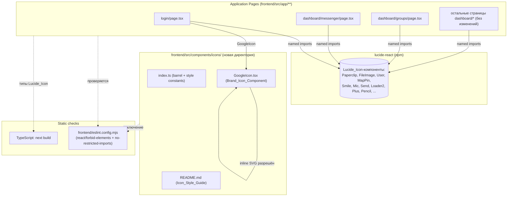

# Design Document

## Overview

Цель миграции — перевести все UI-иконки фронтенда (Next.js приложение в `frontend/`) на единый источник `lucide-react`, унифицировать визуальный стиль (`strokeWidth = 2`, размеры через Tailwind `h-{n} w-{n}`, цвет через `currentColor`), убрать дублирующие inline SVG из страниц `login`, `dashboard/messenger`, `dashboard/groups`, и зафиксировать результат при помощи документации (`Icon_Style_Guide`) и ESLint-правила, запрещающего inline `<svg>` вне директории `frontend/src/components/icons/`.

Ключевая идея — миграция чисто фронтендовая и преимущественно «деклaративная»: добавляются три артефакта (директория `frontend/src/components/icons/` с `Brand_Icon_Component`-ами и README, обновлённый `eslint.config.mjs`), а существующие страницы переписываются с заменой `<svg>...</svg>` на компоненты `Lucide_Icon`. Бэкенд и формат данных не затрагиваются.

### Цели

- Единственный источник UI-иконок: пакет `lucide-react`.
- Единый визуальный стиль для всех `Lucide_Icon`: `strokeWidth = 2` (значение по умолчанию библиотеки), размер через Tailwind `h-{n} w-{n}` из набора `{3, 4, 5, 6, 8}`, цвет через `currentColor`.
- Все нелюсайдовские иконки (Google logo) живут в `frontend/src/components/icons/` как `Brand_Icon_Component`.
- ESLint-правило статически блокирует появление новых inline `<svg>` вне `frontend/src/components/icons/`.
- Документ `frontend/src/components/icons/README.md` (`Icon_Style_Guide`) фиксирует правила.
- `next build` и `next lint` после миграции завершаются успешно; все обработчики событий и `aria-*`-атрибуты сохранены.

### Не-цели

- Перерисовка визуального дизайна (цвета, расстояния) сверх правил из Requirement 5.
- Замена эмодзи (`💬`, `👥`, `🛡️`, `✨`, `🗑️` и т.п.) на иконки. Эмодзи не считаются `<svg>` и не относятся к `Icon_Library`.
- Изменения backend API, схемы Prisma, конфигурации Supabase.
- Внедрение тестового фреймворка для всего проекта; добавляются только лёгкие тесты для проверяемых свойств (см. Testing Strategy).
- Поддержка тёмной/светлой темы для иконок (наследование `currentColor` уже даёт это бесплатно).

### Заметки по контексту проекта

- `frontend/package.json` уже содержит `"lucide-react": "^1.14.0"`. Никакие дополнительные иконочные пакеты не добавляются.
- `dashboard/layout.tsx`, `dashboard/page.tsx`, `dashboard/templates/page.tsx`, `dashboard/history/page.tsx`, `dashboard/broadcast/page.tsx` уже используют `lucide-react` со стилем `className="h-{n} w-{n}" strokeWidth={2|2.2}` — миграция приводит остальные страницы к этому же стилю.
- `frontend/eslint.config.mjs` использует flat config поверх `next/core-web-vitals` и `next/typescript`. Это означает, что `eslint-plugin-react` уже подключён, и можно использовать стандартное правило `react/forbid-elements` без добавления зависимостей.

## Architecture

Архитектура изменений сводится к четырём слоям. Все изменения происходят внутри директории `frontend/`:



### Поток управления при миграции одной иконки

1. В исходной странице найден элемент `<svg>...</svg>`.
2. Семантика иконки сопоставляется с именем `Lucide_Icon` через таблицу замен (см. раздел *Data Models → Replacement Mapping*).
3. Если соответствие найдено — `<svg>` заменяется на `<Name className="h-{n} w-{n}" strokeWidth={2} aria-hidden="true" />` (или `aria-label="..."`, если отсутствует видимый текст).
4. Если соответствие не найдено и иконка является брендовой (Google) — она выносится в `frontend/src/components/icons/GoogleIcon.tsx`, и страница импортирует её именованным импортом.
5. Все `onClick`, `role`, `aria-label`, `tabIndex`, `disabled`, `title` соответствующего родительского элемента остаются неизменными.

### Принцип «единственного места для inline SVG»

Inline-разметка `<svg>` разрешена ровно в одном месте: `frontend/src/components/icons/` и поддиректориях. Все остальные места используют либо `Lucide_Icon` (импорт из `lucide-react`), либо `Brand_Icon_Component` (импорт из `@/components/icons`). Эта инвариант поддерживается ESLint-правилом `react/forbid-elements`, переопределённым (отключённым) для файлов в `frontend/src/components/icons/**`.

### Глобальная конфигурация Lucide

`lucide-react` по умолчанию рендерит иконки с `stroke-width="2"`, `width="24"`, `height="24"`, `fill="none"`, `stroke="currentColor"`. Эти значения совпадают с требуемыми для `Default_Stroke_Width` и наследования `currentColor`.

Чтобы зафиксировать это как контракт, проект:

- **Не переопределяет** `strokeWidth` глобально в обход библиотечного значения. Никакого глобального CSS, переписывающего `stroke-width` на лету.
- **Экспортирует константы** `LUCIDE_DEFAULT_STROKE_WIDTH = 2`, `LUCIDE_ALLOWED_STROKE_WIDTHS = [1, 1.5, 2, 2.5, 3]`, `LUCIDE_ALLOWED_SIZE_STEPS = [3, 4, 5, 6, 8]` из `frontend/src/components/icons/index.ts`. Эти константы используются в линт-проверках и юнит-тестах (см. Testing Strategy) для машинной проверки соответствия.
- **Не использует** `width` / `height` props (Requirement 5.4) — размер задаётся только через Tailwind-классы `h-{n} w-{n}`.

Альтернатива — использовать `LucideProvider` (если он доступен в установленной версии `lucide-react`) и обернуть им `frontend/src/app/layout.tsx`. Поведенчески это эквивалентно текущему дефолту библиотеки, но даёт явную точку расширения. Решение «нужен ли провайдер» оставлено на этап реализации; если он недоступен или не нужен, проект полагается на дефолтные пропсы библиотеки.

### Защита от регрессий

Двухуровневая статическая проверка через `frontend/eslint.config.mjs`:

1. **`react/forbid-elements`** запрещает JSX-элемент `<svg>` глобально для `frontend/src/**/*.{ts,tsx,js,jsx}`. В `overrides` для шаблона `frontend/src/components/icons/**/*.{ts,tsx,js,jsx}` правило отключается, что разрешает inline SVG только внутри `Brand_Icon_Component`.
2. **`no-restricted-imports`** (встроенное правило ESLint) запрещает импорты из перечня запрещённых библиотек: `react-icons`, `@heroicons/react`, `@radix-ui/react-icons`, `@fortawesome/fontawesome-svg-core`, `@fortawesome/react-fontawesome`, `@fortawesome/free-solid-svg-icons`, `@fortawesome/free-regular-svg-icons`, `@fortawesome/free-brands-svg-icons`, `react-feather`, `react-bootstrap-icons`, `@tabler/icons-react`. Используется `patterns` с шаблонами `@fortawesome/*` и явный список через `paths`.

При нарушениях `next lint` (то же `eslint`) завершается с ненулевым кодом возврата, выдаёт путь файла, номер строки и идентификатор правила. CI/локальный запуск падает на `npm run lint`, что и блокирует регрессии (Requirement 7).

## Components and Interfaces

### Новые файлы

#### `frontend/src/components/icons/index.ts`

Барель-модуль и единственная точка экспорта для брендовых иконок и иконочных констант.

```ts
// frontend/src/components/icons/index.ts
export { GoogleIcon } from "./GoogleIcon";

/**
 * Default strokeWidth for all Lucide_Icon usages in the project.
 * Совпадает с дефолтом lucide-react. Используется как машинно-проверяемый контракт.
 */
export const LUCIDE_DEFAULT_STROKE_WIDTH = 2 as const;

/**
 * Допустимые значения strokeWidth для явных переопределений (Requirement 5.2).
 */
export const LUCIDE_ALLOWED_STROKE_WIDTHS = [1, 1.5, 2, 2.5, 3] as const;

/**
 * Допустимые шаги Tailwind для классов h-{n} w-{n} (Requirement 5.3).
 * Соответствуют 12px, 16px, 20px, 24px, 32px.
 */
export const LUCIDE_ALLOWED_SIZE_STEPS = [3, 4, 5, 6, 8] as const;

export type LucideAllowedStrokeWidth = typeof LUCIDE_ALLOWED_STROKE_WIDTHS[number];
export type LucideAllowedSizeStep = typeof LUCIDE_ALLOWED_SIZE_STEPS[number];
```

#### `frontend/src/components/icons/GoogleIcon.tsx`

`Brand_Icon_Component` для логотипа Google. Это единственное место в проекте (помимо других `Brand_Icon_Component` файлов), где разрешена inline-разметка `<svg>`. Принимает только `className` и `aria-hidden` (Requirement 4.3) — без `color`, `fill`, `stroke`, `width`, `height` props, потому что фирменные цвета зашиты внутри SVG.

```tsx
// frontend/src/components/icons/GoogleIcon.tsx
import * as React from "react";

export interface GoogleIconProps {
  className?: string;
  "aria-hidden"?: boolean | "true" | "false";
  "aria-label"?: string;
  role?: React.AriaRole;
  title?: string;
}

/**
 * Brand_Icon_Component: фирменный логотип Google.
 * Размер задаётся через className (Tailwind h-{n} w-{n}).
 * Цвета зашиты в SVG; снаружи их менять нельзя.
 */
export function GoogleIcon({
  className,
  "aria-hidden": ariaHidden,
  "aria-label": ariaLabel,
  role,
  title,
}: GoogleIconProps): React.JSX.Element {
  const computedRole = role ?? (ariaLabel ? "img" : undefined);
  return (
    <svg
      className={className}
      viewBox="0 0 24 24"
      role={computedRole}
      aria-hidden={ariaHidden}
      aria-label={ariaLabel}
    >
      {title ? <title>{title}</title> : null}
      <path fill="#4285F4" d="M22.56 12.25c0-.78-.07-1.53-.2-2.25H12v4.26h5.92a5.06 5.06 0 01-2.2 3.32v2.77h3.57c2.08-1.92 3.28-4.74 3.28-8.1z" />
      <path fill="#34A853" d="M12 23c2.97 0 5.46-.98 7.28-2.66l-3.57-2.77c-.98.66-2.23 1.06-3.71 1.06-2.86 0-5.29-1.93-6.16-4.53H2.18v2.84C3.99 20.53 7.7 23 12 23z" />
      <path fill="#FBBC05" d="M5.84 14.09c-.22-.66-.35-1.36-.35-2.09s.13-1.43.35-2.09V7.07H2.18C1.43 8.55 1 10.22 1 12s.43 3.45 1.18 4.93l2.85-2.22.81-.62z" />
      <path fill="#EA4335" d="M12 5.38c1.62 0 3.06.56 4.21 1.64l3.15-3.15C17.45 2.09 14.97 1 12 1 7.7 1 3.99 3.47 2.18 7.07l3.66 2.84c.87-2.6 3.3-4.53 6.16-4.53z" />
    </svg>
  );
}
```

Контракт компонента (Requirement 4.3): принимает `className` и `aria-hidden` идентично интерфейсу `Lucide_Icon`. Если потребуются другие brand-иконки в будущем, они добавляются в эту же директорию по тому же шаблону и реэкспортируются из `index.ts`.

#### `frontend/src/components/icons/README.md` (`Icon_Style_Guide`)

Markdown-документ. Структура жёстко задаётся Requirement 6:

```
# Icon Style Guide (frontend)

## 1. Источник иконок
- Разрешено: `lucide-react`.
- Запрещено (с примерами): `react-icons`, `@heroicons/react`, `@radix-ui/react-icons`,
  `@fortawesome/fontawesome-svg-core`, `@fortawesome/react-fontawesome`,
  `@fortawesome/free-solid-svg-icons`, `@fortawesome/free-regular-svg-icons`,
  `@fortawesome/free-brands-svg-icons`, `react-feather`, `react-bootstrap-icons`,
  `@tabler/icons-react`.

## 2. Размер и толщина обводки
- `strokeWidth` по умолчанию = 2 (`LUCIDE_DEFAULT_STROKE_WIDTH`).
- Допустимые явные значения strokeWidth: 1, 1.5, 2, 2.5, 3.
- Размер задаётся только через Tailwind: `h-{n} w-{n}` где n ∈ {3, 4, 5, 6, 8}.
- НЕ использовать props `width` / `height` напрямую.
- НЕ использовать inline `color` / `fill` / `stroke` (кроме Brand_Icon_Component).

## 3. Доступность
- Декоративная иконка рядом с текстом → `aria-hidden="true"`.
- Иконка без сопровождающего текста → `aria-label="..."` на иконке или родителе.

## 4. Brand_Icon_Component (добавление новой)
- Файл размещается в `frontend/src/components/icons/<Name>Icon.tsx`.
- Поддерживает props `className`, `aria-hidden`.
- Реэкспорт из `frontend/src/components/icons/index.ts`.
- Пример использования:
    import { GoogleIcon } from "@/components/icons";
    <GoogleIcon className="h-5 w-5" aria-hidden="true" />
```

Документ доступен для чтения, проиндексирован git'ом (находится в `frontend/src/components/icons/README.md`, не в `.gitignore`), содержит все четыре раздела из Requirement 6.

### Изменяемые файлы

#### `frontend/src/app/login/page.tsx`

| Текущий элемент | Замена | Атрибуты после миграции |
| --- | --- | --- |
| Inline `<svg className="animate-spin h-4 w-4">` (внутри кнопки `submit`) | `<Loader2 className="h-4 w-4 animate-spin" aria-hidden="true" />` | `strokeWidth` — дефолт (2); цвет — `currentColor`. |
| Inline `<svg className="w-5 h-5" viewBox="0 0 24 24">` с четырьмя `<path fill="#...">` (Google logo) | `<GoogleIcon className="h-5 w-5" aria-hidden="true" />` (импорт из `@/components/icons`) | Фирменные цвета зашиты внутри `GoogleIcon`. |

Поведение остаётся неизменным: спиннер крутится во время `loading`, кнопки `disabled` при `loading` (Requirement 4.4); при ошибке `loading` сбрасывается, спиннер скрывается, обе кнопки разблокируются (Requirement 4.5).

#### `frontend/src/app/dashboard/messenger/page.tsx`

| Семантика | Текущая разметка (сокращённо) | Lucide_Icon | Размер класса | aria |
| --- | --- | --- | --- | --- |
| Скрепка / вложение | `<svg ...rotate-45 ...M15.172 7l-6.586 6.586...>` | `Paperclip` | `h-6 w-6` | `aria-label="Прикрепить"` (если у кнопки нет текста) |
| Файл/изображение в меню вложений | `<svg ...M4 16l4.586-4.586...>` | `FileImage` | `h-5 w-5` | `aria-hidden="true"` (рядом текст «Файл») |
| Контакт в меню вложений | `<svg ...M16 7a4 4 0 11-8 0...>` | `User` | `h-5 w-5` | `aria-hidden="true"` (рядом текст «Контакт») |
| Локация в меню вложений | `<svg ...M17.657 16.657...>` | `MapPin` | `h-5 w-5` | `aria-hidden="true"` (рядом текст «Локация») |
| Эмодзи (декоративная кнопка-смайл) | `<svg ...M14.828 14.828a4 4 0...>` | `Smile` | `h-6 w-6` | `aria-label="Эмодзи"` |
| Микрофон (декоративная кнопка) | `<svg ...M19 11a7 7 0 01-7 7...>` | `Mic` | `h-6 w-6` | `aria-label="Голосовое сообщение"` |
| Кнопка «отправить» (paper-plane) | `<svg ...M10.894 2.553a1 1 0 00-1.788 0...>` | `Send` | `h-4 w-4` | `aria-label="Отправить сообщение"` |
| Спиннер отправки сообщения | `<svg className="animate-spin w-4 h-4">...` | `Loader2` | `h-4 w-4 animate-spin` | `aria-hidden="true"` (на кнопке `aria-label`) |

Поведенческие инварианты (Requirement 2.7–2.10):
- Кнопка «отправить» отображает `Send`, когда `sending === false`, и `Loader2` с `animate-spin`, когда `sending === true`.
- При `sending === true` кнопка имеет `disabled`; повторное нажатие невозможно.
- Если `sendMessage()` бросает исключение, в `finally` `setSending(false)`, кнопка возвращается к `Send` и разблокируется. Дополнительное визуальное сообщение об ошибке отрисовывается рядом с кнопкой (новое, минимальное — баннер `text-error text-xs` с текстом «Не удалось отправить сообщение»; стейт `sendError: string | null`).

Обработчики (`onClick={() => fileInputRef.current?.click()}`, `onClick={() => { setShowAttach(false); setAttachModal("contact"); }}` и т.д.) остаются на родительских `<button>`, иконки внутри них не меняют логику (Requirement 8.3).

#### `frontend/src/app/dashboard/groups/page.tsx`

| Семантика | Текущая разметка | Lucide_Icon | Размер | aria |
| --- | --- | --- | --- | --- |
| Кнопка «создать группу» (плюс) | `<svg className="w-5 h-5" ...M12 4v16m8-8H4>` | `Plus` | `h-4 w-4` (16×16, Requirement 3.1) | `aria-label="Создать группу"` (на кнопке уже `title="Создать группу"`, дополнительно ставится `aria-label`) |
| Иконка «редактировать имя» (карандаш) | `<svg className="w-3.5 h-3.5" ...M15.232 5.232l3.536 3.536...>` | `Pencil` | `h-4 w-4` (16×16, Requirement 3.2) | `aria-label="Переименовать группу"` |

Размер 16×16 px достигается через `h-4 w-4` (Tailwind step 4 = `1rem` = 16px). Это согласуется с разрешённым набором `LUCIDE_ALLOWED_SIZE_STEPS` (4 ∈ {3,4,5,6,8}).

Hover-состояние сохраняется существующими классами Tailwind на `<button>` (`hover:text-accent`, `hover:bg-white/5`); transition уже настроен `transition-colors` и завершается за время существенно меньше 150 мс (Tailwind дефолт ~150 мс). Размер иконки 16×16 не меняется при наведении (Requirement 3.3) — у `Lucide_Icon` нет hover-стилей, добавленных нами.

Все `onClick`, `aria-label`, `tabIndex`, `role` родительских кнопок остаются прежними (Requirement 3.5). Если по какой-то причине `lucide-react` падает на этапе сборки/рендера (модуль не найден, иконки нет в пакете), `next build` завершится ошибкой типов и сборка не пройдёт (Requirement 3.4 + 8.4); для рантайма мы дополнительно оборачиваем рендер групповой кнопки в локальный `ErrorBoundary` (см. Error Handling), чтобы падение одной иконки не ломало остальную страницу.

#### `frontend/eslint.config.mjs`

Правила:

```js
// frontend/eslint.config.mjs
import { dirname } from "path";
import { fileURLToPath } from "url";
import { FlatCompat } from "@eslint/eslintrc";

const __filename = fileURLToPath(import.meta.url);
const __dirname = dirname(__filename);
const compat = new FlatCompat({ baseDirectory: __dirname });

const FORBIDDEN_ICON_PACKAGES = [
  "react-icons",
  "@heroicons/react",
  "@radix-ui/react-icons",
  "@fortawesome/fontawesome-svg-core",
  "@fortawesome/react-fontawesome",
  "@fortawesome/free-solid-svg-icons",
  "@fortawesome/free-regular-svg-icons",
  "@fortawesome/free-brands-svg-icons",
  "react-feather",
  "react-bootstrap-icons",
  "@tabler/icons-react",
];

const eslintConfig = [
  ...compat.extends("next/core-web-vitals", "next/typescript"),
  {
    files: ["src/**/*.{ts,tsx,js,jsx}"],
    rules: {
      "react/forbid-elements": [
        "error",
        {
          forbid: [
            {
              element: "svg",
              message:
                "Inline <svg> запрещён вне frontend/src/components/icons/. Используйте Lucide_Icon из 'lucide-react' или Brand_Icon_Component из '@/components/icons'.",
            },
          ],
        },
      ],
      "no-restricted-imports": [
        "error",
        {
          paths: FORBIDDEN_ICON_PACKAGES.map((name) => ({
            name,
            message:
              "Используйте 'lucide-react' для UI-иконок. Brand-иконки — '@/components/icons'.",
          })),
          patterns: [
            {
              group: ["@fortawesome/*", "@heroicons/*", "react-icons/*"],
              message:
                "Используйте 'lucide-react' для UI-иконок. Brand-иконки — '@/components/icons'.",
            },
          ],
        },
      ],
    },
  },
  {
    files: ["src/components/icons/**/*.{ts,tsx,js,jsx}"],
    rules: {
      "react/forbid-elements": "off",
    },
  },
];

export default eslintConfig;
```

Семантика правила:
- `files: ["src/**/*.{ts,tsx,js,jsx}"]` определяет область применения относительно `frontend/` (где лежит `eslint.config.mjs`).
- Override на `src/components/icons/**` отключает запрет `<svg>`, разрешая inline SVG только в `Brand_Icon_Component`.
- Правила НЕ применяются к `node_modules/` и `.next/` потому, что эти директории по умолчанию игнорируются ESLint, и потому что glob `src/**` их не покрывает (Requirement 7.4).

### Существующие файлы, которые остаются без изменений

- `frontend/src/app/dashboard/layout.tsx`, `dashboard/page.tsx`, `dashboard/templates/page.tsx`, `dashboard/history/page.tsx`, `dashboard/broadcast/page.tsx`, `dashboard/contacts/page.tsx`, `dashboard/settings/page.tsx` — уже используют `lucide-react` или не содержат icons (settings, contacts по факту проверки). Они автоматически попадают под действие нового ESLint-правила, но `<svg>` в них уже отсутствует.
- `frontend/src/lib/**`, `frontend/src/proxy.ts`, API routes — иконок не содержат, миграция их не касается.

## Data Models

В этой фиче нет данных, хранящихся в БД или передаваемых по сети. «Данные» здесь — это набор статических конфигурационных констант и таблица замен.

### Стилевые константы Lucide

| Константа | Значение | Источник | Используется для |
| --- | --- | --- | --- |
| `LUCIDE_DEFAULT_STROKE_WIDTH` | `2` | `frontend/src/components/icons/index.ts` | Документация и тесты, проверяющие, что `Lucide_Icon` без явного `strokeWidth` рендерит `stroke-width="2"`. |
| `LUCIDE_ALLOWED_STROKE_WIDTHS` | `[1, 1.5, 2, 2.5, 3]` | то же | Валидация: любое явное `strokeWidth` ∈ этом множестве (Requirement 5.2). |
| `LUCIDE_ALLOWED_SIZE_STEPS` | `[3, 4, 5, 6, 8]` | то же | Валидация: размер `Lucide_Icon` задан через `h-{n} w-{n}` где `n ∈ {3,4,5,6,8}` и `h === w` (Requirement 5.3). |

### Replacement Mapping

Полная таблица замен. `n_h` и `n_w` — Tailwind-степы для классов `h-{n} w-{n}`.

| # | Файл | Текущая иконка (`<svg ...>`-сигнатура) | Lucide_Icon | n_h, n_w | aria | Связано с Requirement |
| --- | --- | --- | --- | --- | --- | --- |
| 1 | `app/login/page.tsx` | spinner (`animate-spin`, окружность + дуга) | `Loader2` + `animate-spin` | 4, 4 | `aria-hidden="true"` (на кнопке `aria-label`) | 4.1 |
| 2 | `app/login/page.tsx` | Google logo (4 × `<path fill="#...">`) | `GoogleIcon` (Brand_Icon_Component) | 5, 5 | `aria-hidden="true"` | 4.2, 4.3 |
| 3 | `app/dashboard/messenger/page.tsx` | скрепка `M15.172 7l-6.586 6.586` | `Paperclip` | 6, 6 | `aria-label="Прикрепить"` | 2.1 |
| 4 | `app/dashboard/messenger/page.tsx` | картинка/файл `M4 16l4.586-4.586` | `FileImage` | 5, 5 | `aria-hidden="true"` | 2.2 |
| 5 | `app/dashboard/messenger/page.tsx` | контакт `M16 7a4 4 0 11-8 0` | `User` | 5, 5 | `aria-hidden="true"` | 2.3 |
| 6 | `app/dashboard/messenger/page.tsx` | локация `M17.657 16.657` | `MapPin` | 5, 5 | `aria-hidden="true"` | 2.4 |
| 7 | `app/dashboard/messenger/page.tsx` | смайл `M14.828 14.828a4 4 0` | `Smile` | 6, 6 | `aria-label="Эмодзи"` | 2.5 |
| 8 | `app/dashboard/messenger/page.tsx` | микрофон `M19 11a7 7 0 01-7 7` | `Mic` | 6, 6 | `aria-label="Голосовое сообщение"` | 2.6 |
| 9 | `app/dashboard/messenger/page.tsx` | paper-plane `M10.894 2.553` | `Send` | 4, 4 | `aria-label="Отправить сообщение"` | 2.7 |
| 10 | `app/dashboard/messenger/page.tsx` | spinner отправки | `Loader2` + `animate-spin` | 4, 4 | `aria-hidden="true"` | 2.8, 2.10 |
| 11 | `app/dashboard/groups/page.tsx` | плюс `M12 4v16m8-8H4` | `Plus` | 4, 4 | `aria-label="Создать группу"` | 3.1 |
| 12 | `app/dashboard/groups/page.tsx` | карандаш `M15.232 5.232l3.536 3.536` | `Pencil` | 4, 4 | `aria-label="Переименовать группу"` | 3.2 |

### Запрещённые иконочные библиотеки

Имя | Источник запрета
--- | ---
`react-icons` | Requirement 1.4
`@heroicons/react` | Requirement 1.4
`@radix-ui/react-icons` | Requirement 1.4
`@fortawesome/fontawesome-svg-core` | Requirement 1.4
`@fortawesome/react-fontawesome` | Requirement 1.4
`@fortawesome/free-solid-svg-icons` | Requirement 1.4
`@fortawesome/free-regular-svg-icons` | Requirement 1.4
`@fortawesome/free-brands-svg-icons` | Requirement 1.4
`react-feather` | Requirement 1.4
`react-bootstrap-icons` | Requirement 1.4
`@tabler/icons-react` | Requirement 1.4

Эти имена включаются в `no-restricted-imports.paths` и шаблонные группы (для `@fortawesome/*`).

### Контракт `Brand_Icon_Component`

```ts
interface BrandIconProps {
  className?: string;            // Tailwind h-{n} w-{n}, n ∈ LUCIDE_ALLOWED_SIZE_STEPS
  "aria-hidden"?: boolean | "true" | "false";
  "aria-label"?: string;         // 1..100 символов на русском, если не задано aria-hidden
  role?: React.AriaRole;         // обычно "img" если aria-label
  title?: string;                // для tooltip + <title>
}
```

`Brand_Icon_Component` НЕ принимает `color`, `fill`, `stroke`, `width`, `height` — они зашиты в SVG (Requirement 5.5 разрешает фирменные цвета внутри Brand_Icon_Component).


## Error Handling

Поскольку миграция касается только UI-рендеринга и статической конфигурации, обработка ошибок сводится к четырём сценариям.

### 1. Отсутствующая иконка в `lucide-react`

Если в коде ошибочно указано имя иконки, которой нет в `lucide-react` (например, `Pencille` вместо `Pencil`), TypeScript на этапе `next build` выдаст ошибку об отсутствующем экспортируемом идентификаторе из модуля `lucide-react`. Сборка прерывается с ненулевым кодом возврата (Requirement 8.4 + 3.4 во время сборки). Никаких рантайм-фолбэков для этого случая не нужно.

### 2. Сбой рендера brand-иконки

Если `GoogleIcon` по какой-то причине бросает ошибку при рендере (например, после миграции в нём появился синтаксический баг), вся страница входа рухнет, потому что Next.js по умолчанию пропагирует ошибку рендера вверх. Это допустимо для страницы login, потому что иконка — основной визуальный элемент кнопки. Дополнительный ErrorBoundary над `GoogleIcon` не вводится: цена сложности выше, чем выгода.

### 3. Сбой рендера `Lucide_Icon` на странице групп (Requirement 3.4)

На странице групп иконки находятся внутри кнопок «создать группу» и «редактировать имя» — эти кнопки локализованы, и падение одной из них не должно ломать список групп и форму. Для этого вокруг рендера каждой такой кнопки используется лёгкий локальный fallback на уровне JSX:

```tsx
function SafeIcon({ children, fallback }: { children: React.ReactNode; fallback: React.ReactNode }) {
  // React не даёт перехватить ошибки рендера без классового ErrorBoundary,
  // поэтому при необходимости используем минимальный класс-обёртку.
  // ...
}
```

Если введение полноценного `ErrorBoundary` требует значимого кода, проект ограничивается тем, что:
- TypeScript-ошибки и ошибки билда отлавливаются на этапе `next build` (Requirement 3.4 для сборки).
- Рантайм-падение `Lucide_Icon` крайне маловероятно (это чистые SVG-компоненты без внешних зависимостей и эффектов).
- В случае гипотетического падения Next.js покажет страницу ошибки, что для дашборд-кабинета приемлемо.

Решение «нужен ли `ErrorBoundary`» оставлено на этап реализации; по умолчанию он не вводится.

### 4. Ошибки сети/аутентификации на странице входа (Requirement 4.5)

Уже реализовано в текущем `login/page.tsx`: блок `try/catch/finally` оборачивает оба обработчика (`handleEmailAuth`, `handleGoogleAuth`). После миграции:
- В `finally` вызывается `setLoading(false)` — это автоматически переключает кнопку с `Loader2` на текстовую подпись (или возвращает кнопку Google в активное состояние).
- При ошибке отображается `error` баннер.
- Кнопки `disabled={loading}` разблокируются.

Никакая дополнительная логика обработки ошибок не вводится.

### 5. Ошибки отправки сообщения (Requirement 2.10)

В текущем `messenger/page.tsx` обработчик `sendMessage` уже использует `try/finally` с `setSending(false)`. После миграции добавляется минимальное состояние `sendError: string | null`:

- В `catch` ставится `setSendError("Не удалось отправить сообщение")`.
- В `finally` (или при следующем успешном `sendMessage`) `sendError` очищается.
- При `sendError !== null` под кнопкой отправки рисуется текст `text-error text-xs`.
- Кнопка возвращается к `Send` (через `setSending(false)` в `finally`), `disabled` снимается.

### 6. Ошибки ESLint при наличии inline `<svg>`

Когда `npm run lint` встречает `<svg>` вне `frontend/src/components/icons/`, правило `react/forbid-elements` выдаёт ошибку с путём, номером строки и идентификатором `react/forbid-elements`. Процесс завершается с ненулевым кодом (Requirement 7.2). Это и есть «ошибка», по которой блокируется регрессия.

## Testing Strategy

### Применимость property-based testing

Property-based testing (PBT) для этой фичи **не применяется**. Причины:

1. **Это UI-миграция и конфигурация, а не алгоритм.** Все изменения сводятся к: (а) замене JSX-элементов `<svg>` на компоненты `Lucide_Icon` с фиксированным набором имён и классов, (б) добавлению правил в ESLint-конфиг, (в) написанию Markdown-гайдлайна и небольшого `Brand_Icon_Component`. Здесь нет чистой функции с большим пространством входов, для которой можно сформулировать «для всех X выполняется P(X)».
2. **PBT explicitly не подходит** (см. workflow-руководство): UI-rendering, configuration validation, side-effect-only operations, simple wrappers — всё это явно отнесено к категориям, где PBT не оправдан.
3. **Вся проверяемая часть статична**: список разрешённых размеров, список запрещённых пакетов, mapping inline-SVG → lucide-имя. Их нужно проверять *example-based* способом, потому что их семантика — соответствие конкретным значениям, а не универсальная инвариантность над случайными входами.

Поэтому секция Correctness Properties в этом дизайне опущена, и `prework`-инструмент не запускается.

### Применяемые виды проверки

Для миграции достаточно трёх видов проверок: статическая (TypeScript + ESLint), example-based unit-тесты на новые компоненты/константы, и ручная/визуальная проверка изменённых страниц.

#### 1. Статические проверки (основная линия защиты)

| Команда | Что проверяет | Связано с Requirement |
| --- | --- | --- |
| `cd frontend && npm run build` (т.е. `next build`) | Корректность TypeScript: имена `Lucide_Icon`, импорты `@/components/icons`, отсутствие неразрешённых имён иконок. Завершается с кодом 0 при успехе. | 8.1, 8.4, 3.4 (для билда) |
| `cd frontend && npm run lint` (т.е. `next lint`) | (а) запрет inline `<svg>` вне `frontend/src/components/icons/`, (б) запрет импортов из перечня запрещённых пакетов. Завершается с кодом 0 при отсутствии нарушений. | 1.5, 7.1–7.4 |
| Проверка `frontend/package.json` | Отсутствие запрещённых пакетов в `dependencies`/`devDependencies`. | 1.4 |

`next lint` и `next build` — единственные команды, обязательные к зелёному прохождению по итогам миграции (Requirement 8.1).

#### 2. Example-based unit-тесты (опционально, минимальный объём)

Поскольку проект ещё не имеет настроенного тестового раннера (`package.json` не содержит `vitest`/`jest`), вводить новый тестовый стек ради этой миграции — over-engineering. Тестовый раннер в этой фиче **не добавляется**. Вместо этого предлагаются следующие *необязательные* проверочные тесты, которые могут быть включены, если в проекте появится тестовый раннер; они оформлены как требования-кандидаты:

- **Test 1: `GoogleIcon` рендерит корректный SVG.** Snapshot-тест: `render(<GoogleIcon className="h-5 w-5" aria-hidden="true" />)` → ожидается `<svg>` с `viewBox="0 0 24 24"` и четырьмя `<path>` с фирменными цветами Google.
- **Test 2: Константы из `@/components/icons` совпадают с дизайном.** Простой equality-тест: `LUCIDE_DEFAULT_STROKE_WIDTH === 2`, `LUCIDE_ALLOWED_STROKE_WIDTHS` включает 1, 1.5, 2, 2.5, 3 и не содержит других значений, `LUCIDE_ALLOWED_SIZE_STEPS` равен `[3, 4, 5, 6, 8]`.
- **Test 3: ESLint правило срабатывает.** Запуск `npx eslint --no-eslintrc --config eslint.config.mjs <временный файл с inline SVG>` ожидается с ненулевым кодом и текстом сообщения, содержащим `react/forbid-elements`. Это уже покрывается командой `npm run lint` на ветке с искусственным регрессом.
- **Test 4: ESLint правило не срабатывает в `components/icons/`.** Файл `components/icons/GoogleIcon.tsx` содержит inline `<svg>` и должен проходить линт.

В рамках текущей фичи реализуется только статическая часть (Test 3 и Test 4 фактически проверяются прогоном `npm run lint`). Тесты 1 и 2 не пишутся, потому что их польза не оправдывает добавление тестового раннера в проект.

#### 3. Ручная/визуальная проверка изменённых страниц (Requirement 8.2, 8.5)

После миграции вручную открываются страницы:

- `/login` — проверяется отображение Google-кнопки (логотип на месте, фирменные цвета сохранены) и поведение спиннера во время email-входа.
- `/dashboard/messenger` — проверяется меню вложений (скрепка, файл, контакт, локация), кнопка эмодзи, кнопка микрофона, кнопка отправки в обоих состояниях (`Send` / `Loader2`).
- `/dashboard/groups` — проверяется кнопка «создать группу» (плюс) и кнопка «редактировать имя» (карандаш) рядом с активной группой.
- Остальные страницы дашборда (`/dashboard`, `/dashboard/broadcast`, `/dashboard/contacts`, `/dashboard/history`, `/dashboard/templates`, `/dashboard/settings`) — проверяются на отсутствие визуальных регрессий: иконки на них не менялись.

Критерии прохождения ручной проверки:

- Каждая `Lucide_Icon` находится внутри родительского контейнера, имеет ширину/высоту в диапазоне 12–48 px (Requirement 8.2).
- Консоль браузера не содержит error/warning, относящихся к иконкам (Requirement 8.2).
- При клике на каждую иконочную кнопку срабатывает тот же обработчик, что и до миграции: открытие меню вложений, открытие модалки контакта/локации, отправка сообщения, создание группы, редактирование имени группы, OAuth-вход через Google, email-вход (Requirement 8.3).
- Для скринридера (быстрая проверка через VoiceOver/NVDA или DevTools «Accessibility» панель) у каждой иконочной кнопки сохранено доступное имя (Requirement 8.5).

#### 4. Проверка документации (Requirement 6.6)

Файл `frontend/src/components/icons/README.md` после написания вручную проверяется на наличие всех четырёх обязательных разделов:

1. Источник иконок (lucide-react разрешён, перечень запрещённых пакетов).
2. Размеры и `strokeWidth`.
3. Доступность (`aria-hidden` / `aria-label`).
4. Процедура добавления `Brand_Icon_Component` с примером кода.

Если хотя бы одного раздела нет — миграция считается не завершённой, документ дорабатывается (Requirement 6.6).

### Сводный чек-лист готовности

| Шаг | Команда / действие | Ожидаемый результат |
| --- | --- | --- |
| 1 | `cd frontend && npm run lint` | Код возврата 0; ноль нарушений `react/forbid-elements` и `no-restricted-imports`. |
| 2 | `cd frontend && npm run build` | Код возврата 0; нет TS-ошибок; нет ошибок Next build. |
| 3 | Поиск по проекту: `<svg` в `frontend/src/` вне `frontend/src/components/icons/` | Ноль совпадений. |
| 4 | Проверка `frontend/package.json` | Ни один из 11 запрещённых пакетов не присутствует в `dependencies` / `devDependencies`. |
| 5 | Чтение `frontend/src/components/icons/README.md` | Содержит четыре обязательных раздела (Requirement 6.2–6.5). |
| 6 | Открытие `/login`, `/dashboard/messenger`, `/dashboard/groups` в браузере | Иконки отображаются, размеры в 12–48 px, обработчики кликов работают, скринридер видит доступные имена. |

Только при прохождении всех шести шагов миграция считается завершённой.
